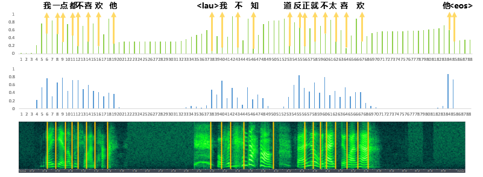
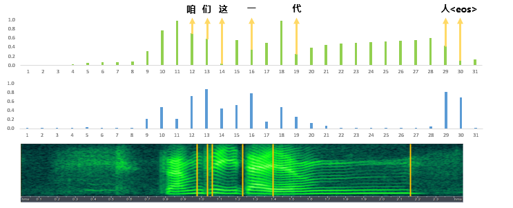
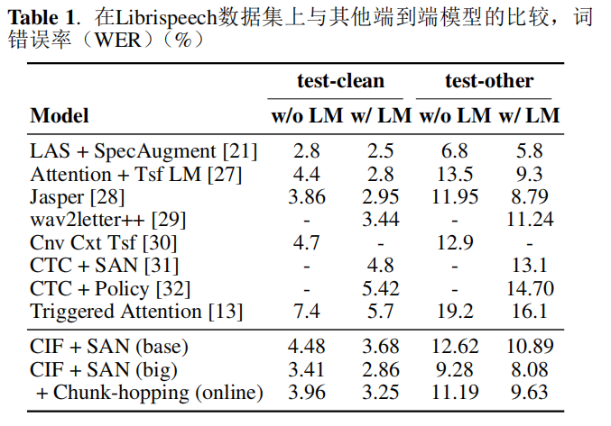
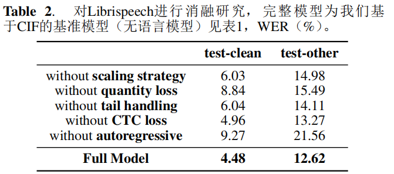
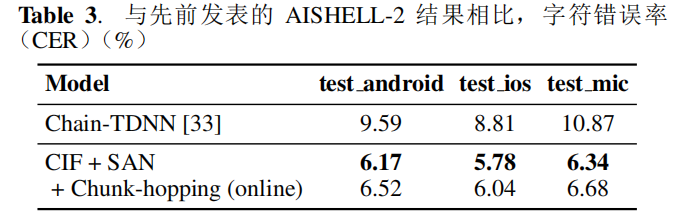
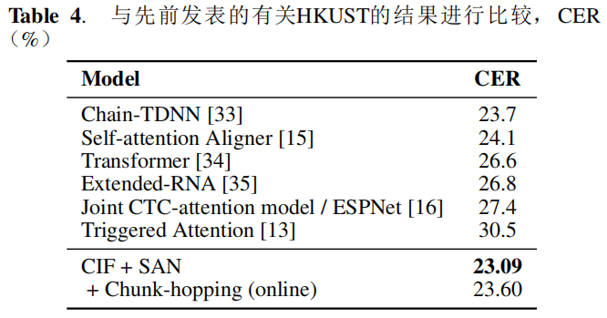

# CIF:用于端到端语音识别的连续积分放电机制

摘要：
- 用于序列转化的软单调对齐机制，灵感来自脉冲神经网络（spiking neural networks ）的积分-放电模型。
- 采用于由连续函数组成的编码器-解码器架构
- 应用于ASR，计算简洁，支持在线识别和声学边界定位
- 提供了几种策略用于缓解CIF模型的独特问题

WER：2.86%（Librispeech）

## 1 简介

基于注意力的端到端模型[1, 2]在每个解码器步骤和每个编码器步骤之间建立软对齐，表现出极好的性能优势。

缺陷：
1. 无法支持在线（或流式）识别，因为它需要参考整个编码序列；
2. 不能很好地为识别结果添加时间戳，因为它不是帧同步的。
3. 关注每个编码器步骤给予解码步骤在声学上无关的步骤带来大量不必要的计算。

目标：寻求一种软对齐，不仅可以执行有效的单调计算，而且可以定位声学边界。从积分-放电模型中找到了灵感 [5, 6]。
积分-放电模型：
1. 前向积分输入信号（例如脉冲列），其膜电位相应变化。
2. 当电位达到特定阈值时，它会发出一个刺激其他神经元的脉冲，并重置其电位

可以发现：
1. 积分-放电过程严格单调。
2. 发出的脉冲可用于声学定位。

建立对齐机制：前向积分声学信号中的信息，一旦定位到边界，即刻发出集成的声学信息以进行进一步识别。

难点：如何使用支持反向传播的连续函数来模拟积分-放电过程。

CIF：单调软对齐，应用于编码器-解码器框架。
- 每个编码器步骤，接收当前编码器步骤的向量表示以及相应缩放权重
- 前向累积权重并整合向量信息，直到达到阈值（到达声学边界）。

此时，该点编码器的声学信息被两个相邻标签共享，CIF将其分为两部分，一部分用于完成当前标签的整合，另一部分用于下一个整合。然后将整合的声学信息发送到解码器以预测当前的标签。


图1示例：长度为标记为“CAT”的编码话语进行注意力对齐(a)和CIF对齐(b)。灰度表示参与计算解码标签的每个编码器标签的每个编码器步骤的权重。(b)中虚线表示定位的声学边界，边界的权重分为两部分，分别用于计算两个相邻标签。

优化策略：
1. 缩放策略：解决交叉熵训练中预测标签和目标标签长度不等的问题。
2. 数量损失：监督模型预测标签的数量更接近目标
3. 尾部处理：处理推理结束时的剩余信息

## 2 相关工作
探讨端到端语音识别模型中的软性和单调对齐的工作：

[8,9]假设对齐是一个适合高斯分布的前向移动窗口；[10]甚至假设其具有启发式规则，其中窗口的中心和宽度由其解码器状态预测。CIF不遵循给定的假设，不使用解码器状态，更多从音频数据中学习模式。

[11,12]需要先使用硬单调注意力决定何时停止再执行软注意力计算的两个独立步骤，[ 13 ]需要CTC训练好的模型在注意力解码前进行预划分。CIF同时进行定位和整合的简洁计算。

[14]提出了自适应计算步骤算法(ACS)，其动机是动态地决定一个帧块来预测一个语言输出。CIF持有不同的动机视角- - "积分与放电"，并以更细的时间粒度建模来处理编码帧内部广泛存在的点火现象。CIF的处理确保了声学信息的充分利用。

## 3 方法

### 3.1 连续积分放电

CIF在编码器-解码器框架中采用软单调对齐。


图2. 我们用于自动语音识别任务的基于CIF的模型架构。虚线矩形中的操作仅在训练阶段应用。CIF模块前的开关（S）在训练阶段连接左侧，在推断阶段连接右侧。

如图2，在每个编码器步骤 $u$ 中，它接收两个输入:
1. 编码器的当前输出： $h_u$ 
2. 当前权重： $\alpha_u$ ，该权重调整 $h_u$ 中包含的信息量。

然后向前累积接收到的权重，并集成接收到的状态，直到累计权重达到给定阈值 $\beta$ ，意味着定位到声学边界。

在该点，当前编码器步骤的信息被当前标签 $y_i$ 和下一个标签共享。CIF将当前权重 $\alpha_u$ 分为两部分：一部分用于在相关编码器步骤上构建完整分布（权重之和为1.0）来完成当前标签 $y_i$ 的集成，另一部分用于下一标签的集成。

之后将集成的嵌入 $c_i$ (以及上下文向量)发送到解码器，预测相应的标签 $y_i$ 。上述过程一直执行到编码末尾。推荐将 $\beta$ 设为1.0。


图3，对编码序列 $h = (h_1, h_2, h_3, h_4, h_5, . . .)$ 上 CIF 的计算进行说明，其中使用了预测权重 $\alpha = (0.2, 0.9, 0.6, 0.6, 0.1, . . .)$ 。集成嵌入 $c_1 = 0.2 ∗ h_1 + 0.8 ∗ h_2$ ， $c_2 = 0.1 ∗ h_2 + 0.6 ∗ h_3 +0.3 ∗ h_4$  。


### 3.2 基于 CIF 模型的支持策略

#### 3.2.1 缩放策略

训练中生成的集成嵌入 $c$ 的长度 $S$ 可能与目标 $\tilde{y}$ 的长度 $\tilde{S}$ 不同，交叉熵损失最好一对一。

将计算得到的权重 $\alpha=(\alpha_1,\alpha_2,\dots,\alpha_U)$ 乘以标量 $\frac{\tilde{S}}{\sum_{u=1}^U{\alpha_u}}$ ，得到缩放后的权重 $\alpha'=(\alpha_1', \alpha_2',\dots, \alpha_U')$ ，总和为 $\tilde{S}$ 。
#### 3.2.2 数量损失

可选的损失函数，用于监督基于CIF的模型预测集成嵌入的数量接近目标标签的数量，定义为数量损失：

```math
\mathcal{L}_{QUA} = \left| \sum_{u=1}^U \alpha_{u} - \tilde{S} \right|
```

这个损失促进了声学边界定位的学习，还在推断中去除缩放策略后减轻了性能下降。

#### 3.2.3 尾部处理

在推断中，尾部留下一些有用信息，不足以达到阈值，直接丢弃会导致信息丢失。
解决方法：
1. 在推断过程中，如果剩余权重大于0.5，则进行额外的发射。
2. 在目标序列尾部引入标签\<EOS>，提供缓存并预测句子的结束。

### 3.3 模型结构

#### 3.3.1 编码器

采用与self-attention aligner相同的编码器。

该结构使用了一个两层卷积前端， 后跟金字塔自注意力网络（SANs），并将时间分辨率降低到1/8。在线识别的前向编码通过应用[15]中的块跳转机制实现。另外，调整编码分辨率使CIF适用于各种任务，例如我们可以使用上采样生成比输出更长的编码序列，使CIF适用于文本到语音（TTS）等任务。

计算与每个编码输出 $h_u$ 对应的权重 $\alpha_u$ ：将一个以 $h_u$ 为中心的窗口（例如 $[h_{u-1},h_{u},h_{u+1}]$ ）传递给一个一维卷积层。然后传递给具有输出单元和sigmoid激活函数的全连接层。

卷积层可以用其他神经网络替代。

#### 3.3.2 解码器

本文分别介绍了自回归和非自回归的解码器。

自回归解码器：首先将前一个标签的嵌入( $e_{i−1}$ )和先前集成的嵌入( $c_{i−1}$ )的联合映射为SANs的输入，然后将SANs的输出( $o_i$ )和当前集成的嵌入( $c_i$ )联合，然后联合映射以获得logit。

非自回归解码器：直接将当前集成的嵌入( $c_i$ )传递给SANs以获得输出( $o_i$ )，然后将输出映射以获得logit。具有更高的计算并行性，并且可以为离线ASR提供推理加速，其中集成嵌入可以一次由CIF计算得出。

#### 3.3.3 损失函数

除了交叉熵损失 $\mathcal{L}_{CE}$ ，两个可选的辅助损失函数：数量损失 $\mathcal{L}_{QUA}$ 和CTC损失 $\mathcal{L}_{CTC}$ 。

CTC损失应用于编码器，并解决了从左到右的声学编码。

```math
\mathcal{L} = \mathcal{L}_{CE} + \lambda_1 \mathcal{L}_{CTC} + \lambda_2 \mathcal{L}_{QUA}
```

其中 $\lambda_1$ 和 $\lambda_2$ 是可调的超参数。

#### 3.3.4 LM整合

推理时对解码器预测的输出分布执行波束搜索，然后使用基于SAN的LM二次评分，最终转录 $y^*$ 。

```math
\mathbf{y^*} = \mathop{\arg\max}_{\mathbf{y} \in \text{NBest}(\mathbf{x},N)} (\text{ log } P(\mathbf{y}|\mathbf{x}) + \gamma \text{ log }P_{LM}(\mathbf{y}))
```

其中， $\gamma$ 是一个可调的超参数， $\text{NBest}(\mathbf{x},N)$ 是通过大小为 $N$ 的束搜索由基于 CIF 的模型产生的假设。

## 4 实验步骤

实验数据集： **Librispeech** , **AISHELL2** , **HKUST** 

数据处理使用与[15]相同的的设置

> 输入特征使用从25ms窗口中提取的40维滤波器组，并且每10ms进行移动，再加上增量和增量-增量， 然后进行说话者内和全局归一化。 输出单元包含3673个类别，包括3642个汉字，26个小写字母，3个特殊字符（噪声等），\<sos> 标签和空白标签。

对所有训练数据集应用固定的 $\pm$ 10%的速度扰动。应用频率掩蔽和时间掩蔽，其中 $F=8$ ， $m_F=2$ ， $T=70$ ， $m_T=2$ ， $p=0.2$ ，适用于所有模型，除了Librispeech的基础模型。

使用BPE工具包在Librispeech上生成3722个词片段，并且在其训练文本上合并7500次，加上特殊标签空白\<BLK>，句子结束\<EOS>，填充\<PAD>,Librispeech的输出标签数为3725。为AISHELL-2生成5230个输出标签，为HKUST生成3674个输出标签。

使用Tensorflow实现模型。自注意力网络（SANS）使用[15]的结构。为两个中文数据集设置 $h=4$ , $d_{model} = 640$ , $d_{ff}=2560$ ,对于Librispeech上的基础模型和大模型，$(d_{model}，d_{ff})$更改为$(512，2048)$，$(1024，4096)$。

编码器采用与[15]相同的配置，金字塔结构中的n全部设置为5。前向编码的块跳跃[15]使用256（帧）的块大小和128（帧）的跳跃大小。

用于预测权重的一维卷积层中，滤波器数量设置为 $d_{model}$ ，窗口宽度除了Librispeech上的基础模型设置为5外，全部设置为3。此卷积后应用层归一化[24]和ReLU激活。CIF的阈值 $\beta$ 设置为0.9 （建议1.0，效果更好）。

解码器，SANs的数量全部设置为2，除了Librispeech上的基础模型设置为3。

损失超参数 $λ_1$ 对于两个中文数据集设置为0.5，对于Librispeech设置为0.25，  $λ_2$ 全部设置为1.0。LM使用SANs， 其中 $h = 4$ ，$d_{model} = 512$ ，$d_{ff} = 2048$，SAN层数分别设置为3、6、20，用于HKUST、 AISHELL-2和Librispeech。

在训练阶段， 仅对SANs应用dropout， 其中注意力dropout和残差dropout均设置为0.2， 除了在Librispeech上的基础模型设置为0.1。 使用[25]中的均匀标签平滑，并将其分别设置为0.2用于基
于CIF的模型和语言模型（uniform label smoothing）。在两个中文数据集上应用常数采样率为0.5的Scheduled Sampling[26]。

在推断阶段， 使用大小为10的beam search。 LM重新评分的超参数γ分别设置为0.1、 0.2、 0.9，用于HKUST、AISHELL-2和Librispeech。所有实验结果均取3次运行的平均值。

CIF的对齐结果（定位边界）展示：https://linhodong.github.io/cif_alignment/





## 5 结果

### 5.1 Results on Librispeech



上述基于CIF的模型都采用了非常低的编码帧率（12.5 Hz）以减轻计算负担。转换到更高的帧率可能会进一步提高它们的性能。

### 5.2 Ablation Study on Librispeech



去除解码器中的自回归机制会导致最大的性能下降。在AISHELL-2的普通话数据集上比较了带/不带自回归的模型，结果发现它们的性能相当。由于普通话字符之间的声学边界更加清晰，可能自回归的重要性与输出标签之间声学边界的清晰程度有关。

### 5.3. Results on AISHELL-2



### 5.4. Results on HKUST



## 6. 讨论与总结

CIF 的动态特性可以描述为  $f(h) =dα^{a} /dt$ ，它遵循了IF 模型的基本动态形式。但在一个方面略有不同：CIF 将时间间隔 $dt$ 内的信息视为整体，并使用连续值来表示和处理。具体来说，CIF 使用一个向量 $h$ 直接表示时间间隔 $dt$ 内的输入，使用连续函数 $f()$ 直接计算由输入带来的 $α^a$ 变化。这种粗粒度动态确定了在编码器步长（ $dt$ ）的时间间隔内产生发射时，CIF 需要分割信息。未来，模仿脉冲神经网络中其他模型的动态可能是改进 CIF 的一种方式。

在应用层面上，CIF 不仅在流行的语音识别基准测试中表现出竞争性能，还能以简洁的方式提取声学嵌入。此外，CIF 还可以通过使用适当的编码分辨率来支持各种序列转导任务（例如 TTS）。