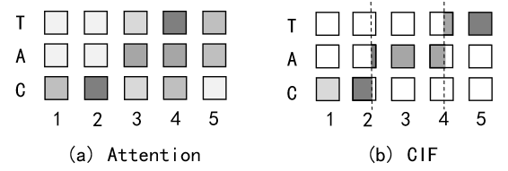
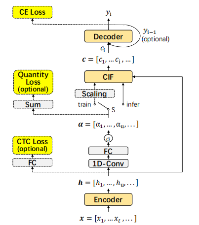
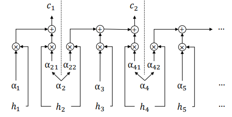

# CIF:用于端到端语音识别的连续积分放电机制

摘要：
- 用于序列转化的软单调对齐机制，灵感来自脉冲神经网络（spiking neural networks ）的积分-放电模型。
- 采用于由连续函数组成的编码器-解码器架构
- 应用于ASR，计算简洁，支持在线识别和声学边界定位
- 提供了几种策略用于缓解CIF模型的独特问题

WER：2.86%（Librispeech）

## 1.简介

基于注意力的端到端模型[1, 2]在每个解码器步骤和每个编码器步骤之间建立软对齐，表现出极好的性能优势。

缺陷：
1. 无法支持在线（或流式）识别，因为它需要参考整个编码序列；
2. 不能很好地为识别结果添加时间戳，因为它不是帧同步的。
3. 关注每个编码器步骤给予解码步骤在声学上无关的步骤带来大量不必要的计算。

目标：寻求一种软对齐，不仅可以执行有效的单调计算，而且可以定位声学边界。从积分-放电模型中找到了灵感 [5, 6]。
积分-放电模型：
1. 前向积分输入信号（例如脉冲列），其膜电位相应变化。
2. 当电位达到特定阈值时，它会发出一个刺激其他神经元的脉冲，并重置其电位

可以发现：
1. 积分-放电过程严格单调。
2. 发出的脉冲可用于声学定位。

建立对齐机制：前向积分声学信号中的信息，一旦定位到边界，即刻发出集成的声学信息以进行进一步识别。

难点：如何使用支持反向传播的连续函数来模拟积分-放电过程。

CIF：单调软对齐，应用于编码器-解码器框架。
- 每个编码器步骤，接收当前编码器步骤的向量表示以及相应缩放权重
- 前向累积权重并整合向量信息，直到达到阈值（到达声学边界）。

此时，该点编码器的声学信息被两个相邻标签共享，CIF将其分为两部分，一部分用于完成当前标签的整合，另一部分用于下一个整合。然后将整合的声学信息发送到解码器以预测当前的标签。

图1示例：长度为标记为“CAT”的编码话语进行注意力对齐(a)和CIF对齐(b)。灰度表示参与计算解码标签的每个编码器标签的每个编码器步骤的权重。(b)中虚线表示定位的声学边界，边界的权重分为两部分，分别用于计算两个相邻标签。

优化策略：
1. 缩放策略：解决交叉熵训练中预测标签和目标标签长度不等的问题。
2. 数量损失：监督模型预测标签的数量更接近目标
3. 尾部处理：处理推理结束时的剩余信息

## 2.相关工作
探讨端到端语音识别模型中的软性和单调对齐的工作：

[8,9]假设对齐是一个适合高斯分布的前向移动窗口；[10]甚至假设其具有启发式规则，其中窗口的中心和宽度由其解码器状态预测。CIF不遵循给定的假设，不使用解码器状态，更多从音频数据中学习模式。

[11,12]需要先使用硬单调注意力决定何时停止再执行软注意力计算的两个独立步骤，[ 13 ]需要CTC训练好的模型在注意力解码前进行预划分。CIF同时进行定位和整合的简洁计算。

[14]提出了自适应计算步骤算法(ACS)，其动机是动态地决定一个帧块来预测一个语言输出。CIF持有不同的动机视角- - "积分与放电"，并以更细的时间粒度建模来处理编码帧内部广泛存在的点火现象。CIF的处理确保了声学信息的充分利用。

## 3.方法

### 3.1 连续积分放电

CIF在编码器-解码器框架中采用软单调对齐。

图2. 我们用于自动语音识别任务的基于CIF的模型架构。虚线矩形中的操作仅在训练阶段应用。CIF模块前的开关（S）在训练阶段连接左侧，在推断阶段连接右侧。

如图2，在每个编码器步骤 $u$ 中，它接收两个输入:
1. 编码器的当前输出： $h_u$ 
2. 当前权重： $\alpha_u$ ，该权重调整 $h_u$ 中包含的信息量。

然后向前累积接收到的权重，并集成接收到的状态，直到累计权重达到给定阈值 $\beta$ ，意味着定位到声学边界。

在该点，当前编码器步骤的信息被当前标签 $y_i$ 和下一个标签共享。CIF将当前权重 $\alpha_u$ 分为两部分：一部分用于在相关编码器步骤上构建完整分布（权重之和为1.0）来完成当前标签 $y_i$ 的集成，另一部分用于下一标签的集成。

之后将集成的嵌入 $c_i$ (以及上下文向量)发送到解码器，预测相应的标签 $y_i$ 。上述过程一直执行到编码末尾。推荐将 $\beta$ 设为1.0。

图三，对编码序列 $h = (h_1, h_2, h_3, h_4, h_5, . . .)$ 上 CIF 的计算进行说明，其中使用了预测权重 $\alpha = (0.2, 0.9, 0.6, 0.6, 0.1, . . .)$ 。集成嵌入 $c_1 = 0.2 ∗ h_1 + 0.8 ∗ h_2$ ， $c_2 = 0.1 ∗ h_2 + 0.6 ∗ h_3 +0.3 ∗ h_4$  。

### 3.2基于 CIF 模型的支持策略

#### 3.2.1 缩放策略

训练中生成的集成嵌入 $c$ 的长度 $S$ 可能与目标 $\tilde{y}$ 的长度 $\tilde{S}$ 不同，交叉熵损失最好一对一。

将计算得到的权重 $\alpha=(\alpha_1,\alpha_2,\dots,\alpha_U)$ 乘以标量 $\frac{\tilde{S}}{\sum_{u=1}^U{\alpha_u}}$ ，得到缩放后的权重 $\alpha'=(\alpha_1', \alpha_2',\dots, \alpha_U')$ ，总和为 $\tilde{S}$ 。
#### 3.2.2 数量损失

可选的损失函数，用于监督基于CIF的模型预测集成嵌入的数量接近目标标签的数量，定义为数量损失：

 $$\mathcal{L}_{QUA}=\left| \sum_{u=1}^U\alpha_{u} - \tilde{S} \right|$$ 
这个损失促进了声学边界定位的学习，还在推断中去除缩放策略后减轻了性能下降。