# **GPT-ST: Generative Pre-Training of Spatio-Temporal** **Graph Neural Networks**

# GPT-ST：时空图神经网络的生成预训练

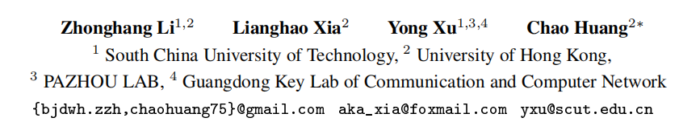

## 摘要

**时空预测技术（spatio-temporal prediction）快速发展

> 时空预测（Spatio-Temporal Prediction）是指对空间和时间上的变化进行预测的过程。这涉及到对特定地点或区域在未来时间内的状态、趋势或事件进行估计。时空预测在许多领域都有应用，包括气象学、地理信息系统（GIS）、环境科学、交通规划、医学等。
>
> 在时空预测中，空间（spatial）通常指地理空间，即不同地点之间的关系。而时间（temporal）则涉及到在不同时间点上的变化和演变。将这两个维度结合起来，可以更全面地理解和预测系统、现象或事件的动态变化。
>
> 时空预测通过使用统计模型、机器学习算法、深度学习等方法来建立模型，通过历史数据来学习时空变化的模式，并用于未来的预测。例如，在气象学中，时空预测可以用于预测未来某地区的温度、降雨量等气象条件。在交通规划中，时空预测可以帮助预测未来某地区的交通流量和拥堵情况。

端到端模型在提高预测性能方面取得了显著成果，整合和扩展存在缺陷。

本文通过引入**时空预训练框架（spatio-temporal pre-training framework）**解决这些问题，该框架与下游基线(downstream baselines)无缝集成并增强其性能。

1. 时空掩码自动编码器(spatio-temporal mask autoencoder)作为学习时空依赖性的预训练模型

	- 定制参数学习器（customized parameter learners）
	- 分层空间式编码网络（hierarchical spatial pattern encoding networks）

这些模块专门设计用于捕获特定时空表示以及聚类内和聚类间区域语义关系

2. 自适应掩码策略(adaptive mask strategy)作为预训练机制的一部分

该策略指导掩码自动编码器(mask autoencoder)学习鲁棒的时空表示，并以从易到难的训练方式促进从聚类内到聚类间的不同关系的建模。

在代表性基准上进行的大量实验证明了方法的有效性。

## 1 介绍

应用背景：智能交通系统（Intelligent Transportation Systems）

时空（ST）预测，包括交通流和乘车需求的预测，旨在预测未来的趋势，有助于交通管理和风险应对的决策，同时提升人们未来出行计划的质量 [43]，深度学习方法如RNN和CNN已广泛应用于建模时空相关性 [5, 51, 50, 45]。

最近，GNN在空间和时间预测任务中引起了关注，并取得了显著的成果。

> 图结构(graph)可用于表示特定领域中数据的底层关系，这些领域包括计算机视觉、数据挖掘、模式识别、分子化学、分子生物学，甚至是自然语言处理领域**。**GNN（Graph Neural Network，图神经网络）旨在利用神经网络来提取图结构中的数据（如属性、特征和模式），以满足诸多任务如分类、预测、生成、聚类、分割的需要。
> 

GNN在时空预测技术的发展
- 根据区域属性（如距离）构建邻接矩阵
- 引入了可学习的图结构来捕捉空间相关性
- 关注区域之间的动态关系，提出了构建动态图的方法

### 尚未解决的问题：

#### 1.  缺乏对特定时空模式的定制表示

定制化分为时间动态（time-dynamic）和节点特定（node-specific)

- 时间动态模式

时间动态模式在不同时间段之间表现出变化，例如在同一地区内工作日与周末之间呈现出截然不同的模式。

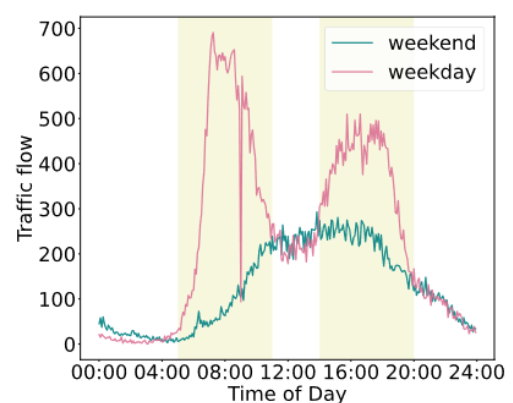

区域之间的相关性会随时间动态演变， 超出静态图表示的能力。

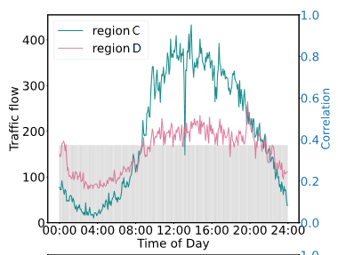

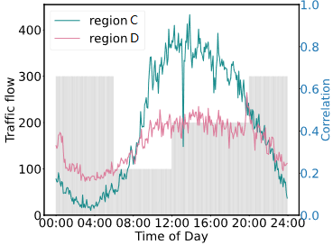

- 节点特定模式

节点特定模式强调不同区域中观察到的独特时间序列，而非共享模式。

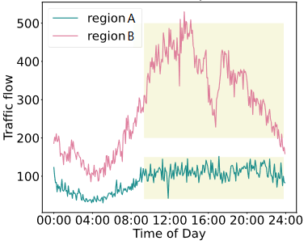

保证不同区域在消息聚合之后仍保留其个体节点特征对于防止空间域中突出节点的干扰至关重要。

#### 2. 对不同层次空间依赖性的考虑不足

大多数方法在建模空间依赖性时主要关注区域之间的成对关联，但忽视了不同空间层次上的语义相关性。在现实世界中，具有相似功能的区域往往呈现出类似的时空模式。 通过对不同区域进行聚类分析，模型可以探索相似区域之间的共同特征，从而促进空间表示学习的改进。

此外，现有研究对于跨时间的高层区域间关系建模不足。不同类型高层区域之间的时空模式可能展示出动态的传递关系。

例如，在工作时间，人们从居住区到工作区域的人流明显增加。

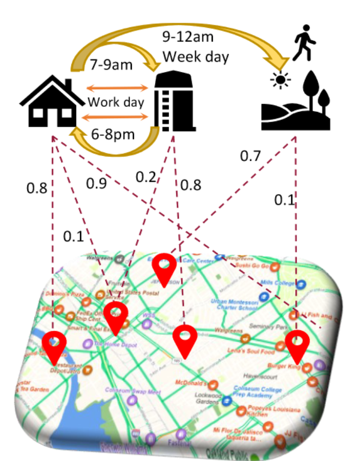

在这种情况下，居住区内的人流变化可以为预测工作区域的人流提供有价值的辅助信号。这凸显了结合不同级别区域之间的细粒度（Fine-grained）和粗粒度（Coarse-grained）相关性以增强时空预测模型的预测能力的重要性。

> 1. **细粒度（Fine-grained）：**
>    - **含义：** 细粒度通常表示在较高的详细程度上对数据或信息进行分析，使得能够区分更小、更具体的特征或属性。
>    - **示例：** 在图像识别中，细粒度可能指的是能够区分相似物体或动物的特定品种或种类。在文本分类中，细粒度可能涉及对于具体细分类别的分类，而不仅仅是一般的大分类。
> 2. **粗粒度（Coarse-grained）：**
>    - **含义：** 粗粒度则表示对数据或信息进行更一般或更高层次的分析，关注的是整体趋势或大致特征，而不是具体的细节。
>    - **示例：** 在经济学中，对不同国家之间的经济相关性进行粗粒度分析可能涉及到国家之间的整体经济趋势，而不是具体的细小经济指标。在软件工程中，粗粒度可能用于描述系统组件之间的整体耦合度，而不考虑每个具体的函数或模块。

一种解决上述挑战的直观方法是开发端到端模型，但是当前的模型各个模块已经完善，任何调整都有可能导致预测性能下降。

预训练框架ChatGPT和MAE提出，它们构建了无监督的训练任务， 涉及掩蔽或其他技术，学习更好的表示并提高下游任务性能。然而，这种可扩展的预训练模型在时空预测领域的应用迄今为止受到限制。

本文提出时空预测生成预训练框架（GPT-ST）。该框架旨在无缝集成到现有的时空预测模型中，从而提高其性能。

贡献如下：

- 提出了一种名为 GPT-ST的全新预训练框架，专为时空预测而设计。该框架可以无缝地集成到现有的时空神经网络中，从而提高性能。将模型参数定制方案与自监督掩蔽自动编码相结合，从而实现有效的时空预训练。
- GPT-ST巧妙地利用分层超图结构从全局角度捕获不同级别的空间依赖关系。通过与精心设计的自适应掩模策略的协作，该模型获得了对区域之间的聚类内和簇=聚类间空间关系进行建模的能力，从而生成鲁棒的时空表示。

> 超图是一种泛化的图结构，包含一组节点和超边。不同于简单图一条边包含两个节点，超边可以包含任意数量的节点。与只能建模对级连接关系的图结构相比，超图在建模复杂关系时具有显著优势。比如说，在一张超图中，节点表示研究者，超边表示多个作者共同署名的文章。这样，研究者之间合作关系越紧密，他们之间的超边就越多。
>
> 超图学习与图学习紧密相关，因为超图是一种泛化的图结构。类似于图学习，超图上的学习也可以看作在超图结构上的信息传播。从这个角度来说，图学习是超图学习的一个特例。不同于图学习，超图学习模型探索数据中的高阶关系，因此有更好的效果。
>
> 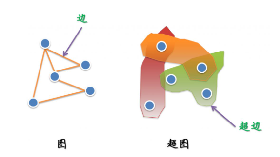

- 对现实世界的数据集进行了广泛的实验，各种下游基线性能的改善展示了 GPT-ST 的卓越性能。

## 2 相关工作

### 深度时空预测技术（Deep Spatio-temporal Prediction Techniques）

许多研究致力于设计深度神经网络用于时空数据预测。

- D-LSTM [49]和GWN [40]分别基于循环神经网络（RNNs）和时域卷积网络（TCNs） 开发了预测框架。

- GMAN [55]和STGNN [36]利用时空自注意力网络促进长距离的时序学习。

- 在空间关系学习中，DMVST-Net [44]采用卷积网络来建模区域关联。

- STGCN [48]和DCRNN [23]利用图神经网络 （GNNs） 进行区域之间的信息传递。 

- STAN [26]基于图注意力网络 （GAT）考虑了区域之间的相互关系。

- 时态图网络作为一种类似的研究基线，旨在推理动态图结构，例如CAWs [37]和PINT [33]。

最近，一些研究探索了ST模型与先进方法的组合，例如基于 Neural-ODE的 [10, 18]和自监督学习的 [24]，以便更好地建模空间和时间依赖关系。

> 神经常微分方程(Neural Ordinary Differential Equations,简称Neural ODE)是一种基于常微分方程
> (Ordinary Differential Equations,ODEs)的深度学习方法,它结合了传统的ODE数值求解技术和神经网络
> 模型。通过使用ODE来建模数据的演化过程,Neural ODE可以自动地学习数据的动力学特征,从而可以进行
> 预测、插值和生成等任务。

与这些工作相比，GPT-ST旨在通过预训练阶段赋予多样的深度时空模型能力。

### 预训练方法（Pre-trainning methods）

近年来，预训练模型取得了显著的进展，包括BERT [ 7、28 ]、Vision transoformers[ 9、8 ]、掩码自编码器(masked autoencoders)[ 15、20]和语言模型[ 3,27,34]。

- 基于自编码器的方法，例如MAE，证明了掩码重建预训练框架的强大表达能力。

- 在此基础上，STEP [31]提出了一种专门用于时间序列预测的预训练模型。

- 在其他领域，CMSF [41]引入了一个用于识别城市村庄的主从框架。主模型预训练区域表示，而从模型对具体区域进行精细调整以实现准确识别。

研究人员还意识到需要比随机掩码更高效的掩码机制。

- AttMask [19]和SemMAE [21]利用注意机制和语义信息来指导掩码操作。
- AdaMAE [2]提出了自适应选择具有更高重构损失（reconstruction loss）的可见信号，因为它们包含更多信息，并相应地使用更高比 例的掩码策略。

尽管预训练模型在NLP和CV领域取得了重大进展，但它们在时空预测领域的应用相对有限。此外，计算效率一直是Transformer架构 的一个主要瓶颈。

### 用于GNN的自监督学习方法(Self-supervised learning methods for GNNs)

近年来，面向图数据的自监督学习方法引起了广泛关注。

基于对比学习的GNNs通过数据增强技术[ 42、29 ]生成原始图的不同视图。然后使用一个损失函数来最大化正样本对的一致性，同时最小化负样本对在不同视图中的一致性。

- GraphCL [ 47 ]通过应用节点删除和边打乱（node dropping and edge shuffling）来生成图的两个视图，并在它们之间进行对比学习。

另一个研究方向聚焦于生成式图神经网络，其中图数据本身作为一种自然的监督信号，通过重构进行表示学习。

- GPTGNN [ 17 ]通过重构图特征和边进行预训练
- GraphMAE [ 16 ]在图编码器和解码器中都利用节点特征掩码来重构特征和学习图表示。

时空预测任务需要同时考虑时间演化模式和空间关联机制。专门针对此类任务设计的预训练范式仍然是一个探索和研究的领域。

## 3 预备

#### **时空数据 X**(Spatio-Temporal Data X)

为了捕获ST信息,将其被表示为三维张量$\textbf{X}\in\mathbb{R}^{R\times T\times F}$，

其中 $R$、$T$ 和 $F$ 分别对应于区域数量、时间片数量和特征维度数量。

 $\textbf{X}_{r,t,f}$ 是第 $t$ 个时间片中第 $r$ 个区域的第 $f$ 个特征。

#### 时空超图

使用时空超图进行时空建模

一个超图 $\mathcal{H} = \{\mathcal{V}, \mathcal{E}, \textbf{H}\}$ 由三个部分组成:

1. 顶点集 $\mathcal{V}=\{v_{r,t}: r\in R, t\in T\}$，每个顶点表示特定时间片 $t$ 中的一个区域 $r$。 
2. $H$ 个超边 $\mathcal{E}=\{e_1,...,e_H\}$，每个超边连接多个顶点以反映区域间的多部分关系（例如，所有住宅区域可以由一条超边连接）。
3. 顶点-超边的连接关系 $\textbf{H}\in\mathbb{R}^{N\times H}$，其中 $N$ 是顶点的数量。为了充分挖掘超图在区域关系学习中的潜力，采用可学习的超图方案，其中 $\textbf{H}$ 是由可训练参数得出的。

#### 时空预训练范式

该模型旨在开发一种预训练的时空表示方法，以提高下游时空预测任务的准确性，例如交通流量预测。

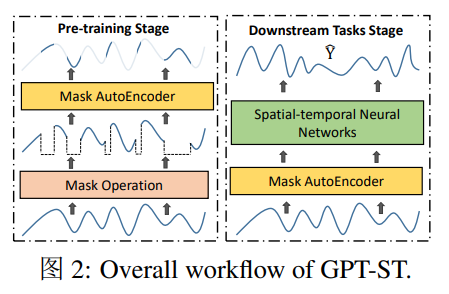

模型框架的流程可以分为预训练阶段和下游任务阶段。

1. 模型框架的预训练阶段采用掩码自编码（MAE） 任务作为训练目标。 这个MAE任务的目标是通过学习一个时空表示函数 $f$ ，根据未被掩码的信息重构被掩码的时空数据。对于时间段 $[t_{K-L+1},t_K]$ 内的训练时空数据，目标是最小化以下目标函数：

$$
\begin{align}
    \mathcal{L}\left((1-\textbf{M}) \odot \textbf{X}_{t_{K-L+1}: t_K}, \textbf{W} \cdot f(\textbf{M} \odot \textbf{X}_{t_{K-L+1}: t_K})\right)
\end{align}
$$

​	其中， $\mathcal{L}$ 表示预测偏差的度量， $\textbf{M} \in \{0,1\}$ 表示掩码张量， $\odot$ 表示逐元素乘法运算。$\textbf{W}$表示预测线性层。

2. 预训练阶段之后，模型结果用于下游任务阶段。预训练模型产生高质量的时空表示，以促进下游的预测任务，如交通预测。具体地，下游阶段被规定为：
   $$
   \begin{align}
       \zeta = f(\textbf{X}_{t_{K-L+1}: t_K});~~~~\hat{\textbf{X}}_{t_{K+1}: t_{K+P}} = g(\zeta, \textbf{X}_{t_{K-L+1}: t_K})
   \end{align}
   $$
   在上述公式中，$\zeta$ 表示 $f$ 根据第 $K$ 个时间段之前的 $L$ 个时间段的历史时空数据生成的表示。输出是对接下来 $P$ 个时间段的预测结果。各种已有的时空神经网络可以作为预测函数 $g$。

## 4 方法

- 定制时间编码器和分层空间编码器，以获取预训练模型的大型建模能力。
- 提出了一种自适应掩码策略，以促进有效的MAE训练。

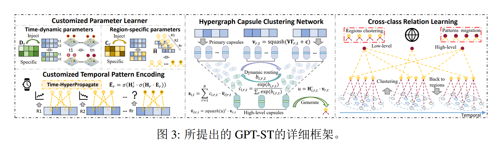

### 4.1定制时间模式编码器（Customized Temporal Pattern Encoding）

**初始嵌入层（Initial Embedding Layer）**：首先构建一个嵌入层来初始化时空数据$\textbf{X}$的表示。原始数据经过Z-Score函数归一化

>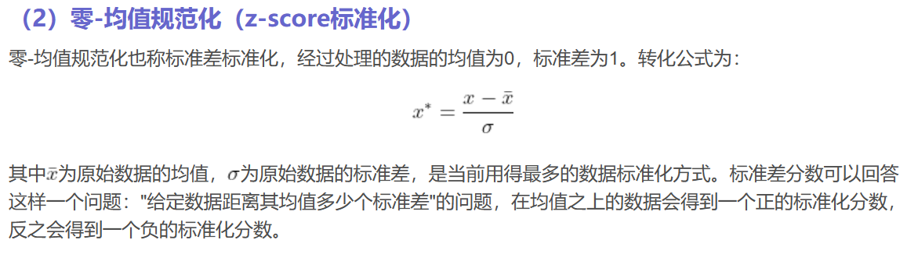

然后使用掩码操作进行屏蔽。随后，应用线性变换来增强表示
$$
\textbf{E}_{r,t} = \textbf{M}_{r,t} \odot \bar{\textbf{X}}_{r,t} \cdot \textbf{E}_0
$$
其中$\textbf{E}_{r,t} \in \mathbb{R}^d$，$\textbf{M}_{r,t} \in \mathbb{R}^F$，$\bar{\textbf{X}}_{r,t} \in \mathbb{R}^F$分别表示第$r$个区域在第$t$个时间段中的表示、掩码操作和归一化的时空数据。变量$d$表示隐藏单元的数量。此外，$\textbf{E}_0 \in \mathbb{R}^{F \times d}$表示$F$个特征维度的可学习嵌入向量。

**时序超图神经网络（Temporal Hypergraph Neural Network）**：为了便于全局关系学习，采用超图神经网络进行时序模式编码
$$
\begin{align}
    \label{eq:hgnnTem}
    \mathbf{\Gamma}_t = \sigma(\bar{\textbf{E}}_t \cdot \textbf{W}_t + \textbf{b}_t + \textbf{E}_t);~~
    \bar{\textbf{E}}_r = \text{HyperPropagate}(\textbf{E}_r) = \sigma(\textbf{H}_r^\top \cdot \sigma(\textbf{H}_r \cdot \textbf{E}_r))
\end{align}
$$
其中$\mathbf{\Gamma}_{t}, \bar{\textbf{E}}_t, \textbf{E}_t\in\mathbb{R}^{R\times d}$分别表示第$t$个时间段的结果、中间和初始区域嵌入。$\textbf{W}_t\in\mathbb{R}^{d\times d}, \textbf{b}_t\in\mathbb{R}^d$代表第$t$个时间段特定的参数。$\sigma(\cdot)$表示**LeakyReLU**激活函数。中间嵌入$\bar{\textbf{E}}\in\mathbb{R}^{R\times T\times d}$通过超图信息传播计算得出。它利用区域特定的超图$\textbf{H}_r\in\mathbb{R}^{H_T\times T}$沿时间段和$H_T$超边之间的连接，传播第$r$个区域的时间嵌入$\textbf{E}_r\in\mathbb{R}^{T\times d}$，以捕捉时间段之间的多部分关系。

> 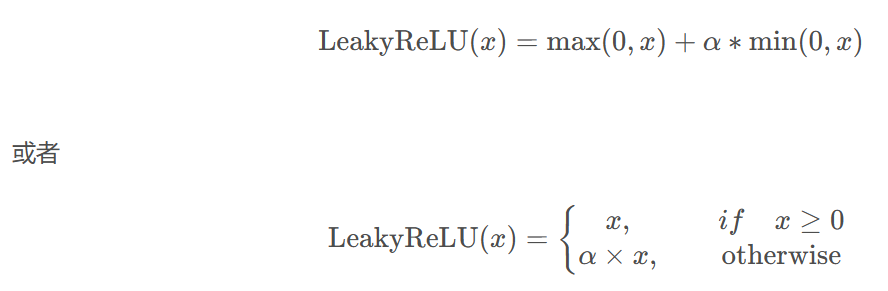
>
> LeakyReLU与ReLU很相似，仅在输入小于0的部分有差别，ReLU输入小于0的部分值都为0，而LeakyReLU输入小于0的部分，值为负，且有微小的梯度。函数图像如下图：
>
> 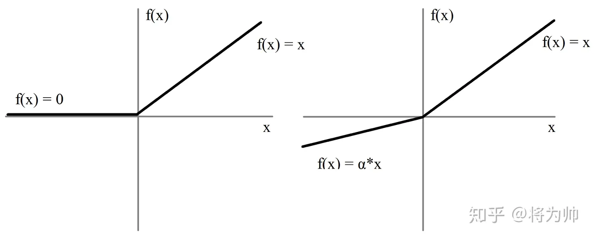
>
> 实际中，LeakyReLU的α取值一般为0.01。使用LeakyReLU的好处就是：在反向传播过程中，对于LeakyReLU激活函数输入小于零的部分，也可以计算得到梯度(而不是像ReLU一样值为0)，这样就避免了上述梯度方向锯齿问题。

**定制参数学习器（Customized Parameter Learner）**：为了描述时间模式的多样性，时间编码器针对不同的区域和不同的时间段进行模型参数定制化。时间特定参数$\textbf{W}_t, \textbf{b}_t$和区域特定超图参数$\textbf{H}_r$是通过可学习的过程生成的，而不是直接使用独立的参数。定制参数的学习过程如下：
$$
\begin{align}
    \label{eq:personalized}
    \textbf{H}_r = \textbf{c}_r^\top \bar{\textbf{H}};~~~\textbf{W}_{t} = \textbf{d}_t ^ \top \bar{\textbf{W}};~~~\textbf{b}_t = \textbf{d}_t^\top \bar{\textbf{b}};~~~\textbf{d}_t=\text{MLP}(\bar{\textbf{z}}^{(d)}_t \textbf{e}_1 + \bar{\textbf{z}}^{(w)}_t \textbf{e}_2)
\end{align}
$$
其中，$\bar{\textbf{H}}\in\mathbb{R}^{d'\times H_T\times T}, \bar{\textbf{W}}\in\mathbb{R}^{d'\times d\times d}, \bar{\textbf{b}}\in\mathbb{R}^{d'\times d}$ 分别是生成的三个参数的独立参数。 $\textbf{c}_r, \textbf{d}_t\in\mathbb{R}^{d'}$ 分别表示第$r$个区域和第$t$个时间段的表示。 对于$r\in R$，$\textbf{c}_r$是自由形式的参数，而对于$t\in T$，$\textbf{d}_t$是根据归一化的时间特征$\bar{\textbf{z}}_t^{(d)}$和星期几（具体星期几，day-of-week）特征$\bar{\textbf{z}}_t^{(w)}$计算得到的。 $\textbf{e}_1, \textbf{e}_2\in\mathbb{R}^{d'}$ 是它们对应的可学习嵌入。参数学习器通过根据特定时间段和区域的特征生成参数来实现空间和时间的定制化。

### 4.2分层空间模式编码（Hierarchical Spatial Pattern Encoding）

#### 4.2.1超图胶囊聚类网络（ Hypergraph Capsule Clustering Network）

现有的空间编码器主要关注捕捉局部相邻区域的关系，而忽略了远距离区域之间存在的广 泛相似性。例如，地理上相隔较远的商业区仍然可以呈现相似的时间模式。

- 模型引入了一个超图胶囊聚类网络来捕捉全局区域之间的相似性。该网络明确地学习多个聚类中心作为超边，刻画了全局区域之间的相似性。
- 为进一步增强超图结构的学习，融入了胶囊网络的动态路由机制。该机制通过语义相似性迭代更新超边的表示和区域-超边的连接。结果是提高了超边的聚类能力，并促进了对区域之间依赖关系的全局建模。

具体来说，我们首先使用之前的嵌入 $\mathbf{\Gamma}_{r,t}$ 和 squash 函数，对每个时间段 $t$ 中的每个区域 $r$ 获得一个归一化的区域嵌入 $\textbf{v}_{r,t}\in\mathbb{R}^d$。然后，在第 $t$ 个时间段内使用这个嵌入计算每个区域 $r$ 到每个聚类中心（超边） $i$ 的转移信息 $\bar{\textbf{v}}_{i|r,t}\in\mathbb{R}^d$。具体地，这两个变量的计算如下：
$$
\begin{align}
    \label{eq:squash}
    \textbf{v}_{r,t} = \text{squash}(\textbf{V} \mathbf{\Gamma}_{r,t} + \textbf{c});~~ \bar{\textbf{v}}_{i|r,t} = \text{squash}(\textbf{H}'_{i,r,t} \textbf{v}_{r,t})\odot \textbf{v}_{r,t};~~
    \text{squash}(\textbf{x}) = \frac{\|\textbf{x}\|^2}{1+\|\textbf{x}\|^2} \frac{\textbf{x}}{\|\textbf{x}\|}
\end{align}
$$
其中$\textbf{V}\in\mathbb{R}^{d\times d}$和$\textbf{c}\in\mathbb{R}^d$是自由形式的可学习参数。超图连接矩阵$\textbf{H}'_t\in\mathbb{R}^{H_S\times R}$记录了$R$个区域和$H_S$个超边之间的关系，即聚类质心。它根据前述的定制参数学习器来适应第$t$个时间段，具体地说，是通过$\textbf{H}'_t=\text{softmax}(\textbf{d}_t^{'\top} \bar{\textbf{H}}')$来实现的。其中，$\textbf{d}_t'$和$\bar{\textbf{H}}'$是时间特征和超图嵌入。

##### 迭代超图结构学习（Iterative Hypergraph Structure Learning）

在初始化区域嵌入$\textbf{v}_{r,t}$和超图连接嵌入$\bar{\textbf{v}}_{i|r,t}$之后，我们按照胶囊网络的动态路由机制来增强超边的聚类效果。第$j$次迭代如下所示：
$$
\begin{align}
    \textbf{s}_{i,t}^j = \textstyle \sum_{r=1}^R c_{i,r,t}^j \bar{\textbf{v}}_{i|r,t};~~~c_{i,r,t}^j = \frac{\exp(b_{i,r,t}^j)}{\sum_{r}\exp(b_{i,r,t}^j)};~~
    b_{i,r,t}^j = b_{i,r,t}^j + \textbf{v}_{r,t}^\top ~ \text{squash}(\textbf{s}_{i,t}^{j-1})
    \label{eq:agg}
\end{align}
$$
其中$\textbf{s}_{i,t}\in\mathbb{R}^d$表示迭代的超边嵌入。它是利用迭代超边-区域权重$c_{i,r,t}\in\mathbb{R}$计算得到的。权重$c_{i,r,t}$从上一次迭代的超边嵌入$\textbf{s}_{i,t}$计算而来。通过这个迭代过程，关系分数和超边表示相互调整，以更好地反映区域和由超边表示的空间聚类中心之间的语义相似性。

在动态路由算法的迭代之后，为了更好地学习区域-超边关系，GPT-ST将$b_{i,r,t}$和$\textbf{H}'_{i,r,t}$两组权重结合起来生成最终的嵌入$\bar{\textbf{s}}_{i,t}\in\mathbb{R}^d$。首先将$b_{i,r,t}$替换为$(b_{i,r,t} + \textbf{H}'_{i,r,t})$，得到一个新的权重向量$\bar{c}_{i,r,t}\in\mathbb{R}$，然后利用$\bar{c}_{i,r,t}\in\mathbb{R}$计算最终的嵌入$\bar{\textbf{s}}_{i,t}$。

#### 4.2.2 跨聚类关系学习（Cross-Cluster Relation Learning）

在具有聚类嵌入$\bar{\textbf{s}}_{i,t}$的基础上，使用高级超图神经网络对聚类间关系进行建模。具体而言，通过在$H_S$个聚类中心和$H_M$个高级超边之间进行信息传递，计算出细化的聚类嵌入$\hat{\textbf{S}}\in\mathbb{R}^{H_S\times T\times d}$：
$$
\begin{align}
    \label{eq:high-level_hypergraph}
    \hat{\textbf{S}} = \text{HyperPropagate}(\tilde{\textbf{S}}) = \text{squash}(\sigma(\textbf{H}^{''\top} \cdot \sigma(\textbf{H}'' \cdot \tilde{\textbf{S}})) + \tilde{\textbf{S}})
\end{align}
$$
其中，$\tilde{\textbf{S}}\in\mathbb{R}^{H_ST\times d}$表示从$\bar{\textbf{s}}_{i,t}$得到的重塑嵌入矩阵，其中$i\in H_S$，$t\in T$。$\textbf{H}''\in\mathbb{R}^{H_M\times H_ST}$表示高层超图结构，是通过上述定制参数学习器获得的。参数定制学习器将所有$t\in T$的时间特征$\bar{\textbf{z}}^{(d)}_t, \bar{\textbf{z}}^{(w)}_t$作为输入并生成参数。

在对于$i\in H_S, t \in T$的聚类嵌入$\hat{\textbf{s}}_{i,t}\in\mathbb{R}^{d}$进行改进后，我们通过低层超图结构将聚类嵌入传播回区域嵌入，具体如下：
$$
\begin{align}
    \mathbf{\Psi}_{r,t} = \sigma(\textstyle \sum_{i=1}^{H_S} c_{i,r,t} \cdot \hat{\textbf{s}}_{i,t} \textbf{W}''_r + \textbf{b}_r'' + \mathbf{\Gamma}_{r,t})
    \label{eq:c2r}
\end{align}
$$
其中，$\mathbf{\Psi}_{r,t}\in\mathbb{R}^d$ 表示第 $t$ 个时间节中第 $r$ 个区域的新区域嵌入。$c_{i,r,t}\in\mathbb{R}$ 表示低层超图胶囊网络的权重。$\textbf{W}_r''\in\mathbb{R}^{d\times d}$ 和 $\textbf{b}_r''\in\mathbb{R}^d$ 表示由定制参数学习器生成的区域特定的转换和偏置参数。

### 4.3聚类感知掩码机制（Cluster-aware Masking Mechanism）

受语义引导的MAE [21]的启发，设计了一种聚类感知的屏蔽机制，以增强聚类内和聚类间的关系学习。自适应掩码策略结合了前面学到的聚类信息$\bar{c}_{i,r,t}$。在训练开始时，我们随机掩码每个聚类的部分区域，这种情况下，被屏蔽的数值可以通过参考具有相似时空模式的聚类内区域来轻松预测。随后，逐渐增加特定类别的掩码比例，通过减少相关信息来增加这些聚类的预测难度。最后，完全掩码某些聚类的信号，促进预训练模型的聚类间知识传播能力。

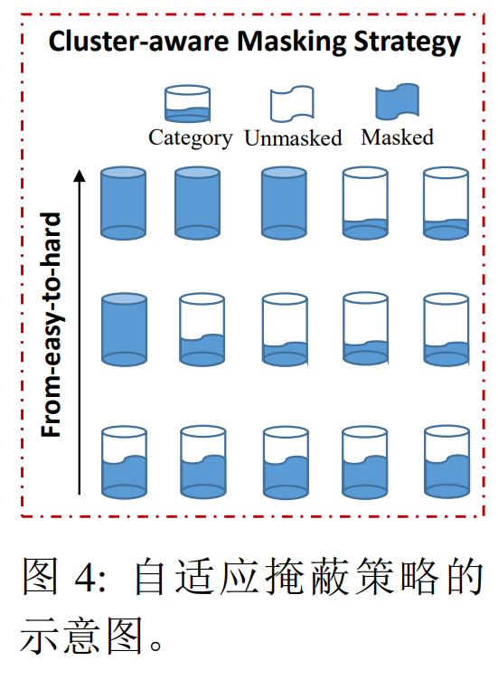

然而，直接利用学习到的聚类信息$\bar{c}_{i,r,t}$生成考虑聚类的掩码$\textbf{M}$是不可行的。因为聚类信息是由模型的深层网络计算得出的，而生成的掩码需要作为输入提供给网络($\textbf{M}\odot{\textbf{X}}$)。为了解决这个问题，采用了双层MLP网络，其中的转换与偏置向量被时间动态和节点特定参数所取代，这些参数由定制参数学习器生成。随后，使用一个线性层和$\text{softmax}(\cdot)$函数来获得预测值$q_{i,r,t}\in\mathbb{R}$，其中$i\in H_S, r\in R, t\in T$。为了优化$q_{i,r,t}$的分布，利用KL散度损失函数$\mathcal{L}_{kl}$与真实值$\bar{c}_{i,r,t}$。需要特别注意的是，在这一步中阻止$\bar{c}_{i,r,t}$的反向传播。根据$q_{i,r,t}$的最大概率，将其所属类别作为分类结果。

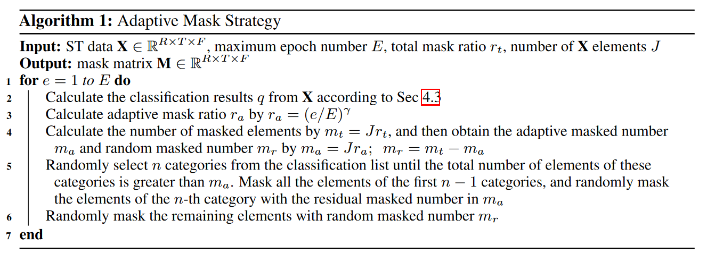

## 5 评估

通过回答以下五个问题来验证GPT-ST的有效性：

- 研究问题 1：预训练框架GPT - ST在不同的时空预测任务上的预测精度如何受益于不同的下游基线方法?
- 研究问题 2：GPT - ST框架的技术模块的有效性如何?
- 研究问题 3：GPT - ST框架的层级空间模式编码中，学习到的全局区域据点和聚类间转移模式的解释能力如何
- 研究问题 4:   GPT - ST在预训练阶段和下游任务阶段的效率如何?
- 研究问题 5：改变掩码率设置对GPT - ST的性能有何影响?

### 5.1 实验设置

为了评估有效性，在四个真实世界的时空数据集上进行了实验：$\textbf{PEMS08}，\textbf{METR-LA}，\textbf{NYC Taxi}和\textbf{NYC Citi Bike}$。

它们分别记录了交通流量、交通速度、出租车订单记录和自行车订单记录。

选择平均绝对误差（MAE）、均方根误差（RMSE）和平均绝对百分比误差（MAPE）作为评估指标，这些指标在时空预测任务中被广泛使用。指标值越低，模型性能越好。根据以前的工作，时间段数$L$被设置为12。我们将METR-LA数据集分为训练集、验证集和测试集，比例为7:1:2；其他数据集的比例为6:2:2。最终的模型参数根据验证集的最佳效果（最小的MAE值）进行选择。

对于优化，在预训练阶段，使用绝对误差损失函数$\mathcal{L}_r$来优化参数，并采用超参数$\lambda$来平衡$\mathcal{L}_r$和$\mathcal{L}_{kl}$的权重。在下游任务阶段，我们首先将嵌入矩阵$\zeta$和原始信号$\textbf{X}$进行融合，作为下游模型的输入，而不同的下游模型采用不同的优化策略。

### 5.2 主要结果(RQ1)

评估了四个数据集上不同基线的原始性能和增强性能，需要注意的是，由于DMVSTGCN、STMGCN和CCRNN专门设计用于需求预测，我们在交通预测任务中将它们排除在外。

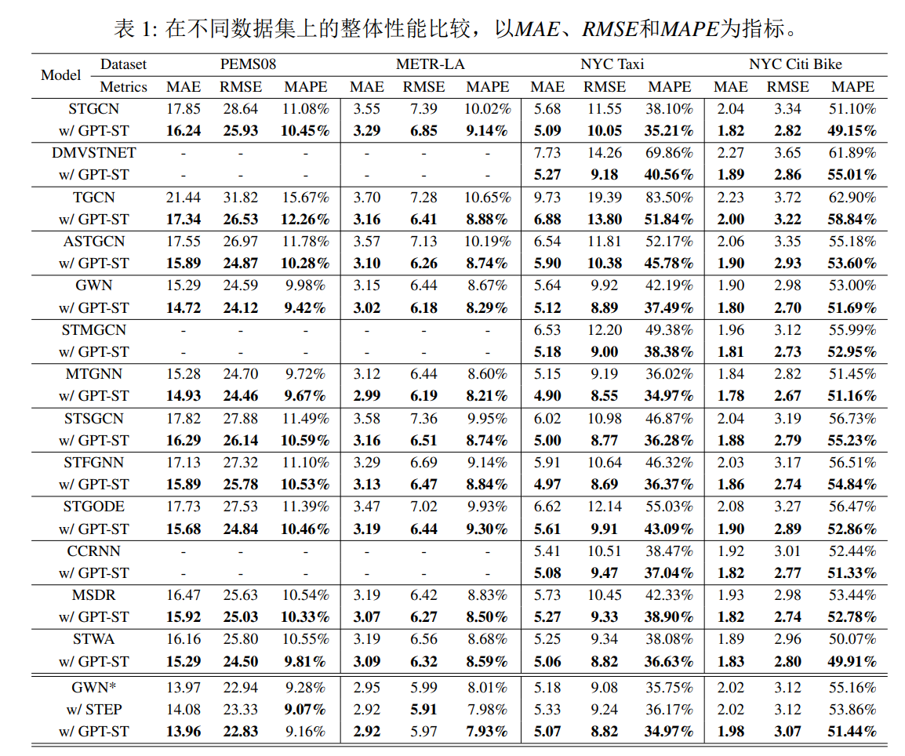

结果表明，所提出的模型显著改善了不同基线在所有数据集上的预测性能，证明了框架的有效性。从三个维度分析促进效果：

- **一致的改进效果**:GPT - ST改进了不同类型的方法(例如,基于GNN的模型,或者基于注意力的模型)，并且这种积极效果并不偏向于某一类基线，这验证了GPT - ST的泛化能力。作者将这种改进归因于具有聚类内和聚类间ST关系意识的MAE预训练。
- **基准模型之间的差异**:与最近提出的方法(如MSDR )相比，GPT - ST在应用于经典的基线(如STGCN )时表现出更大的改进。具体地，在使用PEMS08数据集的交通流量预测中，MSDR在MAE、RMSE和MPAE上分别提高了0.55、0.60和0.21 %，而STGCN在MAE、RMSE和MPAE上分别提高了1.61、2.71和0.63 %。对这些发现的一个可能的解释是，像MSDR这样的高级基线在建模各种因素方面已经设计得很好和全面。因此，他们能够独立地编码丰富的知识，这可能会减少预训练模型提供的额外信号的效用。相反，像STGCN这样的经典基线可能会从GPT-ST中获得更大的好处.
- **与预训练方法的比较**:与预训练基线STEP进行了比较。该方法利用长期时间序列作为预训练的输入，以增强下游模型( GWN )的性能。GPT - ST在预训练阶段只使用了短期数据，但它在几个指标上优于STEP。此外，GPT - ST在长期数据不足的场景中表现出更大的性能优势，例如出租车和自行车需求预测任务。这突出了GPT - ST框架的更广泛的适用性，强调了其在各种环境中的能力。

### 5.3 模型消融实验(RQ2)

研究了GPT-ST中主要组成部件的影响。为了评估不同组件的影响，重新训练多个删减模型，并使用新预训练的删减模型评估下游方法的性能。将GWN用作下游方法，并使用METR-LA和NYC Taxi两个数据集进行评估。

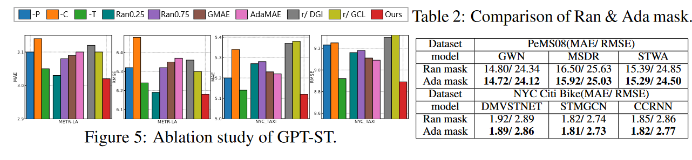

- **基本组件的影响**：i) -P. 移除模型中的定制参数学习器。 ii) -C. 禁用超图胶囊聚类网络以取消聚类操作。在这种情况下，空间超图 NN 直接在细粒度区域上工作。 iii) -T. 通过移除高层空间超图来使交叉聚类关系学习未被探索。明显的性能衰减表明了所有三个组件带来的正面效益，表明生成定制的 ST 参数和建模聚类内和聚类间 ST 依赖关系能够有效地捕捉复杂的 ST 关联以提升预测效果。在这三个组件中，移除超图胶囊聚类网络导致了最显著的性能下降。这是因为聚类结果在许多其他组件中也起着重要作用，包括交叉聚类依赖关系和聚类感知自适应掩码。
- **掩码机制的影响**：i) Ran0.25和Ran0.75. 分别用掩码比例为0.25（与GPT-ST相同的掩码比例）和0.75（MAE [15]和STEP [31]中使用的掩码比例）替换了自适应掩码策略。结果一致表明，GPT-ST的掩码策略优于随机掩码策略。这可以归因于GPT-ST掩码策略有效地促进了GPT - ST对聚类内和聚类间关系的学习，从而产生了高质量的表示。 ii) GMAE和AdaMAE. 将GPT-ST与GraphMAE [16]和AdaMAE [2]的掩码策略提出的两个变体进行了比较。两个变体的性能均不如我们的方法，突显了在掩码策略中考虑空间和时间模式的重要性。这进一步证实了GPT-ST的自适应掩码策略利用聚类信息影响力更大。
- **预训练策略的影响**：为了进一步考察掩码重建预训练方法在时空预训练中的有效性，将其与其他预训练方法进行比较：local-global infomax 和 contrastive pre-training。

> - 互信息最大化 Mutual Information Maximization
>
> 互信息最大化使用全局特征和局部特征作为不同的视图。
>
> 以经典工作Deep InfoMax[1]为例。一张图片经过卷积网络会得到一个M x M大小的特征图，再经过一个全局池化层会得到一个一维的特征。互信息最大化的目标是使得同一张图片的任意局部特征（特征图上任意一个位置的特征）与全局特征之间的距离尽可能近，从而达到一叶知秋的效果（只看到狗的鼻子就知道某张图片是狗的照片，而不是负样本猫的照片）。
>
> - 对比式预训练 Contrastive Pre-training
>
> 对比式预训练的核心想法是学习如何区分不同的数据。
>
> 日常生活中我们会进行大量类似的训练，比如区分你每天接触到的人。尽管他们每天的打扮都不同，但是大部分时候你可以只通过他们的外表、动作甚至背影就判断出他的名字。
>
> 大部分对比学习预训练方法都可以归结为以下几步：
>
> 1. 对于任意一个数据 X，构造它的两个视图，查询视图Xq和键值视图Xk 
>
> 1. 使用编码器encoder将不同的视图映射到低维的特征空间，使用解码器decoder将这些特征映射到度量空间
> 2. 优化编码器和解码器，使得在度量空间中，同一个数据的不同视图之间的距离尽可能近
> 3. 将预训练得到的编码器作为下游任务的特征提取器

使用DGI [ 35 ]和GraphCL [ 47 ]作为基线，它们是GNNs广泛认可的预训练策略。

通过使用这些方法(记为' r / ')替换GPT - ST的预训练策略，观察到与没有预训练的模型相比，性能有所改善。

可以得到GPT-ST利用掩码重构任务取得了最显著的性能提升。这可以归因于掩码重构任务与下游回归任务之间的更高相关性，从而更有效地学习时空表示。此外，我们的自适应掩码策略通过增加预训练任务的难度，在促进模型学习鲁棒的时空表示中起着至关重要的作用。

### 5.4 聚类效果(RQ3)

通过分析由超图胶囊聚类网络（HCCN） 生成的嵌入来评估其可解释性。

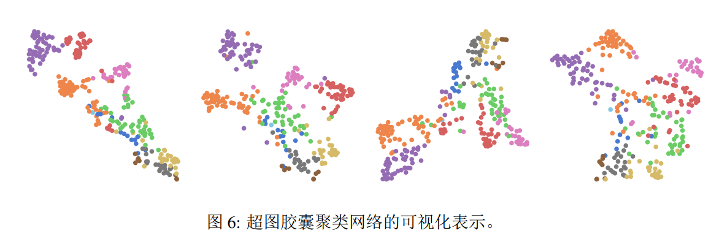

使用 T-SNE 算法将 HCCN 生成的高维嵌入可视化为二维向量。每个类别由不同的颜色表示，对于超参数 $H_S$，定义了 10 个类别。区域聚类是基于属于不同类别的概率来确定的。在检查可视化的嵌入时，同一类别的区域在一个有限的空间内呈紧密聚类，这提供了超图胶囊聚类网络强大聚类能力的经验证据。

在另一份基于METR-LA数据集的案例研究中，体现了由超图胶囊聚类网络派生的聚类内区域关系以及由跨聚类超图网络获得的跨聚类依赖关系。

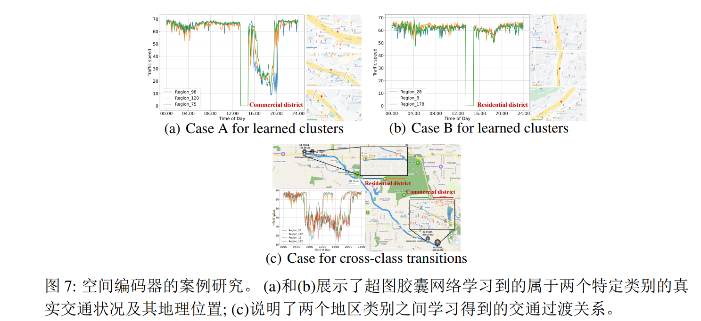

图7 ( a )和图7 ( b )所示，同一类别中的前3个区域表现出相似的交通模式，表明具有共同的功能。例如，靠近商业区( 7 ( a ) )的区域出现晚高峰，而靠近居民区( 7 ( b ) )的区域则保持相对稳定。这些观察与真实世界的情景相吻合。图7 ( c )分析了在特定时间段内经历了交通模式转变的两类中的前2个区域，同时在跨类转换中共享类似的超边权重。结果表明，发生模式转变的区域表现出不同的交通模式，同时在较短的驾驶距离内保持紧密的相互联系。这些发现进一步证明了跨聚类迁移学习能够捕获区域之间的语义级关系，反映了真实世界的交通场景。这些优势有助于GPT - ST框架中生成高质量的表示，从而提高下游任务的性能。

### 5.5 模型效率研究（RQ4）

本节评估模型效率，测量了PEMS08数据集上所有方法的每个epoch的训练时间。

所有实验在配备GTX 3090 GPU和Intel Core i9-12900K CPU的系统上进行。除标记为' b8 '的方法外，所有方法的batch size均设置为64 (其中' b8 '表示batch size为8)。

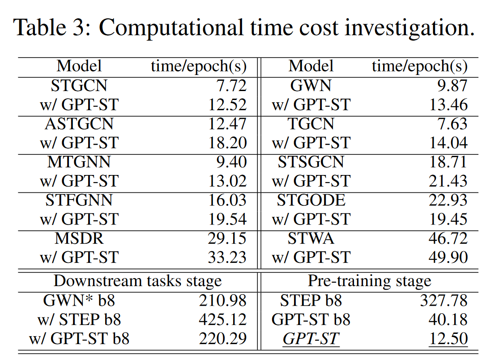

- 大多数基准方法在得到GPT-ST增强后训练效率略有降低，但它们的性能得到了显著改进。 
- STEP在预训练阶段和下游任务阶段都会产生大量的时间开销，而GPT - ST以轻量级的方式增强了现有的基线。这些案例表明，GPT-St框架在性能和训练效率方面实现了双赢，使其非常适合实际应用。

### 5.6 模型超参数实验( RQ5 )

为了考察不同超参数对GPT-ST的影响，以GWN为下游模型，在NYC Taxi数据集上进行参数实验。评估指标以相对值的形式绘制。

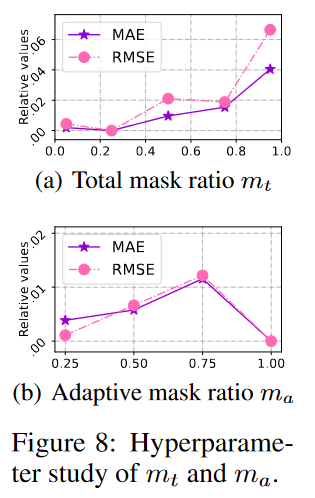

- 总掩码比例$r_t$设置为0.25时达到了最优效果。超过该值后增加掩码比例并不能提高模型学习更好表示的能力；反而导致了预测性能的下降。
- 进一步，探究了自适应掩码比例$r_r$的影响，它决定了完全被掩码的聚类的数量，从而影响整个训练过程。当自适应掩模比例设置为1时，获得了最好的性能。这表明这种特定的配置增强了模型对区域关系的学习能力。

## 6 结论

在本研究中，GPT-ST引入了一种针对时空预测任务量身定制的可扩展和有效的预训练框架。框架始于一个基础的预训练模型，着重捕捉时空依赖关系。它利用定制参数学习器和分层超图网络来提取特定的时空特征和区域间的语义关联。为了进一步提高模型的性能，GPT-ST引入了自适应掩码策略。该策略在预训练阶段考虑聚类内和聚类间关系，指导模型学习推理能力。GPT-ST在四个真实世界数据集上进行了大量实验，证明了GPT-ST在不同的时空任务中提升下游基线性能的有效性。

## 附录 

参数学习器算法：
输入：时空数据 $X∈R^{R × T × F}$ ，掩码矩阵 $M∈R^{R × T × F}$ ，动态路由迭代次数R，最大历元数E，学习率η

输出：训练好的参数

1.初始化Θ中的所有参数

2.根据式( 10 )计算近似分类结果q，生成掩码矩阵M

![[GPT-ST/Pasted image 20240409173057.png]]
在给定的公式中， $W^p_r$ 和 $b^p_r$ 表示区域参数，而 $W^p_t$ 和 $b^p_t$ 是时间动态参数。预测q由Q通过线性层和softmax函数得到。

3.用M对X中的元素进行掩码，然后计算每个时间段每个区域的掩码交通数据的初始表示E

4.根据式( 4 )计算原始时间特征 $d_t$ ，初始化自由区域嵌入矩阵 $c_r$
![[GPT-ST/Pasted image 20240409174009.png]]
5.将自定义参数 $d_t$ 和 $c_r$ 集成到时序超图神经网络中，用Γ对时序交通模式进行编码
![[GPT-ST/Pasted image 20240409175235.png]]

6.生成归一化区域嵌入 v,计算从每个区域r到每个聚类中心（超边）i的传递信息
![[GPT-ST/Pasted image 20240409175553.png]]

7.执行动态路由算法来表征区域（低级胶囊）和空间聚类中心（高级胶囊）之间的语义相似性
![[GPT-ST/Pasted image 20240409175646.png]]

8.生成最终的聚类嵌入 $\overline{s}$ 用于跨类关系学习

9.生成个性化的高级超图结构，并将其应用于重塑的嵌入 $\widetilde{s}$ 上，生成 $\hat{s}$ 根据方程 7 来建模类间关系
![[GPT-ST/Pasted image 20240409180024.png]]
10.根据方程 8 进行定制的低级超图结构，将聚类嵌入 $\hat{s}$传播回区域嵌入 Ψ
![[GPT-ST/Pasted image 20240409180148.png]]

11.进行预测 $\hat{Y}$ 并根据式 9 计算绝对误差损失 $L_r$
![[GPT-ST/Pasted image 20240409180235.png]]

12.计算 KL 散度
![[GPT-ST/Pasted image 20240409180330.png]]

13.计算最终损失L
![[GPT-ST/Pasted image 20240409180350.png]]

14.最后使用梯度下降方法得到最终的参数
