# LLM体现出时空概念

## 摘要：

LLM是学习了大量的表面数据还是生成了一个连贯的数据模型——世界模型。

研究团队通过Llama2族模型分析三个空间数据集（世界，美国，纽约地标），三个时间数据集（历史名人，影视作品，新闻），发现LLM学习的是多个尺度的时间和空间的线性表示。

这些表示对于提示的变化具有鲁棒性，并在不同实体类型中统一。

研究团队识别了编码空间和时间的空间神经元和时间神经元。

分析表明，LLM学会的是关于时空维度的结构化知识，表明LLM是字面意义上的世界模型。

## 1.介绍

### 1.1假设

一种假设：LLM在大量文本训练下，学习了相关性，但缺乏连贯的模型和对底层数据的过程理解。

另一种假设：LLM压缩数据过程中，学习到了数据背后更紧凑，更连贯，更可解释的”世界模型“

### 1.2研究现状

有研究表明用下一个Token预测训练的Transformer学会了棋盘游戏Othello显式的游戏表示，并且表示是线性的。LLM追踪的是文本中主体的布尔值，在空间和颜色上反映出感知结构和概念结构。

### 1.3数据集

空间数据集：世界地点， 美国地点，纽约城地点

时间数据集：3000年来历史人物的逝世年，20世纪50年代以来艺术与娱乐的发布日期，2010 - 2020年新闻标题的发布日期

### 1.4实验方法

在每一层对这些地点和时间的名称的内部激活训练线性回归探针，预测它们在真实世界中的坐标或时间

### 1.5实验结果

探针实验表现出模型在中期停滞前在早期层就建立空间和时间表征，并且大的模型效果由于小的模型。

实验证明：

1.这些表示是线性的（非线性探针效果差）
2.对提示有很强的鲁棒性
3.统一于不同种类的实体（例如城市和自然地标）

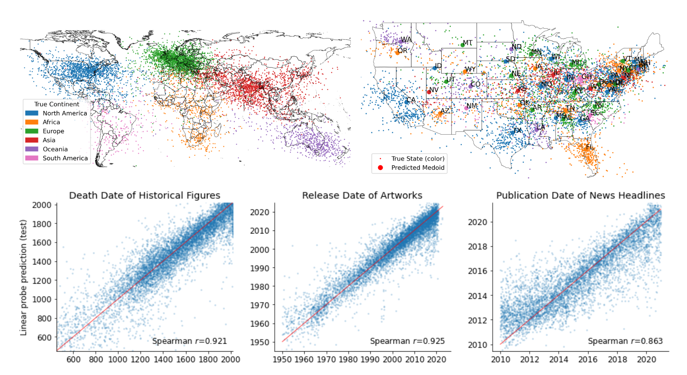

Llama-2-70b的时间和空间模型，每个点都是一个时间或地点最后一个标记投影在第50层上用学习到的线性探针方法激活。

验证是否是模型只学了映射，而实际是探针学习了时空分布。

验证实验：

1.探针如何在不同数据分步中生成的

2.探针用PCA形式训练如何表现

> PCA（Principal Component Analysis） 是一种常见的数据分析方式，常用于高维数据的降维，可用于提取数据的主要特征分量。

结论：探针记忆了绝对定位，模型体现了相对定位。探针学习的是模型坐标到人类理解的坐标的映射。

最后使用了探针找到了激活时空功能的”神经元“，证明模型使用了这些特征。

## 2.实证概述

### 2.1时空原始数据集

构建了六个实体数据集，在时间上有各自的位置以及有不同的数量级规模。

每个数据集包括多种实体（例如人密集的地方和自然景点），研究如何统一表示不同的对象类型。

维护和丰富了元数据，以便更详细的分析数据，找出训练-测试泄漏的来源，并支持未来在 LLM 中进行知识召回的工作。

> **知识召回**：在多轮场景中，需要先整合当前问题和对话历史，然后对当前问题进行改写，使其成为一个独立问题，再进行知识检索。

还尝试去重和过滤模糊或嘈杂的数据。

#### 空间：

世界，美国，纽约（主要来自DBpedia）

特别对人口聚居地、自然地和建筑物进行查询，与维基匹配筛选出3年内少于5000浏览量的实体。

#### 时间：

(1)公元前1000年至公元2000年之间去世的历史人物的姓名和职业

(2)1950 - 2020年歌曲、电影、书籍的标题和创作者

(3)《纽约时报》2010 - 2020年的新闻标题

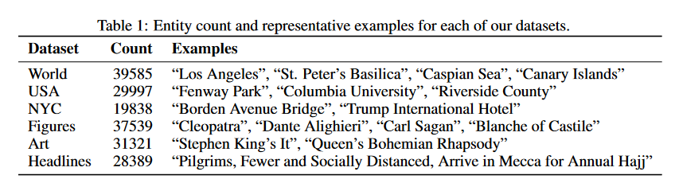

### 2.2模型和方法

#### 数据准备：

使用基本的Llama-2系列模型，参数从70亿到700亿。

通过模型运行每个实体名称，预设了一个简短的提示，保存每层最后一个实体标记的隐藏状态（残差流）的激活。对于一组 n 个实体，每一层都会产生一个 $n × d_{model}$ 激活数据集。

#### 探针：

使用标准探针技术（standard technique of probing）

> #### 使用线性分类器探针理解中间层—Understanding intermediate layers using linear classifier probes
>
> 通过在每个隐层中添加一个线性探针来测试隐层的表征性能。线性探针：以每个隐藏层为输入，判别的label为输出建立一个逻辑回归模型，通过评估模型的准确率得到隐层在整个训练过程中以及训练结束之后表征性能的变化。

它对网络激活拟合一个简单的模型来预测与有标签输入数据相关的一些目标标签。

给定激活数据集$A\in \mathbb{R}^{n\times d_{model}}$

目标$Y$，包含时间或者二维经纬度坐标

拟合线性回归探针
$$
\hat{W}=\underset{W}{arg\ min}||Y-AW||^2_2+\lambda||W||^2_2=(A^TA+\lambda I)^{-1}A^TY
$$
得到线性预测器$\hat Y=A\hat W$.

样本外数据的高预测性能表明基础模型的表征中具有可线性解码的时间和空间信息，但并不意味模型实际使用了这些表征。

使用留一法交叉验证（Leave-One-Out Cross-Validation）调整$\lambda$。

> #### **交叉验证的种类**
>
> 根据切分的方法不同，交叉验证分为下面三种
>
> **第一种是简单交叉验证**
>
> 首先，随机的将样本数据分为两部分（比如： 70%的训练集，30%的测试集），然后用训练集来训练模型，在测试集上验证模型及参数。接着再把样本打乱，重新选择训练集和测试集，继续训练数据和检验模型。最后选择损失函数评估最优的模型和参数。
>
> **第二种是K折交叉验证（K-Fold Cross Validation）**
>
> 和第一种方法不同，K折交叉验证会把样本数据随机的分成 K份，每次随机的选择K−1份作为训练集，剩下的1份做测试集。当这一轮完成后，重新随机选择 K−1份来训练数据。若干轮（小于 K）之后，选择损失函数评估最优的模型和参数。
>
> **第三种是留一交叉验证（Leave-one-out Cross Validation）**
>
> 它是第二种情况的特例，此时 K等于样本数 N，这样对于 N个样本，每次选择 N−1个样本来训练数据，留一个样本来验证模型预测的好坏。此方法主要用于样本量非常少的情况，比如对于普通适中问题，N小于50时，一般采用留一交叉验证。

### 2.3评估

1.测试数据的标准回归指标,如$R^2$和斯皮尔曼等级相关系数(Spearman rank correlation)

> 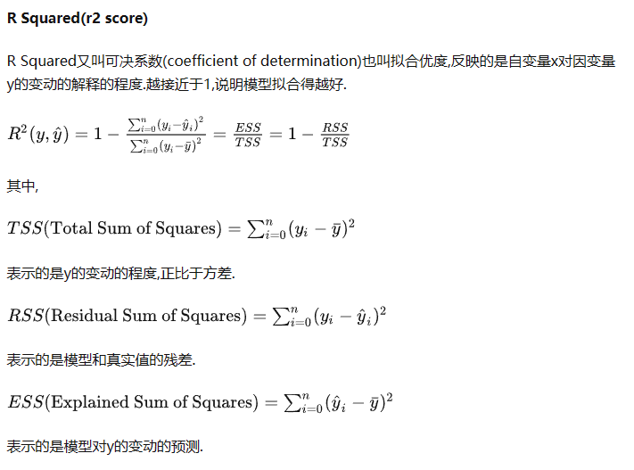
>
> 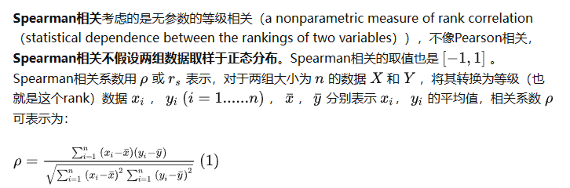
>
> 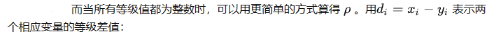
>
> 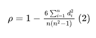

2.每个预测的接近误差

预测结果比实际预测结果更接近目标点的部分。对于空间数据来说，绝对误差指标可能会产生误导（美国东海岸一个城市 500 公里的误差远比西伯利亚 500 公里的误差要大得多）。考虑期望精度的局部差异。

## 3.空间和时间的线性模型

### 3.1存在性

对 Llama-2-{7B, 13B, 70B} 的每一层进行了空间和时间数据集的探测训练。

不同数据集之间具有一致的模式。

线性探针的准确率随模型增大而增大，并在前半部分层中达到最高值。（与早期到中期的MLP层负责回忆有关事实主题的信息的研究一致）

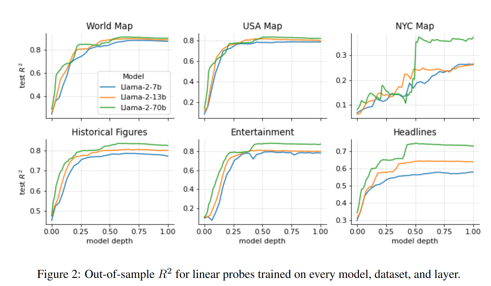

New York数据集表现最差，但最大模型相对性能最好，$R^2$几乎是较小模型的2倍（这表明足够大的 LLM 最终可以形成单个城市的详细空间模型）。

### 3.2线性表示

可解释网络领域越来越多证据支持线性假说，即神经网络的特征是线性表示的。

为了验证时间和空间特征是否线性表示，比较了线性脊回归探针和非线性MLP探针（$W_2ReLU(W_1x + b_1) + b_2$ with 256 神经元）的性能。

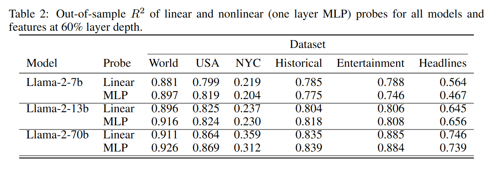

使用非线性探针对任何数据集或模型的 R2 改善都微乎其微。作者认为这有力地证明，尽管空间和时间是连续的，但它们也是线性表示的（或至少是可线性解码的）。

### 3.3对Prompt的敏感性

问题：空间或时间特征是否对提示敏感，即上下文是否可以诱导或抑制事实回忆。

创建了新的激活数据集，其中根据几个基本主题对每个实体标记施加不同的提示。

所有情况下，都有空白提示。

之后给出提示：要求模型回忆相关事实（"经纬度是什么"或"<作者>的<书>发布日期是什么"）

特殊情况下明确区域（美国，纽约）消除歧义。

10个随机token的提示，作为基线

大写所有实体名称。

在标题的最后一个token和附加在token上的一个周期标记上进行探索。

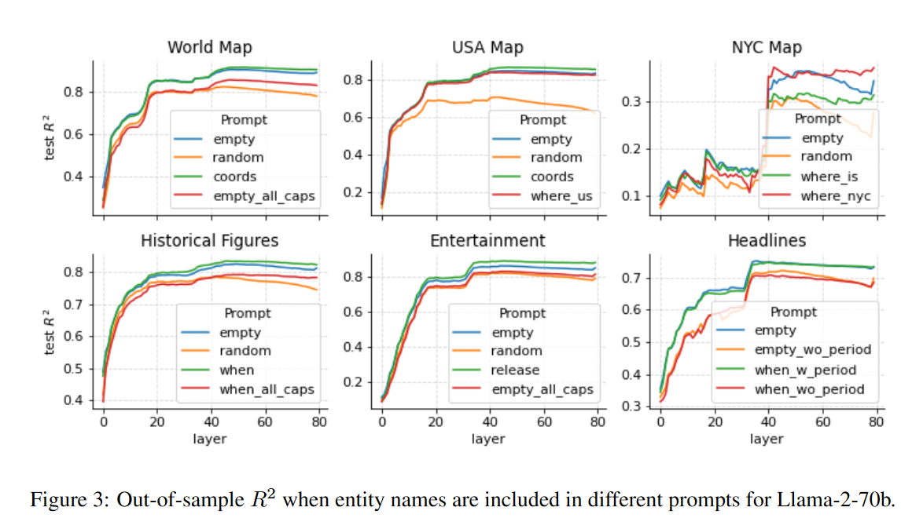

消除歧义几乎没有影响。

随机token有较大影响，降低了性能

全大写轻微降低性能。

## 4.鲁棒性检查

### 4.1泛化验证

#### 4.1.1 块留出泛化

为了证明模型学到了国家的几何意义。

训练了一系列探针，每一个探针都分别保留了世界、美国、纽约市、历史人物、娱乐和头条新闻数据集的一个国家、州、区、世纪、年代或年份。

然后，在保留的数据块上评估探针。

表 3 中，报告了完全保留数据块时的平均接近误差，与默认训练-测试分割中该数据块测试点的误差（所有保留数据块的平均值）进行了比较。

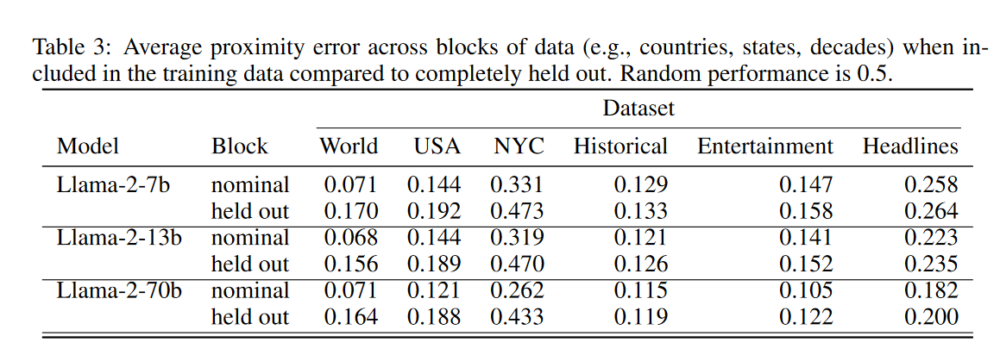

泛化性能变弱，但比随机数据集性能要好

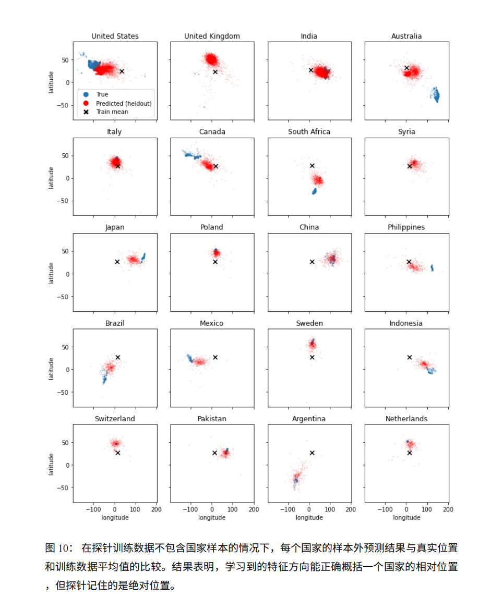

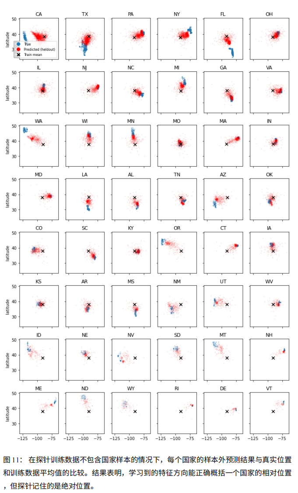

探针通过将点放置在正确的相对位置（通过真实质心和预测质心之间的角度测量）而不是绝对位置来正确地进行概括。作者将此视为微弱的证据，表明探针正在通过模型提取显式学习的特征，但正在记住从模型坐标到人类坐标的转换。然而，这并不能完全排除潜在的二元特征假设，因为可能存在不遵循国家或十年边界（decade boundaries，可能是时间限制）的此类特征的层次结构。

#### 4.1.2 跨实体泛化

作者主张模型以统一的方式表示不同类型实体（例如城市或自然地标）的空间或时间坐标。

但是纬度探测可能是隶属特征的加权和，纬度探测也可以是城市纬度和自然地标纬度的不同（正交）方向的总和。

保留特定实体类别的所有点训练探针

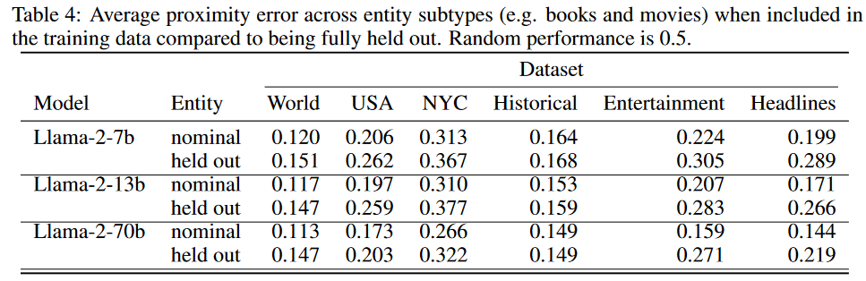

### 4.2 跨实体泛化

作为泛化实验证据的补充形式，作者通过将激活数据集投影到其 k 个最大主成分上来训练参数少 2 到 3 个数量级的探针。

> 主成分分析(principal component analysis)
>
> 主成分分析是数据处理中常用的降维方法。我们需要处理的数据往往是高维数据，把它看成是由某个高维分布产生。高维分布的不同维之间可能具有较强的相关性，这也就为数据降维提供了可能。
>
> 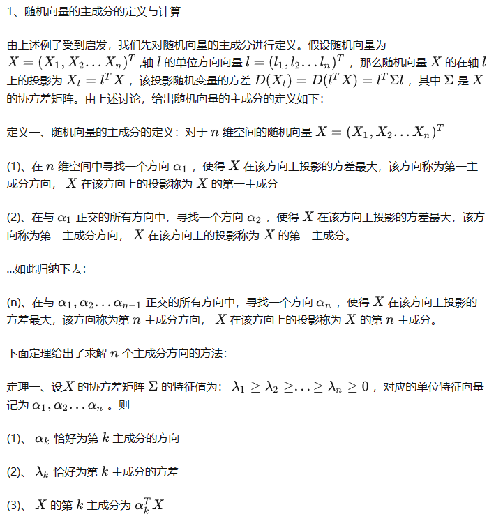

图 4 说明了在 k 值范围内针对每个模型和数据集训练的探针的测试$R^2$

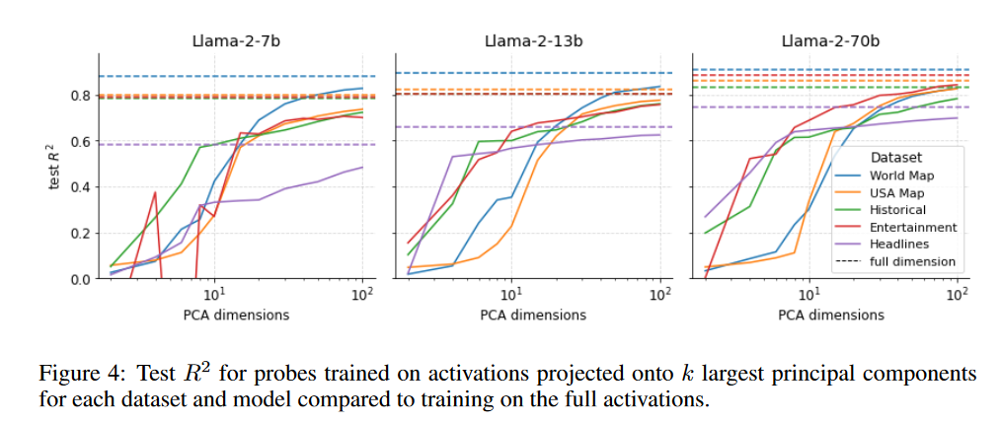

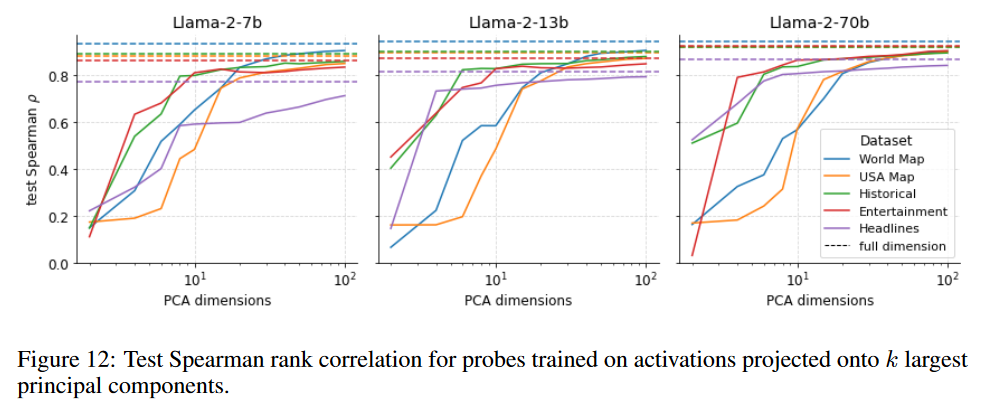

Spearman 相关性，随着 k 的增加，增加速度比 $R^2$ 快得多。

Spearman 相关性仅取决于预测的排序顺序，而  $R^2$ 还取决于它们的实际值。

作者将这一差距视为模型明确表示空间和时间的进一步证据，因为这些特征必须考虑足够的方差才能进入前十几个主成分，但探针需要更多参数才能从模型的坐标系转换为文字空间坐标或时间戳。

作者还观察到，前几个主要成分聚集了数据集中的不同实体类型，这解释了为什么需要多个主要成分。

## 5.空间和时间神经元

为了解决这个问题，作者搜索具有输入或与学习的探测方向具有高余弦相似度的输出权重。即搜索从与探针学习的方向相似的方向读取或写入的神经元。

将激活数据集投影到最相似神经元的权重上时，这些神经元对实体在空间或时间中的真实位置高度敏感.

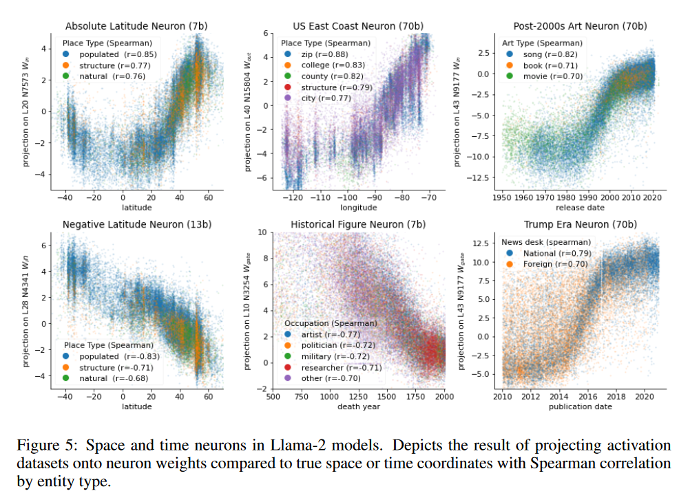

模型中存在单个神经元，它们本身就是相当有预测性的特征探针。

此外，这些神经元对数据集中的所有实体类型都很敏感，为这些表示是统一的说法提供了更有力的证据。

如果通过显式监督训练的探针是模型表示这些空间和时间特征的程度的近似上限，那么单个神经元的性能就是下限。特别是通常期望特征以叠加方式分布，从而使单个神经元处于错误的分析级别。然而，这些单个神经元的存在除了下一个标记预测之外没有接受任何监督，这是该模型已经学习并利用空间和时间特征的有力证据。

## 6.相关工作

### 神经世界模型：

最直接的灵感来自于先前的研究，深度学习系统在多大程度上形成其数据生成过程的可解释模型。

在国际象棋和Othello游戏上训练的 GPT 风格模型，显示出对棋盘和游戏状态的明确表示。

Othello游戏的后续工作表明这些表示是线性的。

在真实的语言模型中，上下文中不同点的表示中可以线性读出实体的动态属性和关系。

大模型具有反映颜色和空间区域的感知和概念结构的表示（类似本文的地理结构）。

最相关工作，研究地理在词嵌入或小语言模型中反映的程度，信息量是有限的，但是大模型显示出更多地理知识的迹象。作者证明了这个假设。

### 事实回忆：

事件或地点的时间或空间点是一种特殊的事实。

本文研究基于之前对LLM事实回忆机制的研究，表明早期到中期的 MLP 层负责输出有关事实主题的信息，通常是在主题的最后一个标记上。

他们的很多研究也表现出线性，陈述的事实性（Burns et al., 2022）或主客关系的结构（Hernandez et al., 2023）。

### 可解释性：

本文工作借鉴了借鉴了可解释性文献中的许多结果和想法

特别是与探针相关的主题

线性度假设和叠加

机械可解释性

跟具体的工作：在上下文中寻找实现大于的机制；多模态模型中发现了与地点相对应的神经元

## 7.讨论

推论：只要有足够的模型和数据大小，仅下一个标记预测就足以学习世界的文字地图。

但空间和时间表征的真正范围和结构仍不清楚。

推测这种结构的最典型形式是离散化的分层网状结构，其中任何样本都被表示为其在每一级粒度上的最近基点的线性组合。

未来的工作是提取模型坐标系中的表征，而不是试图重建人类可解释的坐标，可能可以使用稀疏自编码器（sparse autoencoders）

> 自动编码器(AutoEncoder)是神经网络的一种,一般来讲自动编码器包括两部分:`编码器`和`解码器`,编码器和解码器相互串联合作,实现数据的`降维或特征学习`,现在也广泛用于生成模型中.
>
> 稀疏自动编码器(SAE)在普通autoencoder的基础上增加了`稀疏`的约束,使得神经网络在隐藏层神经元较多的情况下依然能够提取样本的特征和结构。
>
> 关于稀疏的解释:当神经元的的输出接近激活函数上限时(例如对于Sigmoid为1)称该神经元状态为激活,反之当神经元的输出接近激活函数的下限时称该神经元的状态为抑制,那么当某个约束或规则使得神经网络中大部分的神经元的状态为抑制时,称该约束为`稀疏性限制`.
>
> 稀疏自编码器引入了稀疏性惩罚项，以促使隐藏层神经元的激活更加稀疏。通过强制隐藏层神经元的稀疏激活，稀疏自编码器能够更好地捕捉输入数据的重要特征。
>
> 稀疏自编码器的训练通常使用反向传播算法和梯度下降方法。在反向传播过程中，首先计算重构误差，即输入数据与重构数据之间的差异。然后，根据重构误差计算梯度，并更新网络参数。为了实现稀疏性，还需要引入稀疏性惩罚项，通常使用L1正则化或KL散度来度量隐藏层神经元的稀疏激活程度。通过调整稀疏性惩罚项的权重，可以控制隐藏层神经元的稀疏程度。

在本工作的研究中，一个干扰因素是数据集中存在许多模型不知道的实体，这些实体污染了激活数据集。

值得研究的的点：除了简单地提示特定事实和冒着产生幻觉的风险之外，还能识别出模型何时识别出特定实体的方法。

模型在不依赖多步骤推理的情况下很难回答基本的空间和时间关系问题，使得任何因果干预分析（causal intervention analysis）变得复杂，作者认为这是理解这些特征何时以及如何使用的自然下一步。

> 

在生物神经网络中，空间和时间的表示比人工神经网络受到更多的关注。

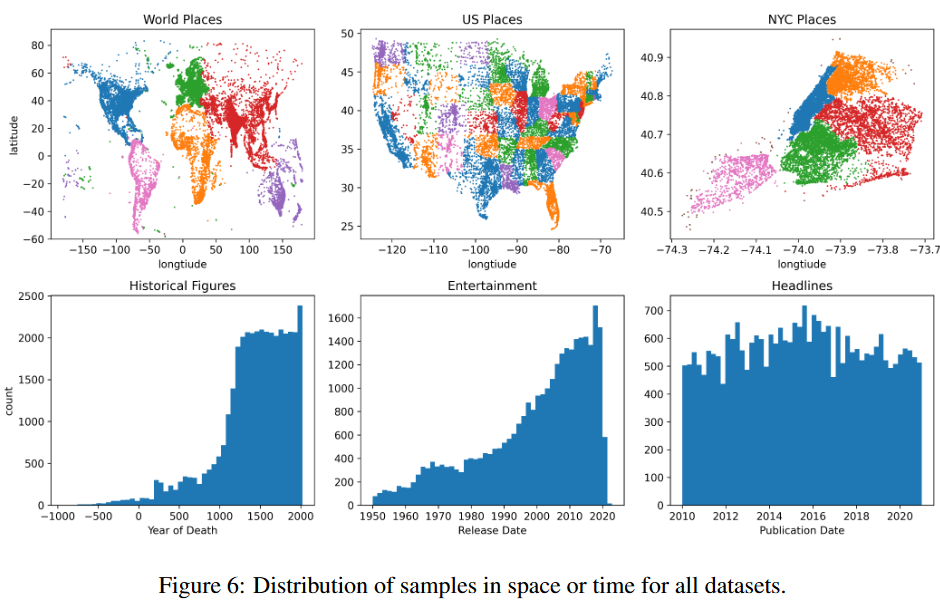

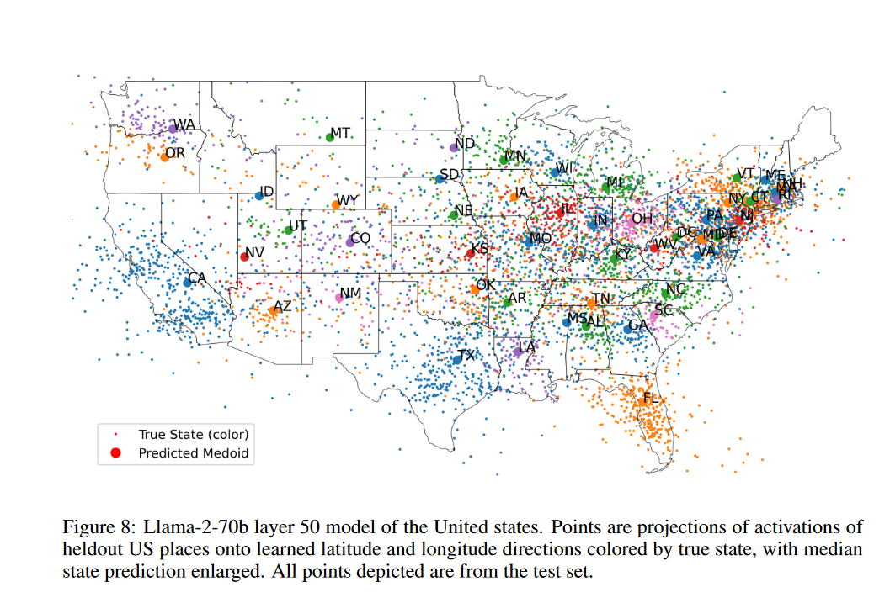

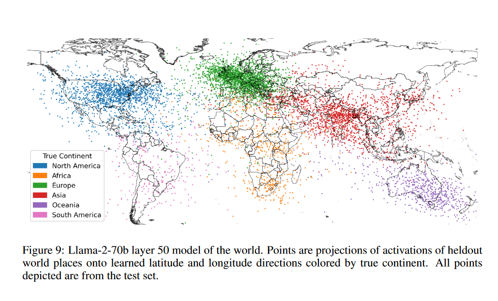
