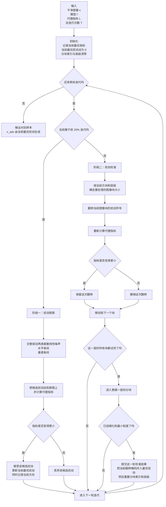

# 深入探究语义分割中的基于决策的黑盒攻击

Zhaoyu Chen1,2* Zhengyang Shan1* Jingwen Chang1 Kaixun Jiang1

Dingkang Yang1 Yiting Cheng2 Wenqiang Zhang1,2

1 复旦大学工程与技术学院，上海人工智能与机器人工程技术研究中心 2 复旦大学计算机科学技术学院，上海市智能信息处理重点实验室

zhaoyuchen20@fudan.edu.cn

# 摘要

语义分割是一项基础视觉任务，在诸多安全敏感应用中得到广泛部署。尽管近期工作已经展示了语义分割模型在白盒攻击下的对抗脆弱性，但其面对黑盒攻击时的对抗鲁棒性仍未被充分探索。本文首次研究语义分割上的基于决策的黑盒攻击。首先，我们通过案例分析了语义分割为决策型攻击带来的挑战。随后，为应对这些挑战，我们首次提出一种面向语义分割的决策型攻击方法，称为离散线性攻击（Discrete Linear Attack，DLA）。该方法基于随机搜索和代理指标，利用离散线性噪声进行扰动探索与校准，从而实现高效攻击。我们在 Cityscapes 和 ADE20K 上，对 5 个模型在 8 种攻击下进行了对抗鲁棒性评估。DLA 在 Cityscapes 上表现出极强攻击能力，仅用 50 次查询就将 PSPNet 的 mIoU 从 $77.83\%$ 大幅降至 $2.14\%$。

# 1. 引言

[[concepts/Deep Neural Network (DNN)|深度神经网络（DNN）]]近年来取得了前所未有的进展，并被广泛用于各种基础视觉任务，例如[[concepts/Semantic Segmentation|语义分割]] [5, 25, 35] 和视频目标分割 [17-19]。然而，近期研究表明，只需向输入中添加人类难以察觉的精心设计的小扰动，DNN 就会受到对抗样本的影响 [6, 7, 9, 31]。对抗样本的出现促使研究者更加关注底层视觉任务的安全性，并试图通过研究对抗样本，为构建鲁棒 DNN 提供启发。

语义分割是一项面向像素级分类的核心视觉任务。尽管它已广泛用于自动驾驶、医学图像分割等现实世界中的安全关键场景，但它同样容易受到对抗样本的攻击。近年来，Segment Anything Model（SAM）[22] 的出现吸引了人们对分割模型的更多关注，也激发了对其鲁棒性的研究。不过，针对语义分割的对抗攻击工作仍然较少 [15]，且更多聚焦于白盒攻击。白盒攻击需要获得目标模型的全部信息，例如梯度和网络结构，这在真实场景中往往很难实现。因此，黑盒攻击更适合用于研究现实场景下语义分割模型的对抗鲁棒性。

本文首次研究语义分割在基于决策设置下的黑盒攻击。基于决策的设置是黑盒攻击中最具挑战性的情形，因为攻击者只能访问目标模型给出的输出类别，而无法获得概率或置信度等信息。然而，由于语义分割本质上是像素级分类，这类攻击的效果受到严重限制，主要体现在以下几个方面。i）优化目标不一致。在图像分类中，决策型攻击通常是在误分类前提下尽量减小扰动幅度；但在语义分割中，扰动越大，评价指标通常越低，而且扰动难以被约束在 $l_p$ 范数内。ii）扰动交互。不同迭代中的扰动会彼此干扰，一个像素在本轮可能被错误分类，但在下一轮叠加新扰动后又可能恢复为正确分类，从而导致优化困难。iii）参数空间复杂。攻击语义分割本质上是一个多约束优化问题，参数空间的复杂性会显著限制攻击效率。

在实际应用中，我们迫切需要一种高效的基于决策的黑盒攻击方法来评估语义分割模型的对抗鲁棒性。因此，所提出的攻击方法必须同时具备高攻击效率和可靠攻击性能。

为了解决上述挑战，我们提出了面向语义分割的决策型攻击方法 DLA。DLA 基于随机搜索框架，从干净图像出发，在代理指标的引导下高效生成对抗样本。具体来说，我们利用图像对应代理指标的变化来优化对抗样本。同时，针对第 3.2 节分析的困难，我们提出使用离散线性噪声来更新对抗扰动。对于扰动之间的相互干扰，我们发现局部加噪虽然攻击效果较好，但引入的彩色块状噪声很容易被感知。因此，我们改用线性噪声，通过向图像中加入水平或垂直方向的线性噪声来更新扰动。为了进一步压缩参数空间，我们将复杂的连续参数空间离散化，并从 $l_{\infty}$ 范数球的极值点出发对离散噪声进行二分细化。整个过程分为两个阶段：扰动探索和扰动校准。在扰动探索阶段，DLA 向输入加入离散线性噪声以获得更好的初始化；在扰动校准阶段，DLA 根据代理指标自适应翻转部分区域的扰动方向，以更新并校准最终扰动。

我们在 Cityscapes [11] 和 ADE20K [36] 上，对基于卷积神经网络的语义分割模型（FCN [25]、PSPNet [35]、DeepLabv3 [5]）以及基于 Transformer 的模型（SegFormer [34] 和 MaskFormer [10]）进行了评估。大量实验表明，DLA 在语义分割上实现了最先进的攻击效率与攻击性能。本文的主要贡献如下：

- 我们首次从基于决策的黑盒攻击角度，系统探索了现有语义分割模型的对抗鲁棒性，覆盖 CNN 和 Transformer 两类模型。
- 我们分析并总结了语义分割上决策型攻击面临的关键挑战。
- 我们首次提出了语义分割上的决策型攻击方法 DLA，将离散线性噪声用于扰动探索与扰动校准。
- 大量实验揭示了现有语义分割模型的对抗脆弱性。在 Cityscapes 上，DLA 可在 50 次查询内将 PSPNet 的 mIoU 从 $77.83\%$ 降至 $2.14\%$。

# 2. 相关工作

语义分割。语义分割是一项像素级分类任务。自 Fully Convolutional Networks（FCNs）[25] 开创性工作以来，基于 DNN 的方法已成为语义分割的主流方案。随后的一类模型关注在最终特征图上聚合长程依赖，例如 DeepLabv3 [5] 使用不同空洞率的空洞卷积，PSPNet [35] 使用不同核大小的池化操作。再后来的工作开始引入 Transformer [32] 进行上下文建模：SegFormer [34] 用 Vision Transformer（ViT）[12] 替代卷积骨干网络，从最初层就捕获长距离上下文；MaskFormer [10] 则引入 mask classification，并利用 Transformer 解码器同时计算类别预测与掩码预测。

黑盒对抗攻击。本文主要关注基于查询的黑盒攻击，在该设置下，攻击者对目标网络的访问受限，只能通过查询获得特定输入的网络输出（置信度或标签）[8, 23]。前者称为基于分数的攻击，后者称为基于决策的攻击。一般而言，基于分数的攻击在图像分类上的攻击效率更高。对于语义分割中的决策型攻击，我们将模型输出定义为每个像素的标签。考虑到语义分割的 mIoU 是依据每个像素标签计算得到的连续值，本文选择图像分类中的基于分数攻击方法作为对比对象。大多数基于分数的图像分类攻击通过零阶优化估计近似梯度 [20]。Bandits [21] 进一步引入梯度先验和 bandit 策略来加速 [20]。随后，Liu 等人 [24] 将零阶设置引入基于符号的随机梯度下降（SignSGD）[3]，提出了 ZO-SignSGD [24]。之后，Sign-Hunter [1] 利用方向导数的可分性进一步提升查询效率。近年来，基于随机搜索的方法也被提出，并表现出更好的查询效率。SimBA [16] 从预定义的正交基中随机采样向量来更新图像。Square Attack [2] 则在随机位置选择局部方形更新来优化扰动。与以往方法不同，DLA 从语义分割任务的特点出发分析问题挑战，并基于离散线性噪声实现了高查询效率的攻击。

语义分割上的对抗攻击。与图像分类相比，针对语义分割的对抗攻击研究较少。[14] 和 [33] 最早研究了语义分割的对抗鲁棒性，并通过大量实验说明其脆弱性。Indirect Local Attack [28] 揭示了语义分割模型由于长程上下文而存在的对抗脆弱性。SegPGD [15] 从损失函数角度改进了白盒攻击，能够更好地评估并提升分割鲁棒性。ALMA prox [29] 则通过近端分裂生成 $l_{\infty}$ 范数更小的对抗扰动。上述方法主要侧重于增强语义分割白盒攻击的强度，而对基于查询的黑盒攻击的对抗鲁棒性关注较少。因此，作为补充，本文首次在极具挑战性的基于决策设置下系统研究语义分割模型的对抗鲁棒性。


图 1. 基于 Random Attack，我们展示了在不同扰动幅度下 mIoU 的变化。如果加入非常大的扰动，mIoU 会显著降低；但在减小扰动幅度后，mIoU 又会上升，这使得优化目标与攻击方向不一致。

# 3. 方法

# 3.1. 预备知识

在语义分割任务中，给定语义分割模型 $f(\cdot)$，干净图像记为 $x \in [0, 1]^{C \times H \times W}$，对应标签记为 $y_i \in \{1, \ldots, K\}$（$i = 1, \ldots, d$，其中 $d = HW$）。这里，$C$ 表示通道数，$H$ 和 $W$ 分别表示图像的高与宽，$K$ 表示语义类别数。我们记对抗样本为 $x_{adv} = x + \delta$，其中 $\delta \in \mathbb{R}^{C \times H \times W}$ 为对抗扰动，并满足 $||\delta||_{\infty} \leq \epsilon$。由于我们考虑的是基于决策的攻击设置，因此将模型输出记为逐像素预测标签 $\hat{y} = f(x) \in \{1, \ldots, K\}^{d}$。我们的目标是让对抗样本尽可能多地使像素发生误分类，因此优化目标可写为：

$$
\underset {\delta} {\arg \max } \sum 1 (f (x + \delta) _ {i} \neq y _ {i}), \tag {1}
$$

$$
\begin{array}{l} \text {s . t .} | | \delta | | _ {\infty} \leq \epsilon \text {a n d} i = 1, \dots , d, \end{array}
$$

其中，1 为指示函数，条件成立时取 1，否则取 0。


图 2. 使用不同代理指标的 Random Attack。我们的设计重点在于从干净图像出发，根据观测到的代理指标变化，迭代地优化对抗扰动。


图 3. 在语义分割黑盒攻击中，扰动的更新会使已被攻击成功的像素重新回到原始类别，从而带来优化困难。

# 3.2. 攻击分析

尽管图像分类上的基于决策攻击已经得到广泛而深入的研究 [23]，语义分割场景却尚未被充分探索。语义分割属于像素级分类，其攻击难度远高于图像分类，因为图像分类是单约束优化，而语义分割中的每个像素都需要被分类，因此整体上是一个多约束优化问题。正因如此，语义分割上的决策型攻击会面临显著挑战，并且很容易收敛到局部最优，下面我们逐一说明。

优化目标不一致。图像分类中的基于决策攻击通常依赖边界攻击 [23]。边界攻击要求图像先被错误分类，再在此基础上最小化扰动幅度，使对抗样本靠近决策边界。然而，这一策略并不适用于语义分割。正如图 1 所示，我们可以通过加入很大的噪声使 mean Intersection-over-Union（mIoU）变得很低；但当减小噪声幅度时，与图像分类中仍能维持误分类不同，语义分割的 mIoU 也会随之增大，因此优化目标和攻击方向是不一致的。

干净图像


随机


有重叠补丁


无重叠补丁


线状扰动


图 4. 扰动交互现象说明。我们分别采用随机扰动、有重叠补丁、无重叠补丁和线状扰动进行攻击，结果表明不同扰动之间确实存在相互干扰。重叠越少通常能带来更好的攻击效果，而线性噪声在不可感知性和攻击效果之间取得了更佳平衡。

为应对这一挑战，我们提出利用代理指标从干净图像生成对抗样本。具体做法是从干净图像出发，根据图像对应代理指标的变化来更新对抗样本。为了更深入理解代理指标，我们提出了一个简单的基线方法，称为 Random Attack。该基线的更新过程如下：

$$
x _ {a d v} ^ {0} = x, x _ {a d v} ^ {t + 1} = \Pi_ {\epsilon} \left(x _ {a d v} ^ {t} + r a n d \left[ - \frac {\epsilon}{1 6}, + \frac {\epsilon}{1 6} \right]\right), \tag {2}
$$

其中，$rand[-\frac{\epsilon}{16}, +\frac{\epsilon}{16}]$ 生成与输入维度相同、并服从区间 $[-\frac{\epsilon}{16}, +\frac{\epsilon}{16}]$ 上随机分布的噪声，$\Pi_{\epsilon}$ 则将输入裁剪到区间 $[x - \epsilon, x + \epsilon]$。在迭代过程中，Random Attack 仅在代理指标变得更小时才更新扰动。Random Attack 的完整算法见补充材料 B。

补充理解：Random Attack 可以看作“随机搜索 + 贪心接受”的黑盒基线。它从干净图像出发，每轮随机试探一个小扰动，只在代理指标下降时保留更新。

在 Random Attack 的基础上，我们使用 PSPNet [35] 和 SegFormer [34]，在 Cityscapes [11] 与 ADE20K [36] 上进行了一个 toy study，实验设置与第 4 节保持一致。考虑到 mIoU 是语义分割中被广泛采用的评估指标 [13]，它有潜力作为合适的代理指标。此外，逐像素分类准确率（PAcc）也能反映攻击效果。因此，我们选择 mIoU 与 PAcc 作为代理指标，并在图 2 中展示了使用 Random Attack 时的攻击过程。我们观察到：i）基于代理指标的 Random Attack 能够降低图像的 mIoU；ii）当 mIoU 被用作代理指标时，攻击性能更优。原因在于，当使用 PAcc 作为代理指标时，对抗样本只需尽可能让每个像素误分类，而不关注整体类别结构；相反，使用 mIoU 作为代理指标时，单张图像的 mIoU 更接近整个数据集上的 mIoU，因此攻击效果更好。基于这一观察，本文最终选择 mIoU 作为代理指标。

扰动交互。尽管引入代理指标后的 Random Attack 已经有效，但如图 2 所示，其攻击性能仍然有限且容易收敛，这表明它可能陷入了局部最优。近期研究 [15] 表明，在语义分割白盒攻击中，每个像素的分类状态具有不稳定性：一个像素在某次迭代中可能被错误分类，而在下一次迭代中又重新被正确分类。类似现象在语义分割黑盒攻击中同样存在，如图 3 所示。

回头审视 Random Attack，我们推测每次迭代加入的扰动之间存在干扰。这种干扰源于黑盒攻击与白盒攻击在更新方向上的不一致，因此一个像素可能在本轮攻击成功，却在下一轮再次失败，最终导致优化过程收敛到局部最优。为缓解这一问题，我们提出不再对整张图像整体更新扰动，而是改为在局部区域上更新扰动。这种局部更新方式有望减弱扰动之间的干扰，并提升攻击性能。

受此启发，我们进一步探索了不同形状的扰动更新策略，并开展相应实验，可视化结果见图 4。当在整张图像上加入随机扰动时，得到的分割掩码通常仍接近原始预测，目标轮廓也保留得较为完整，这与图 2 中有限的攻击性能一致。进一步地，当我们使用带重叠的补丁扰动 [2] 来更新时，攻击性能变化不大，目标轮廓依然基本保留。相反，当使用无重叠补丁扰动 [21] 时，大量目标轮廓被破坏，这表明不同扰动更新之间确实存在干扰。

回看无重叠补丁对应的对抗样本，虽然其攻击效果显著，但也很容易看出图像中加入了精心设计的扰动，因为这些补丁呈块状且颜色明显。为了同时兼顾有效攻击与不可感知性，我们考虑将扰动建模为线条形式，如图 4 所示。我们之所以选择线性噪声，主要有两个原因：i）语义分割模型的上下文建模会使局部对抗扰动扩散到全局 [28]，从而影响其他区域像素，因此线性噪声仍然有效；ii）相比补丁，线性噪声更细，更不容易被人眼察觉。图 4 也表明，线性噪声在保持较强攻击效果的同时，具有更好的不可感知性。

参数空间复杂。尽管线性噪声已经能显著提升攻击效果，但复杂参数空间仍然限制了攻击效率。语义分割本身是一个多约束优化问题，因此在有限查询预算下很难找到最优对抗样本。

在黑盒攻击中，常用的扰动更新策略通常有两类：随机噪声 [2, 16] 和梯度估计 [20, 21]。随机噪声让干净图像在决策边界附近随机游走，并希望越过边界；梯度估计则是一种无梯度优化技术，通过随机采样近似梯度方向，从而提升攻击效率，其中最常用的是 [[concepts/Natural Evolutionary Strategies (NES)|Natural Evolutionary Strategies（NES）]][20]。尽管上述两类策略都有效，但它们仍然需要大量查询，并且参数空间越大，所需查询预算增长越明显 [21]。即便 [21] 通过引入先验信息来降低参数空间，查询效率仍然比较有限。因此，我们考虑进一步压缩参数空间。

补充理解：NES 更适合有 score / confidence 可比较的 score-based 黑盒设置。它的核心不是直接乱试，而是通过高斯方向采样估计一个近似梯度，再沿该方向更新。

在查询次数有限时，几乎不可能枚举完整参数空间。近期工作 [4, 27] 表明，对抗样本往往出现在 [[concepts/L-infinity Norm Ball|$l_{\infty}$ 范数球]] 的极值点上，这说明在这些极值点附近更容易找到对抗样本。[27] 的经验结果也显示，由 PGD 攻击 [26] 得到的对抗样本大多位于 $l_{\infty}$ 范数球的极值点。受此启发，我们直接将可能的扰动限制为 $l_{\infty}$ 范数球的极值点，从而把参数空间从连续空间变为离散空间。具体而言，我们令对抗扰动 $\delta$ 服从二项分布 $\{-\epsilon, \epsilon\}^d$，并将其称为离散噪声。这样一来，参数空间就从 $[-\epsilon, \epsilon]^d$ 直接缩减为 $\{-\epsilon, \epsilon\}^d$，只剩下 $2^d$ 个可能搜索方向。我们通过一个案例研究说明离散噪声的有效性，如表 1 所示。这里我们以 Random Attack 为基线，并报告 50 和 200 次查询预算下的 mIoU。可以看到，在相同查询次数下，离散噪声始终能取得更低的 mIoU，且与其他策略存在明显差距，说明压缩参数空间是有效的。

补充理解：$l_{\infty}$ 范数球表示“每个像素的改变量都不超过 $\epsilon$”的扰动集合；其极值点 / 顶点对应每一维都取到边界，因此可写成 $\{-\epsilon, \epsilon\}^d$。联网校准后更精确的说法是：[27] 对“顶点化搜索”给出了更直接的组合优化与经验依据，而 [4] 更偏向支持“对抗样本常位于约束边界”这一较弱结论；DLA 在这里采取的是一种有经验支持的离散化近似。

表 1. 扰动取值的搜索策略。我们报告在 50/200 次查询预算下的 mIoU，可以看到在相同查询次数下，离散扰动总能取得更低的 mIoU（%）。

<table><tr><td rowspan="2">数据集</td><td rowspan="2">模型</td><td colspan="4">攻击</td></tr><tr><td>Clean</td><td>Random</td><td>NES</td><td>Discrete</td></tr><tr><td rowspan="2">Cityscapes</td><td>PSPNet</td><td>77.83</td><td>48.81/47.18</td><td>48.34/47.40</td><td>33.57/33.54</td></tr><tr><td>SegFormer</td><td>80.43</td><td>58.59/56.07</td><td>58.00/55.34</td><td>41.70/41.70</td></tr><tr><td rowspan="2">ADE20K</td><td>PSPNet</td><td>37.68</td><td>26.63/26.34</td><td>25.67/25.52</td><td>23.50/23.31</td></tr><tr><td>SegFormer</td><td>43.74</td><td>34.72/34.45</td><td>34.66/34.55</td><td>33.68/33.53</td></tr></table>

# 3.3. 离散线性攻击

本节介绍基于上述分析提出的离散线性攻击（DLA）。DLA 由两个核心部分组成：扰动探索和扰动校准。在扰动探索阶段，DLA 向输入中加入水平方向或垂直方向的离散扰动，以获得更好的初始化；在扰动校准阶段，DLA 根据代理指标动态翻转某些区域的扰动方向，从而迭代地更新和校准扰动。DLA 的整体流程如算法 1 所示。

算法 1 离散线性攻击（DLA）

直观流程图：



一句话理解：

- DLA 先用“整幅图上的水平/垂直离散条纹”快速找到一个有效的初始扰动，再用“分层分块的符号翻转”逐步细化局部区域，让 mIoU 持续下降。

```text
Input: image x, model f, proxy index L, iteration T
Output: x_adv
1: l_min <- L(x), hat{delta} <- 0, i <- 0, M <- 1, n <- 0
2: for t in [1, T] do
3:   if t <= T/5 then
4:     // Perturbation Exploration
5:     k <- t % 2
6:     delta ~ k * {-epsilon, epsilon}^h + (1 - k) * {-epsilon, epsilon}^w
7:     if l_min > L(x + delta) then
8:       l_min <- L(x + delta), hat{delta} <- delta, d <- k
9:     end if
10:  else
11:    // Perturbation Calibration
12:    c <- d * ceil(h / 2^n) + (1 - d) * ceil(w / 2^n)
13:    M[d x i x c : d x (i + 1) x c + (1 - d) x h, (1 - d) x i x c : (1 - d) x (i + 1) x c + d x w] *= -1
14:    if l_min > L(x + hat{delta} * M) then
15:      l_min <- L(x + hat{delta} * M), hat{M} <- M
16:    else
17:      M[d x i x c : d x (i + 1) x c + (1 - d) x h, (1 - d) x i x c : (1 - d) x (i + 1) x c + d x w] *= -1
18:    end if
19:    i <- i + 1
20:    if i == 2^n then
21:      i <- 0, n <- n + 1
22:    end if
23:    if n == ceil(log_2(d x h + (1 - d) x w)) + 1 then
24:      hat{delta} <- hat{delta} * M, i <- 0, n <- 0
25:    end if
26:  end if
27: end for
28: x_adv <- x + hat{delta} * hat{M}
29: return x_adv
```

扰动探索。第 3.2 节表明，离散线性噪声能够显著压缩参数空间并提升攻击效率。结合代理指标，并考虑图像的宽高比，我们将扰动初始化为：

$$
x _ {a d v} \leftarrow x + \delta , \quad \delta \sim \{- \epsilon , \epsilon \} ^ {d}, \tag {3}
$$

其中，$d$ 表示图像的高度或宽度。在扰动探索阶段，我们交替采样水平方向和垂直方向的离散线性噪声，并将其加入干净图像。随后，计算代理指标，并保留使代理指标最小的扰动作为 $\hat{\delta}$。

扰动校准。尽管扰动探索已经展现出较高攻击性能，但得到的对抗扰动仍然不是最优的。这是因为扰动探索是粗粒度的，只能给出一个较好的初始化，而无法对局部扰动进行细粒度更新。鉴于噪声本身是离散的，我们提出通过翻转现有扰动的符号来生成新的扰动。

在扰动校准阶段，我们采用分层方式随机翻转局部扰动的符号，从而进一步细化扰动。具体来说，先尝试翻转全局扰动，再将图像划分为若干块，对每一块执行翻转操作。若翻转后的 mIoU 更低，则保留当前扰动。遍历完当前粒度后，DLA 会继续把图像划分得更细，并在更细粒度的块上重复这一过程。通过分层分块与符号翻转，我们希望获得最有效的对抗样本。该过程对应算法 1 中的第 12-25 行。

# 4. 实验

# 4.1. 实验设置

数据集。我们在两个广泛使用的语义分割数据集上攻击语义分割模型：Cityscapes [11]（19 类）和 ADE20K [36]（150 类）。按照 [28] 和 [15] 的设置，我们分别从 Cityscapes 和 ADE20K 的验证集中随机选择 150 张和 250 张图像。评估指标采用标准的 mean Intersection-over-Union（mIoU）[13]。该指标是逐像素度量，与语义分割的逐像素分类形式直接对应。攻击后，mIoU 越低，说明攻击效果越好。

模型。我们选择两类语义分割模型：传统卷积模型（FCN [25]、DeepLabv3 [5]、PSPNet [35]）以及基于 Transformer 的模型（SegFormer [34] 和 MaskFormer [10]）。更多模型细节见补充材料 C。

攻击方法。我们选取了 7 种攻击算法进行性能对比，包括零阶优化类方法（NES [20]、Bandits [21]、ZO-SignSGD [24]、SignHunter [1]）以及随机搜索类方法（Random attack（Random）、SimBA [16] 和 Square Attack [2]（Square））。

实现细节。在所有实验中，最大扰动幅度 $\epsilon$ 设为 8。对于 NES [20]，单次攻击的查询次数设为 $q = 10$。对于 Bandit Attack，patch size prior 的初始值设为 $\iota_{size} = 20$，prior-exploration learning rate 设为 $0.1$。对于 ZO-SignSGD [24]，单次攻击查询次数同样设为 $q = 10$。对于 Square Attack [2]，初始像素比例 $p_{init}$ 设为 0.05。对于 SimBA [16]，扰动步长 delta 设为 50。SignHunter [1] 的设置与原论文一致。为减轻随机性的影响，我们报告三次攻击后的平均 mIoU（%）。

# 4.2. 性能比较

攻击结果。表 2 展示了 8 种黑盒攻击在 Cityscapes [11] 和 ADE20K [36] 上的结果。我们报告了 5 个模型在 50 和 200 次查询预算下的 mIoU（%）。由于参数空间复杂，Random 和 NES [20] 的攻击性能较低。ZO-SignSGD [24]、SimBA [16] 和 Square [2] 利用局部先验信息，进一步提升了攻击性能。Bandits [21] 和 Sign-Hunter [1] 则都使用了无重叠局部噪声，因此取得了次优效果。然而，如图 5 所示，Bandits 的补丁噪声与 SignHunter 的条带噪声都带有明显颜色，非常容易被人感知。相比之下，DLA 在两个数据集上都显著优于其他竞争方法。在 Cityscapes 的 PSPNet 上，DLA 在 200 次查询下相对 Bandits 和 SignHunter 分别额外降低了 $15.49\%$ 和 $23.98\%$ 的 mIoU。在更具挑战性的 ADE20K 的 PSPNet 上，DLA 在 200 次查询下相对 Bandits 和 SignHunter 分别额外降低了 $14.08\%$ 和 $10.31\%$ 的 mIoU。从可视化角度看，DLA 在保持扰动不可感知性的同时，也能有效破坏目标轮廓。从攻击效率上看，DLA 在 50 次查询下的结果，与其他方法在 200 次查询下相比仍有非常明显的优势。总体而言，DLA 具有极高的攻击效率，能够更有效地评估现有语义分割模型的对抗鲁棒性。

表 2. Cityscapes 与 ADE20K 上的攻击结果。我们报告在 50/200 次查询预算下的 mIoU（%）。

<table><tr><td rowspan="2">数据集</td><td rowspan="2">攻击</td><td colspan="5">模型</td></tr><tr><td>FCN [25]</td><td>PSPNet [35]</td><td>DeepLab V3 [5]</td><td>SegFormer [34]</td><td>MaskFormer [10]</td></tr><tr><td rowspan="9">Cityscapes [11]</td><td>Clean</td><td>77.89</td><td>77.83</td><td>77.70</td><td>80.43</td><td>73.91</td></tr><tr><td>Random</td><td>35.76/34.94</td><td>48.81/47.18</td><td>54.57/52.77</td><td>58.59/56.07</td><td>39.09/39.06</td></tr><tr><td>NES [20]</td><td>34.47/33.82</td><td>48.34/47.40</td><td>54.32/52.99</td><td>58.00/55.34</td><td>51.94/52.56</td></tr><tr><td>Bandits [21]</td><td>18.17/15.65</td><td>20.81/17.55</td><td>29.85/26.73</td><td>39.43/36.14</td><td>26.94/26.88</td></tr><tr><td>ZO-SignSGD [24]</td><td>34.97/34.01</td><td>46.69/45.80</td><td>51.83/50.54</td><td>55.67/54.81</td><td>49.65/49.59</td></tr><tr><td>SignHunter [1]</td><td>23.88/21.67</td><td>33.52/26.04</td><td>44.24/35.93</td><td>41.38/34.18</td><td>47.05/27.06</td></tr><tr><td>SimBA [16]</td><td>33.74/29.58</td><td>46.27/40.22</td><td>54.67/50.17</td><td>54.17/52.67</td><td>33.52/32.71</td></tr><tr><td>Square [2]</td><td>35.47/35.99</td><td>48.47/49.18</td><td>54.45/56.23</td><td>56.71/52.18</td><td>50.87/49.84</td></tr><tr><td>Ours</td><td>3.18/3.07</td><td>2.14/2.06</td><td>1.79/1.71</td><td>18.12/17.78</td><td>2.79/2.78</td></tr><tr><td rowspan="9">ADE20K [36]</td><td>Clean</td><td>33.54</td><td>37.68</td><td>39.36</td><td>43.74</td><td>45.50</td></tr><tr><td>Random</td><td>22.85/22.13</td><td>27.72/27.36</td><td>25.82/24.81</td><td>38.02/37.64</td><td>25.37/24.06</td></tr><tr><td>NES [20]</td><td>24.47/23.96</td><td>26.57/26.26</td><td>23.83/23.41</td><td>36.35/36.06</td><td>34.78/34.55</td></tr><tr><td>Bandits [21]</td><td>25.10/23.67</td><td>25.02/23.93</td><td>27.52/26.36</td><td>36.32/35.03</td><td>26.14/26.91</td></tr><tr><td>ZO-SignSGD [24]</td><td>23.29/22.94</td><td>26.82/26.47</td><td>25.38/24.41</td><td>35.22/32.18</td><td>33.32/32.86</td></tr><tr><td>SignHunter [1]</td><td>20.15/16.72</td><td>24.21/20.16</td><td>25.40/20.48</td><td>32.56/28.22</td><td>28.78/16.78</td></tr><tr><td>SimBA [16]</td><td>24.20/21.49</td><td>26.36/22.92</td><td>25.56/22.13</td><td>36.70/34.81</td><td>35.62/33.18</td></tr><tr><td>Square [2]</td><td>23.94/22.90</td><td>26.87/25.89</td><td>27.70/26.46</td><td>35.43/34.76</td><td>26.29/26.41</td></tr><tr><td>Ours</td><td>8.18/7.97</td><td>10.19/9.85</td><td>11.34/10.67</td><td>28.91/27.85</td><td>12.14/12.14</td></tr></table>


图 5. Cityscapes 上不同攻击方法的可视化结果，威胁模型为 SegFormer。

讨论。由表 2 可知，在 ADE20K [36] 上进行基于决策的攻击比在 Cityscapes [11] 上更具挑战。我们认为可能原因是：Cityscapes 中图像的类别分布相对均匀，且都是相似度较高、复杂度较低的城市场景，因此更容易攻击；而 ADE20K 的类别更多、图像之间差异更大，因此攻击更困难。此外，我们还发现，在两个数据集和 8 种攻击下，SegFormer [34] 相较于另外 4 个语义分割模型都表现出更强的对抗鲁棒性。这是因为 SegFormer 是基于 Transformer 的模型，其核心结构为 Transformer，自注意力机制通常会带来更高的对抗鲁棒性 [8, 30]，这也与 SegFormer 本身的描述一致。进一步地，值得注意的是，MaskFormer 的 backbone 含有 CNN 结构，这意味着它并没有展现出比 SegFormer 更高的鲁棒性。

# 4.3. 诊断实验

为了研究核心设计的作用，我们在 Cityscapes 和 ADE20K 上进行了消融实验。我们以 SegFormer [34] 为威胁模型，并分别在 50/200 次查询预算下进行攻击。

攻击设计。我们首先研究 DLA 的攻击设计，如表 3 所示。在扰动探索阶段，random 表示 Random Attack 使用的随机噪声，horizontal 和 vertical 分别表示在水平方向和垂直方向加入离散线性噪声，iterative 表示交替加入水平和垂直离散线性噪声。在扰动校准阶段，random 表示 Random Attack 的随机更新噪声，flip 表示 DLA 中通过翻转扰动符号进行更新的策略。我们观察到，在扰动校准阶段，flip 比 random 具有更好的攻击性能。当扰动探索采用 iterative 时，在 200 次查询下，它在 Cityscapes 和 ADE20K 上分别比 random 高出 $0.76\%$ 和 $0.83\%$ 的攻击收益。在扰动探索阶段，离散线性噪声相较随机噪声具有明显优势。其中，vertical 和 iterative 分别在 Cityscapes 与 ADE20K 上表现最佳。我们发现，Cityscapes 的宽高比固定，因此垂直噪声更有效；ADE20K 的宽高比变化较大，因此 iterative 表现更好，也说明该策略在面对不同尺度图像时更具泛化性。综合考虑对不同宽高比图像的适应能力，我们最终选择 iterative 作为加入离散线性噪声的策略。


图 6. 在 200 次查询预算下，不同扰动幅度 $\epsilon$ 时各类黑盒攻击的攻击性能。

扰动幅度 $\epsilon$。为了评估不同扰动幅度 $\epsilon$ 对攻击性能的影响，我们在 SegFormer 上选择 $\epsilon = 4, 8, 16$ 进行实验。图 6 展示了在不同扰动幅度下，各种黑盒攻击的攻击表现。随着扰动幅度增大，所有攻击的整体 mIoU 都会进一步下降。值得注意的是，在三种扰动幅度下，DLA 始终取得最强攻击性能。此外，我们还观察到，随着扰动幅度增加，DLA 相比其他竞争攻击在降低 mIoU 的幅度上优势更明显。上述实验说明，与其他方法相比，DLA 在不同扰动幅度下都更能有效评估语义分割模型的对抗鲁棒性。

有限查询。由于大量查询容易被目标系统检测到，因此我们进一步测试了在极少查询次数下的攻击性能。为模拟有限查询场景，我们将查询预算设为 10，并评估攻击后的 mIoU，结果如表 4 所示。在 Cityscapes 上，DLA 展现出极高攻击效率，仅用 10 次查询就将 SegFormer 的 mIoU 降低了 $61.54\%$，并且相较排名第二的 Bandits 攻击又拉开了 $22.31\%$ 的显著差距。在更具挑战性的 ADE20K 上，DLA 在 10 次查询下将 SegFormer 的 mIoU 降低了 $12.89\%$；同样地，它也比次优的 Bandits 高出 $4.86\%$。结合表 1 中的结果可见，DLA 无论在极少查询还是较大查询预算下，其攻击性能都优于当前其他具有竞争力的方法。这表明 DLA 能够在工业界和学术界场景中有效评估语义分割模型的对抗鲁棒性。

表 3. DLA 攻击设计的消融实验。

<table><tr><td colspan="4">Pert. Explor.</td><td colspan="2">Pert. Calibr.</td><td colspan="2">Dataset</td></tr><tr><td>random</td><td>horizontal</td><td>vertical</td><td>iterative</td><td>random</td><td>flip</td><td>Cityscapes</td><td>ADE20K</td></tr><tr><td></td><td></td><td></td><td></td><td></td><td></td><td>80.43</td><td>43.74</td></tr><tr><td>Y</td><td></td><td></td><td></td><td>Y</td><td></td><td>58.59/56.07</td><td>38.02/37.64</td></tr><tr><td>Y</td><td></td><td></td><td></td><td></td><td>Y</td><td>55.47/55.12</td><td>36.94/36.57</td></tr><tr><td></td><td>Y</td><td></td><td></td><td></td><td>Y</td><td>26.41/26.21</td><td>32.02/31.65</td></tr><tr><td></td><td></td><td>Y</td><td></td><td></td><td>Y</td><td><strong>17.53/17.10</strong></td><td>29.61/28.49</td></tr><tr><td></td><td></td><td></td><td>Y</td><td>Y</td><td></td><td>18.29/18.26</td><td>29.56/28.77</td></tr><tr><td></td><td></td><td></td><td>Y</td><td></td><td>Y</td><td>18.12/17.78</td><td><strong>28.91/27.85</strong></td></tr></table>

表 4. 有限查询（10 次查询预算）下的攻击结果。

<table><tr><td>攻击</td><td>Clean</td><td>Random</td><td>NES</td><td>Bandits</td><td>ZO-SignSGD</td><td>SignHunter</td><td>SimBA</td><td>Square</td><td>Ours</td></tr><tr><td>Cityscapes</td><td>80.43</td><td>59.22</td><td>59.26</td><td>41.20</td><td>56.23</td><td>47.90</td><td>54.62</td><td>57.22</td><td>18.89</td></tr><tr><td>ADE20K</td><td>43.74</td><td>37.82</td><td>38.20</td><td>35.71</td><td>37.82</td><td>35.95</td><td>37.57</td><td>37.64</td><td>30.85</td></tr></table>

# 5. 结论

本文首次对语义分割中的基于决策攻击进行了较为深入的研究。我们首次系统分析了语义分割与图像分类之间的差异，并总结了对应决策型攻击所面临的三大挑战。基于随机搜索和代理指标，我们发现了离散线性噪声，并据此提出了一种新的离散线性攻击（DLA）。我们在 2 个数据集和 5 个模型上进行了大量实验。与 7 种竞争攻击相比，DLA 在攻击性能和查询效率上都更具优势。在 Cityscapes 上，DLA 能在 50 次查询内将 PSPNet 的 mIoU 从 $77.83\%$ 降到 $2.14\%$。因此，DLA 有望被用于安全敏感应用中的对抗鲁棒性评估。

更广泛影响。我们提出的方法表现出极强的攻击性能和攻击效率，因此对语义分割领域构成了显著且值得重视的威胁。尤其是在其可能被部署于医学诊断、自动驾驶等安全敏感应用时，这种威胁会更加突出。因此，我们希望这一威胁能够推动语义分割模型鲁棒设计的发展，并引发公众更多关注。

# References

Note: bibliography entries are kept in English for retrieval.

[1] Abdullah Al-Dujaili and Una-May O'Reilly. Sign bits are all you need for black-box attacks. In International Conference on Learning Representations, 2019.

[2] Maksym Andriushchenko, Francesco Croce, Nicolas Flammarion, and Matthias Hein. Square attack: a query-efficient black-box adversarial attack via random search. In European conference on computer vision, pages 484-501. Springer, 2020.

[3] Jeremy Bernstein, Yu-Xiang Wang, Kamyar Azizzadenesheli, and Animashree Anandkumar. signsgd: Compressed optimisation for non-convex problems. In International Conference on Machine Learning, pages 560-569. PMLR, 2018.

[4] Jinghui Chen, Dongruo Zhou, Jinfeng Yi, and Quanquan Gu. A frank-wolfe framework for efficient and effective adversarial attacks. In The Thirty-Fourth AAAI Conference on Artificial Intelligence, AAAI 2020, The Thirty-Second Innovative Applications of Artificial Intelligence Conference, IAAI 2020, The Tenth AAAI Symposium on Educational Advances in Artificial Intelligence, EAAI 2020, New York, NY, USA, February 7-12, 2020, pages 3486-3494, 2020.

[5] Liang-Chieh Chen, George Papandreou, Florian Schroff, and Hartwig Adam. Rethinking atrous convolution for semantic image segmentation. arXiv preprint arXiv:1706.05587, 2017.

[6] Zhaoyu Chen, Bo Li, Shuang Wu, Jianghe Xu, Shouhong Ding, and Wenqiang Zhang. Shape matters: deformable patch attack. In Computer Vision-ECCV 2022: 17th European Conference, Tel Aviv, Israel, October 23-27, 2022, Proceedings, Part IV, pages 529-548. Springer, 2022a.

[7] Zhaoyu Chen, Bo Li, Jianghe Xu, Shuang Wu, Shouhong Ding, and Wenqiang Zhang. Towards practical certifiable patch defense with vision transformer. In Proceedings of the IEEE/CVF Conference on Computer Vision and Pattern Recognition, pages 15148-15158, 2022b.

[8] Zhaoyu Chen, Bo Li, Shuang Wu, Shouhong Ding, and Wenqiang Zhang. Query-efficient decision-based black-box patch attack. IEEE Transactions on Information Forensics and Security, 18: 5522-5536, 2023a.

[9] Zhaoyu Chen, Bo Li, Shuang Wu, Kaixun Jiang, Shouhong Ding, and Wenqiang Zhang. Content-based unrestricted adversarial attack. In Thirty-seventh Conference on Neural Information Processing Systems, 2023b.

[10] Bowen Cheng, Alexander G. Schwing, and Alexander Kirillov. Per-pixel classification is not all you need for semantic segmentation. In Advances in Neural Information Processing Systems 34: Annual Conference on Neural Information Processing Systems 2021, NeurIPS 2021, December 6-14, 2021, virtual, pages 17864-17875, 2021.

[11] Marius Cordts, Mohamed Omran, Sebastian Ramos, Timo Rehfeld, Markus Enzweiler, Rodrigo Benenson, Uwe Franke, Stefan Roth, and Bernt Schiele. The cityscapes dataset for semantic urban scene understanding. In 2016 IEEE Conference on Computer Vision and Pattern Recognition, CVPR 2016, Las Vegas, NV, USA, June 27-30, 2016, pages 3213-3223, 2016.

[12] Alexey Dosovitskiy, Lucas Beyer, Alexander Kolesnikov, Dirk Weissenborn, Xiaohua Zhai, Thomas Unterthiner, Mostafa Dehghani, Matthias Minderer, Georg Heigold, Sylvain Gelly, Jakob Uszkoreit, and Neil Houlsby. An image is worth 16x16 words: Transformers for image recognition at scale. In 9th International Conference on Learning Representations, ICLR 2021, Virtual Event, Austria, May 3-7, 2021. OpenReview.net, 2021.

[13] Mark Everingham, SM Ali Eslami, Luc Van Gool, Christopher KI Williams, John Winn, and Andrew Zisserman. The pascal visual object classes challenge: A retrospective. International journal of computer vision, 111: 98-136, 2015.

[14] Volker Fischer, Mummadi Chaithanya Kumar, Jan Hendrik Metzen, and Thomas Brox. Adversarial examples for semantic image segmentation. In 5th International Conference on Learning Representations, ICLR 2017, Toulon, France, April 24-26, 2017, Workshop Track Proceedings. OpenReview.net, 2017.

[15] Jindong Gu, Hengshuang Zhao, Volker Tresp, and Philip HS Torr. Segpgd: An effective and efficient adversarial attack for evaluating and boosting segmentation robustness. In European Conference on Computer Vision, pages 308-325. Springer, 2022.

[16] Chuan Guo, Jacob Gardner, Yurong You, Andrew Gordon Wilson, and Kilian Weinberger. Simple black-box adversarial attacks. In International Conference on Machine Learning, pages 2484-2493. PMLR, 2019.

[17] Pinxue Guo, Wei Zhang, Xiaoqiang Li, and Wenqiang Zhang. Adaptive online mutual learning bi-decoders for video object segmentation. IEEE Transactions on Image Processing, 31: 7063-7077, 2022.

[18] Lingyi Hong, Wei Zhang, Liangyu Chen, Wenqiang Zhang, and Jianping Fan. Adaptive selection of reference frames for video object segmentation. IEEE Transactions on Image Processing, 31: 1057-1071, 2021.

[19] Lingyi Hong, Wenchao Chen, Zhongying Liu, Wei Zhang, Pinxue Guo, Zhaoyu Chen, and Wenqiang Zhang. Lvos: A benchmark for long-term video object segmentation. arXiv preprint arXiv:2211.10181, 2022.

[20] Andrew Ilyas, Logan Engstrom, Anish Athalye, and Jessy Lin. Black-box adversarial attacks with limited queries and information. In Proceedings of the 35th International Conference on Machine Learning, ICML 2018, Stockholmsm"assan, Stockholm, Sweden, July 10-15, 2018, pages 2142-2151. PMLR, 2018.

[21] Andrew Ilyas, Logan Engstrom, and Aleksander Madry. Prior convictions: Black-box adversarial attacks with bandits and priors. In 7th International Conference on Learning Representations, ICLR 2019, New Orleans, LA, USA, May 6-9, 2019. OpenReview.net, 2019.

[22] Alexander Kirillov, Eric Mintun, Nikhila Ravi, Hanzi Mao, Chlo'e Rolland, Laura Gustafson, Tete Xiao, Spencer Whitehead, Alexander C. Berg, Wan-Yen Lo, Piotr Doll'ar, and Ross B. Girshick. Segment anything. CoRR, abs/2304.02643, 2023.

[23] Huichen Li, Xiaojun Xu, Xiaolu Zhang, Shuang Yang, and Bo Li. QEBA: query-efficient boundary-based blackbox attack. In 2020 IEEE/CVF Conference on Computer Vision and Pattern Recognition, CVPR 2020, Seattle, WA, USA, June 13-19, 2020, pages 1218-1227, 2020.

[24] Sijia Liu, Pin-Yu Chen, Xiangyi Chen, and Mingyi Hong. signsgd via zeroth-order oracle. In 7th International Conference on Learning Representations, ICLR 2019, New Orleans, LA, USA, May 6-9, 2019. OpenReview.net, 2019.

[25] Jonathan Long, Evan Shelhamer, and Trevor Darrell. Fully convolutional networks for semantic segmentation. In IEEE Conference on Computer Vision and Pattern Recognition, CVPR 2015, Boston, MA, USA, June 7-12, 2015, pages 3431-3440. IEEE Computer Society, 2015.

[26] Aleksander Madry, Aleksandar Makelov, Ludwig Schmidt, Dimitris Tsipras, and Adrian Vladu. Towards deep learning models resistant to adversarial attacks. In ICLR, 2018.

[27] Seungyong Moon, Gaon An, and Hyun Oh Song. Parsimonious black-box adversarial attacks via efficient combinatorial optimization. In Proceedings of the 36th International Conference on Machine Learning, ICML 2019, 9-15 June 2019, Long Beach, California, USA, pages 4636-4645, 2019.

[28] Krishna Kanth Nakka and Mathieu Salzmann. Indirect local attacks for context-aware semantic segmentation networks. In Computer Vision-ECCV 2020: 16th European Conference, Glasgow, UK, August 23-28, 2020, Proceedings, Part V 16, pages 611-628. Springer, 2020.

[29] J'er^ome Rony, Jean-Christophe Pesquet, and Ismail Ben Ayed. Proximal splitting adversarial attack for semantic segmentation. In Proceedings of the IEEE/CVF Conference on Computer Vision and Pattern Recognition, pages 20524-20533, 2023.

[30] Rulin Shao, Zhouxing Shi, Jinfeng Yi, Pin-Yu Chen, and Cho-Jui Hsieh. On the adversarial robustness of vision transformers. Transactions on Machine Learning Research, 2022.

[31] Christian Szegedy, Wojciech Zaremba, Ilya Sutskever, Joan Bruna, Dumitru Erhan, Ian Goodfellow, and Rob Fergus. Intriguing properties of neural networks. arXiv preprint arXiv:1312.6199, 2013.

[32] Ashish Vaswani, Noam Shazeer, Niki Parmar, Jakob Uszkoreit, Llion Jones, Aidan N. Gomez, Lukasz Kaiser, and Illia Polosukhin. Attention is all you need. In Advances in Neural Information Processing Systems 30: Annual Conference on Neural Information Processing Systems 2017, December 4-9, 2017, Long Beach, CA, USA, pages 5998-6008, 2017.

[33] Cihang Xie, Jianyu Wang, Zhishuai Zhang, Yuyin Zhou, Lingxi Xie, and Alan L. Yuille. Adversarial examples for semantic segmentation and object detection. In IEEE International Conference on Computer Vision, ICCV 2017, Venice, Italy, October 22-29, 2017, pages 1378-1387. IEEE Computer Society, 2017.

[34] Enze Xie, Wenhai Wang, Zhiding Yu, Anima Anandkumar, Jose M Alvarez, and Ping Luo. Segformer: Simple and efficient design for semantic segmentation with transformers. Advances in Neural Information Processing Systems, 34: 12077-12090, 2021.

[35] Hengshuang Zhao, Jianping Shi, Xiaojuan Qi, Xiaogang Wang, and Jiaya Jia. Pyramid scene parsing network. In 2017 IEEE Conference on Computer Vision and Pattern Recognition, CVPR 2017, Honolulu, HI, USA, July 21-26, 2017, pages 6230-6239. IEEE Computer Society, 2017.

[36] Bolei Zhou, Hang Zhao, Xavier Puig, Sanja Fidler, Adela Barriuso, and Antonio Torralba. Scene parsing through ADE20K dataset. In 2017 IEEE Conference on Computer Vision and Pattern Recognition, CVPR 2017, Honolulu, HI, USA, July 21-26, 2017, pages 5122-5130. IEEE Computer Society, 2017.
