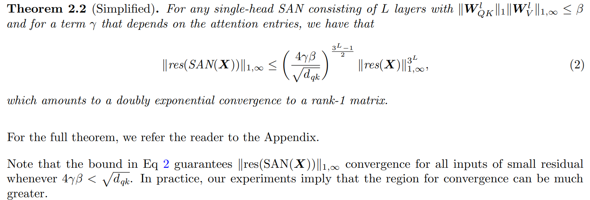
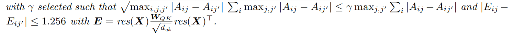
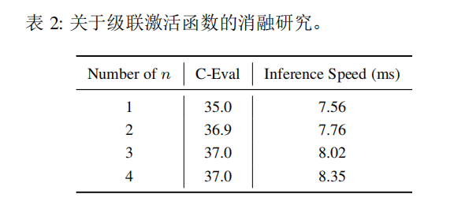
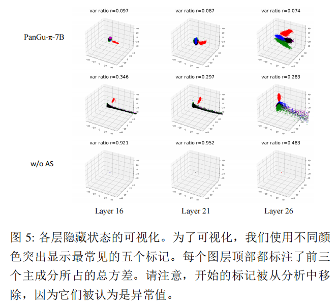
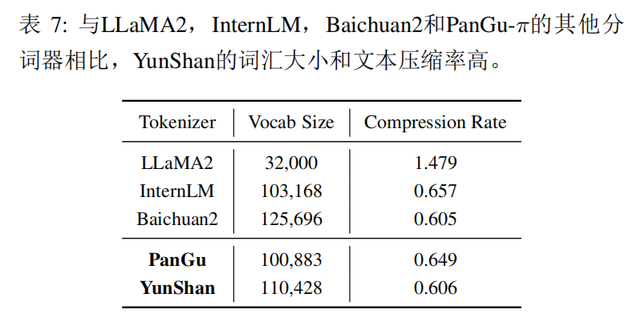

# PanGu-π: Enhancing Language Model Architectures via Nonlinearity Compensation

# PanGu-π：通过非线性补偿增强语言模型结构

## 摘要

大型语言模型的最近趋势是增加模型规模（即参数数量）和数据集以实现更好的生成能力，这一点已经在许多工作中得到证明，例如著名的GPT和Llama。然而，大型模型往往涉及巨大的计算成本，实际应用无法负担如此高昂的价格。然而，关于构建LLMs强大模型架构的方法很少被讨论。作者首先分析了最先进的语言模型架构，并观察到特征坍塌（feature collapse）问题。

> 这里的特征崩塌主要指秩崩塌
>
> ##### -
>
> 
>
> 
>
> 
>
> 
>
> 
>
> 

基于理论分析，本文提出非线性在语言模型中也非常重要，这通常是在用于视觉任务的卷积神经网络中的研究内容。然后，通过可忽略的微小计算引入级联信息激活函数（informed activation function），并进一步使用增强捷径（augmented shortcut）来增强模型的非线性。然后通过精心设计的消融试验证明了所提出的方法对于增强模型的非线性具有显著效果，从而本文提出了一个用于构建现代模型的高效模型架构，即PanGu-*π*。随后，本文使用相同的数据集和训练策略进行实验，将PanGu-*π*与最先进的LLMs进行比较。结果表明，PanGu-*π*-7B在推理速度提高约10%的情况下实现与基准模型相当的性能，而PanGu-*π*-1B在精度和效率方面可以实现最先进的性能。此外，将PanGu-*π*-7B部署在金融和法律等高价值领域，开发了名为YunShan的LLM进行实际应用。结果显示，YunShan可以超越其他类似规模的模型在基准测试上的表现。

索引术语——Transformer、大型语言模型、非线性、网络架构、金融、法律。

## 1 介绍

缩放定律（scaling law） [1]：通过增加模型大小和数据规模以显着提高下游任务的性能和新能力：
- 1750亿参数的GPT-3 [3]
- 5400亿参数的PaLM [4]
ChatGPT的成功归因于在大量文本数据上的预训练以及对人类偏好的微调，推动了LLM领域的快速发展：LLaMA [7]、ChatGLM [8]和Baichuan [9]。

高价值的领域特定大型模型LLM:
- LaWGPT[10]通过专门的法律词汇和大规模中国法律语料库的广泛预训练，提升了在法律领域的基本语义理解。
- FinGPT [11] 以数据为中心的方法开发了开源LLM。
- Huatuo[12]构建了中文医学指导微调数据集，并增强了其在医学领域问答的性能。

专业领域LLM行业分布的分析表明，金融和法律领域的LLM因其广泛的需求和商业价值而最受关注。

Transformer模型 [13]是许多LLM的基础架构。Transformer模型的核心组件包括多头自注意力（MSA）和前馈网络（FFN）。MSA为输入序列中的每个标记计算与所有其他标记的注意力分数，捕捉关系和依赖性。 FFN单独对每个标记执行操作，提供更多的非线性变换和模型容量（模型能够拟合数据的能力）。

Transformer架构用于构建用于自然语言处理（NLP）任务的编码器（例如BERT）和解码器（例如GPT-2）。在LLM中，普遍使用仅解码器架构，通过上下文信息预测下一个标记 [3], [5]。

 在标准Transformer架构之外，一系列研究探索了架构修改（尤其是MSA [14], [15]或FFN[4], [7]），以寻求更好的性能。

- PaLM [4]和LLaMA [7]使用基于SwiGLU的FFN [16]，它由两个线性层的分量积组成，展现了显著提高的生成质量。

- RWKV（Receptance Weighted Key Value） [14]提出了一种RNN风格的注意力机制，以减轻标准MSA中的二次复杂性。

- Switch Transformer [17]为每个输入示例分配不同的参数，得到一个稀疏激活的模型。 

LLM的开发是一项复杂的系统工程，其中模型架构设计是最重要的组成部分，它决定了部署的LLM的最大性能潜力。在2022-2023年的最新项目中，常用于二次开发的热门版本是GPT-3 [3]和LLaMA [7]。
特征崩溃问题影响Transformer架构的表达能力。以LLaMA为例， 使用秩1矩阵 （rank-1 metric）[19]对其特征崩溃现象进行了分析。特征的秩在深层中快速退化，导致所有标记之间的相似性增加。 这严重降低了LLM的生成质量和多样性。

作者在Transformer架构中从理论上分析了特征崩溃问题（详见第 3节），非线性显著影响Transformer模型的能力。增强非线性能够有效缓解特征崩溃问题，提高Transformer模型的表达能力。

PanGu-π通过非线性补偿来解决特征坍塌问题。从两个方法的角度引入更多的非线性，分别在FFN和MSA模块中，而不显著增加模型复杂度。
- 在FFN中配备了级联激活函数，该函数具有多个可学习的仿射变换，增强整个网络的非线性，计算量几乎可以忽略不计。
- 将增强捷径与每个 MSA 模块的主分支并行，以避免秩崩溃。

增强型PanGu - π架构由基于级联激活的FFN和捷径增强型MSA共同构成。

作者构建了两个不同模型规模的PanGu-π版本， 即PanGu-π-7B和PanGu-π-1B。 

- 通过在大规模语料库上训练， PanGu-π模型在下游任务上获得了通用的语言能力。 

- 通过消融实验，证明了所提出的方法可以有效地增强模型的非线性和减轻特征坍塌。

因此，在相同的参数规模下，通过这两个模块，可以实现大幅度的效率提升。

与最先进的LLM进行比较。在模型规模相似的情况下， PanGu-π模型在准确性和效率方面都可以取得更好的性能。 

除了基础能力外，在金融和法律等高价值领域部署PanGu-π-7B，并开发了一种名为YunShan的专用LLM。金融和法律基准的广泛评估也显示出YunShan在类似规模的其他最先进模型上具有出色的性能。

该工作介绍了一种新的LLM网络架构PanGu-π， 通过广泛的实验和理论分析，借鉴了作者在NeurIPS 2023 [20]和NeurIPS 2021 [18]上发表的初步工作的一些思想。 本文的研究做出了以下贡献。

- 之前的两篇论文，一 篇涉及CNN主体的构建 [20]，另一篇则专注于Vision Transformers [18]，为本文在LLM中的延伸奠定了基础。
- 之前的两篇论文从不同的角度分析了网络设计的问题。在本次研究中，这两个工作在理论上得到了 整合，并从统一的角度解决了LLM领域中的同一关键问题。
- 有机地将级联激活适应到FFN中，并将增强的捷径集成到MSA中。这两个组件相互补充，有效地引入更多非线性到Transformer架构中。
- 通过大规模训练和微调（SFT）开发了PanGu-π基础模型，其在类似的模型规模下，在一般的NLP任务中取得了最先进的结果。
- 通过迁移学习将PanGu-π扩展到金融和法律领域，并在这些下游任务中获得了出色的性能。

## 2 相关工作

### 2.1 LLMs

随着OpenAI的ChatGPT [ 21 ]的出现，具有数十亿个参数的LLMs在各种自然语言处理任务上取得了惊人的性能。随后，最新的GPT - 4 [ 22 ]将LLMs的泛化能力推向了一个新的高度。然而，GPT系列模式不利于开源社区的蓬勃发展。

开源LLMs的代表性工作是LLaMA [ 23 ]，它是一个从7B到65B参数的开源基础语言模型的集合。之后，推出了一个更详细的模型LLaMA2 [24]，根据人类评估结果，它与一些闭源模型 [21]不相上下。 自发布以来，LLaMA引起了学术界和工业界的广泛关注。 后续的努力都基于LLaMA进行了指令调整或持续预训练。

1. Stanford Alpaca [25]是第一个使用由自我指令方法 [26]生成的52K条指令跟踪样本进行微调的LLaMA聊天机器人。
2. Vicuna [27]使用了从ShareGPT [28]收集的用户对话进行了LLaMA的微调。

除了针对英语主导应用的语言模型之 外，多语言语言模型也在蓬勃发展。

1. InternLM [29]提出了一个 基于大规模语料库预训练的多语言基础语言模型，其过程是一个多阶段的渐进式过程，总共有1.6T个tokens。 
2. Baichuan2 [9]引入了一系列包含70亿和130亿参数的大规模多语言语言模型。
3. PanGu-Σ [30]将稠密的Transformer模型扩展为稀疏模型，并使用随机路由专家模块。

4.  Qwen [31]推出了一个全面的语言模型系列，包括参数数量不同的不同模型。
4. Skywork [32]提出了一种使用两阶段训练方法从英文和中文文本中提取语料进行训练的130亿参数LLMs。

### 2.2 增强型Transformer架构

#### 自然语言处理领域

传统的自注意机制具有二次计算复杂度，在训练和推理过程中处理长输入序列时存在挑战。

> 1. 注意权重计算：计算每个位置上的注意权重需要考虑所有位置之间的关系，因此注意力权重的计算成本是与序列长度的平方成正比。 
> 2.  注意力矩阵计算：在计算注意力权重的过程中，需要对所有位置上的特征进行加权求和，这需要构建一个注意力矩阵，其大小为序列长度的平方。

为了缓解这个问题，提出了一些关于注意力的结构先验，包括稀疏性(sparsity)[33], [34], [35], [36], [37]和线性注意力(linear attention) [15], [38]。

> 稀疏注意力（Sparse Attention）是一种优化的注意力机制，它可以将一个查询向量和一组键值对映射到一个输出向量，但与单头注意力和多头注意力不同的是，它不会计算查询向量和所有键向量的相似度，而是只计算查询向量和部分键向量的相似度，从而减少计算量和内存消耗。稀疏注意力的概念最早出现在2018年的论文《Generating Long Sequences with Sparse Transformers》中，该论文提出了一种基于Transformer的长序列生成模型，其中使用了稀疏注意力来处理超过8000个单词的文本序列。
>
> 线性注意力计算注意力权重的过程采用了简单的线性变换，而不是像传统的自注意力机制一样使用复杂的softmax函数来计算。在传统自注意力机制中，计算注意力权重需要对所有位置的特征进行加权求和，并且采用softmax函数来归一化这些权重，这会带来比较大的计算复杂度。而线性注意力则在计算注意力权重时，采用了简单的线性变换，这可以减少计算复杂度。
>
> 具体来说，线性注意力的计算过程如下： 假设给定输入序列的特征矩阵为X（假设形状为 [seq_length, hidden_dim]），那么对于位置i上的特征，可以定义一个权重矩阵W（形状为 [hidden_dim, 1]），然后通过简单的矩阵乘法运算得到位置i上的注意力权重为：$$ \alpha_i = X_i^T W $$，其中，$\alpha_i$ 表示位置i上的注意力权重，$X_i$ 表示位置i上的特征向量。这里不涉及softmax函数的计算，只是通过简单的线性变换得到注意力权重。

1. Reformer [39]采用了局部敏感哈希(locality-sensitive hashing)来近似全局注意力。
2. Longformer [40]将局部窗口注意力和任务驱动的全局注 意力结合起来。
3. GPT-3[41]还结合了局部带状稀疏注意力方法，比如因子化注意力(Factorized Attention) [34]。

还有一些模型专注于替换注意力模块，通过融入循环模型 [42], [43], [44]。

1. Hyena [45]通过训练一系列的门控单元和隐式参数化的长卷积，作为传统Transformer架构的无注意力替代。
2. RWKV [46]用线性成本的标量公式代替了二次的QK注意力。
3. RetNet [44]在理论上推导出了循环和注意力之间的联 系，并提出了序列建模的保留机制。

还有一些关注前馈网络(FFN)的高效改进方法。

1. 混合专家(Mixture-of-Experts, MoE) [47], [17], [48], [49], [50]在LLMs的预训练中证明了其有效性。
2. PaLM [51]和LLaMA [23]利用SwiGLU激活函数来处理原始的FFN中间激活。这个选择基于观察到的事实，在计算等价实验中，SwiGLU激活相对于标准激活函数如ReLU、GeLU或Swish大大提高了质量。

#### 计算机视觉领域

1. PVT [53]和Swin [54]利用多个阶段的分层结构， 克服了原始等向性ViT [55]在各种计算机视觉任务中所面临的挑战。

目前正在进行的研究关注于完善局部信息处理 [56], [57], [58], [59], [60], [61], [62]，简化注意力机制 [63], [64], [65]，以及探索替代模块 [66], [67], [68], [69], [70], [71]。

1. T2T-ViT [72]通过迭代聚合减少 了令牌长度，而TNT [62]通过将ViT的补丁划分来捕获局部信息。
2. Swin [54]和Cswin [73]在一个窗口内引入了局部注意力，并采用了移动的窗口划分来实现窗口间的连接。
3. GFnet [74]使用快速傅里叶变换(Fast Fourier Transform)进行令牌混合。
4. ResMLP [75]和MLP-Mixer [76]这样的架构完全依赖多层感知器(MLPs)，不包括卷积或自注意机制。

### 2.3 LLMs for Finance and Law

#### 金融领域LLM

> BigScience 大型开放科学开放获取多语言模型（简称 BLOOM）代表了语言模型技术民主化的重大进步。
>
> BLOOM由来自39个国家的1200多名参与者共同开发，是全球努力的产物。该项目由 BigScience 与 Hugging Face 和法国 NLP 社区合作协调，超越了地理和机构的界限。
>
> 它是一个开源的、仅解码器的转换器模型，具有 176B 参数，在 ROOTS 语料库上训练，该语料库是 59 种语言的数百个来源的数据集：46 种口语和 13 种编程语言。
>

1. Wu等人提出了第一个专用于金融领域的私有LLM，即BloombergGPT [77]，它是基于BLOOM [78]的仅解码器的因果语言模型。 提出的混合领域特定和通用数据的训练策略在两个领域中实现了平衡的性能。
2. FinGPT [79], [80]采用了以数据为中心的方法，并向研究人员和实践者呈现了一个开源的LLM。 它在情感分类、量化交易和金融欺诈检测等金融任务中展现出了良好的性能。
3. PIXIU [81]通过手工重构开源数据集 [82]创建了一个大规模的多任务指令数据集。
4. 通过对构建的指令数据集进行LLaMA的微调，得到了一个名为FinMA的金融LLM。

为了解决缺乏专门为中国金融设计的开源模型的问题，

1. Zhang等人引入了基于BLOOM [78]架构的XUANYUAN 2.0 [83]。为 了减轻灾难性遗忘，提出了结合预训练和微调阶段的混合调整策略。通过在预训练和微调阶段适当混合通用和金融语料库，XUANYUAN 2.0在通用领域和金融领域都取得了令人瞩目的表现。
2. Chen等人提出了一种名为DISC-FinLLM [84]的金融LLM，通过多位专家基于Baichuan-13B [85]进行框架微调。 对多个评估基准的实验结果显示了它的优异性能。

#### 法律领域LLM

1. Bao Luo和Lychee [ 86 ]、[ 87 ]是通过微调中国法律领域问答数据集开发的律师助理。
2. AI Lawyer [ 88 ]应用主动学习来缓解法律领域监督数据量有限的问题。 

3. Fed Judge [ 89 ]关注法律数据的隐私性，在指令调优时采用联邦学习[ 90 ]，并利用连续学习[ 91 ]缓解数据分布偏移问题。

HanFei、LaWGPT、 Lawyer-llama、 WisdomInterrogatory和Fuzi.Mingcha [92], [10], [93], [94], [95]经历了两阶段的训练过程：进一步使用无监督法律语料库进行预训练，提升在法律领域中的语义理解能力， 然后使用相应数据集进行监督训练。

4. HanFei [92]是中国第一个完全使用70亿参数进行训练并支持多轮对话的法律LLM。
5. LaWGPT [10]通过添加特定的法律领域术语扩展了词汇量。
6. Lawyer-llama [93]在指令调整阶段进行了不同的数据排列和训练顺序的实验。

在推理时，LawGPT zh(XieZhi)、LexiLaw、 ChatLaw、Lawyer-llama、Fuzi.Mingcha和DISC-LawLLM [96], [97], [98], [93], [95], [99]引入检索模块，以确保知识库中的法律文件支持回应。

7. ChatLaw [98]还使用关键词模型 进行关键信息提取，以减少用户查询的歧义性。
7. Fuzi.Mingcha [95]通过将LLM训练在一个自构建的数据集上，使其能够使用推理推断进行裁决预测。

## 3 准备工作和动机

Transformer 架构有两部分组成，多头自注意力(multi-head selfattention,MSA)和多层MLP模块(multi-layer perceptrons modules,MLP)。

具有 H个头的 MSA 模块定义为:
$$
\begin{equation}
	\begin{aligned}
		&MSA(\boldsymbol{Z}_l)=Concat ([\boldsymbol{A}_{lh}\boldsymbol{Z}_{l}\boldsymbol{W}^v_{lh}]_{h=1}^H)\boldsymbol{W}^o_{l},\\
		&	l \in [1,2,\cdots, L],
	\end{aligned}
\end{equation}
$$
其中$\boldsymbol{Z}_l\in \R^{N\times d}$是第$l$个$MSA$层的特征，$\boldsymbol{A}_{lh}\in \R^{N\times N}$和$\boldsymbol{W}^v_{lh} \in \R^{d\times (d/H)}$是第$h$个头的相应的注意力变换和值投影矩阵。$Concat(\cdot)$表示$H$个头的特征拼接运算，$\boldsymbol{W}^o_l\in \R^{d\times d}$是输出投影矩阵。
	
注意力矩阵$\boldsymbol{A}_{lh}$通过自注意力机制计算，
$$
\begin{equation}
	\boldsymbol{A}_{lh}={\rm softmax}\left(\frac{(\boldsymbol{Z}_{l}\boldsymbol{W}^q_{lh})(\boldsymbol{Z}_{l}\boldsymbol{W}^k_{lh})^\top}{\sqrt d}\right),
\end{equation}
$$
其中，$\boldsymbol{W}^q_{lh}\in \R^{d\times (d/H)}$和$\boldsymbol{W}^k_{lh}\in \R^{d\times (d/H)}$分别是查询和键投影矩阵。注意力$\boldsymbol{A}_{lh}$反映了不同token之间的关系，较大的值$\boldsymbol{A}_{lh}^{ij}$表示token$i$和token$j$之间的关系更强。

MLP模块定义为
$$
\begin{equation}
	MLP (\boldsymbol{Z}'_{l}) = \sigma(\boldsymbol{Z}'_{l}\boldsymbol{W}'_{l_1})\boldsymbol{W}'_{l_2},~l \in [1,2,\cdots, L],
\end{equation}
$$
其中，$\boldsymbol{Z}'_{l}\in \R^{N\times d}$ 是第 $l$ 层 $MLP$ 的特征，$\boldsymbol{W}'_{l_1}$ 和 $\boldsymbol{W}'_{l_2}\in \R^{d\times d}$ 是权重矩阵。

在Transformer架构中，非线性表达能力来自两个方面：MSA和MLP中的激活函数。

定义 $\mathcal{M}_m:=\{\boldsymbol{Y}\in\mathbb{R}^{N\times m}|\boldsymbol{Y}=\boldsymbol{1x}^\top, \boldsymbol{x}^\top\in\mathbb{R}^{1\times m}\}$ 为 $\mathbb{R}^{N\times m}$ 中的子空间，其中 $\boldsymbol{1}=[1, 1, \dots, 1]^\top\in\mathbb{R}^{N\times1}$，$n$ 是token数量，$d$ 是token的维数。

定义矩阵 $\boldsymbol{H}\in\mathbb{R}^{N\times m}$ 与$\mathcal{M}_m$之间的距离为$d_{\mathcal{M}_m(\boldsymbol{H})}:=\min_{\boldsymbol{Y}\in\mathcal{M}_m} \Vert\boldsymbol{H}-\boldsymbol{Y}\Vert_F$,其中 $\Vert\cdot\Vert_F$ 是Frobenius范数。

$d_{\mathcal{M}_m}(\boldsymbol{Z_l})$是衡量Transformer架构能力和非线性性的常用度量。研究层 $l$ 的输出 $\boldsymbol{Z_l}$ 与子空间 $\mathcal{M}_d$ 之间的距离。

> 

##### **自注意力模块的非线性表达能力**

Transformer 中的自注意力矩阵可以直观地比作相应图的归一化邻接矩阵。从图的角度来看，自注意力层可以看作相当于在具有归一化边权重的全连接图上运行的图神经网络（GNN）。过多的自注意力层（例如 GNN 层）会导致过度平滑，节点向量表示往往相同，从而导致任何给定输入收敛到特定的低秩子空间。

利用自注意力层的公式来阐明这一现象的复杂性。

**Lemma 1.**对于自注意力矩阵$\boldsymbol{A} \in \mathbb{R}^{N\times N}$,任意权重矩阵 $\boldsymbol{W} \in \mathbb{R}^{d\times m}$,任意 $\boldsymbol{H},\boldsymbol{B}\in \mathbb{R}^{N\times d}$,$\alpha_1, \alpha_2 \geq 0$，且 $\sigma$ 是非线性Lipschitz连续激活函数,有
$$
\begin{align*}
		d_{\mathcal{M}_m}(\boldsymbol{HW}) &\leq sd_{\mathcal{M}_d}(\boldsymbol{H}), \\
		d_{\mathcal{M}_d}(\sigma(\boldsymbol{H})) &\leq Ld_{\mathcal{M}_d}(\boldsymbol{H}), \\
		d_{\mathcal{M}_d}(\alpha_1 \boldsymbol{H}+\alpha_2 \boldsymbol{B}) &\leq \alpha_1 d_{\mathcal{M}_d}(\boldsymbol{H}) + \alpha_2 d_{\mathcal{M}_d}(\boldsymbol{B}), \\
		d_{\mathcal{M}_d}(\boldsymbol{A}\boldsymbol{H}) &\leq \sqrt{\lambda_{\max}} d_{\mathcal{M}_d}(\boldsymbol{H}) 
	\end{align*}
$$
其中$s$是矩阵$\boldsymbol{W}$的最大奇异值，$\lambda_{\max}$是矩阵$\boldsymbol{A}^\top(\boldsymbol{I}-\boldsymbol{ee}^\top)\boldsymbol{A}$的最大特征值，$L$是激活函数$\sigma(\cdot)$的Lipschitz常数。

**Proof**：

(1) 该公式的证明如下：

设 $\boldsymbol{WW}^\top=\boldsymbol{PDP}^\top$ 为 $\boldsymbol{WW}^\top$ 的特征分解，其中 $\boldsymbol{P}=[\boldsymbol{p}_1,\boldsymbol{p}_2, \dots, \boldsymbol{p}_d]$ 是标准正交矩阵，$\boldsymbol{D}=\text{diag}(d_1, \dots, d_d)$ 的所有元素满足 $d_1 \geq \dots \geq d_d\geq 0$，对于非零特征值 $d_i = s_i^2 > 0$，其中 $s_i$ 是 $\boldsymbol{W}$ 的第 i 个最大奇异值。

设 $\boldsymbol{HH}^\top=\boldsymbol{Q\Omega Q}^\top$ 为 $\boldsymbol{HH}^\top$ 的特征分解，其中 $\boldsymbol{Q}=[\boldsymbol{q}_1,\boldsymbol{q}_2, \dots, \boldsymbol{q}_N]$ 是正交矩阵，$\boldsymbol{\Omega}=\text{diag}(\omega_1, \dots, \omega_N)$ 的所有元素满足 $\omega_i\geq 0$。并且 $\boldsymbol{e}=N^{-1/2}[1,1, \dots, 1]^\top= N^{-1/2} \boldsymbol{1} \in\mathbb{R}^{N\times 1}$。
$$
\begin{align*}
		d_{\mathcal{M}_m}(\boldsymbol{H}\boldsymbol{W})^2
		&=\Vert(\boldsymbol{I}-\boldsymbol{ee}^\top)\boldsymbol{H}\boldsymbol{W} \Vert^2_F \\
		&=tr\{(\boldsymbol{I}-\boldsymbol{ee}^\top)\boldsymbol{H}\boldsymbol{WW}^\top\boldsymbol{H}^\top(\boldsymbol{I}-\boldsymbol{ee}^\top)\} \\
		&=tr\{\boldsymbol{WW}^\top\boldsymbol{H}^\top(\boldsymbol{I}-\boldsymbol{ee}^\top)\boldsymbol{H}\}\\
		&=tr\{\boldsymbol{PD{P}^\top}\boldsymbol{H}^\top(\boldsymbol{I}-\boldsymbol{ee}^\top)\boldsymbol{H}\}\\
		&=tr\{\boldsymbol{D{P}^\top}\boldsymbol{H}^\top(\boldsymbol{I}-\boldsymbol{ee}^\top)\boldsymbol{HP}\}\\
		&=\sum_{i=1}^N d_i\boldsymbol{p}_i^\top\boldsymbol{H}^\top(\boldsymbol{I}-\boldsymbol{ee}^\top)\boldsymbol{H}\boldsymbol{p}_i\\
		&\leq \sum_{i=1}^N s^2\boldsymbol{p}_i^\top\boldsymbol{H}^\top(\boldsymbol{I}-\boldsymbol{ee}^\top)\boldsymbol{H}\boldsymbol{p}_i\\
		&=s^2d_{\mathcal{M}_d}(\boldsymbol{H})^2.
	\end{align*}
$$
由于矩阵 $\boldsymbol{H}^\top(\boldsymbol{I}-\boldsymbol{ee}^\top)\boldsymbol{H}$ 是半正定的，$\boldsymbol{p}_i^\top\boldsymbol{H}^\top(\boldsymbol{I}-\boldsymbol{ee}^\top)\boldsymbol{H}\boldsymbol{p}_i \geq 0$。

由此可得 $d_{\mathcal{M}_m}(\boldsymbol{H}\boldsymbol{W}) \leq sd_{\mathcal{M}_d}(\boldsymbol{H})$。

注意到 $d_{\mathcal{M}_d}(\boldsymbol{H}) = \Vert \boldsymbol{H}-\boldsymbol{1x}_{\min}^\top\Vert_F$，其中 $\boldsymbol{x}_{\min}^\top = \arg\min_{\boldsymbol{x}_l} \Vert \boldsymbol{H}-\boldsymbol{1x}_{l}^\top \Vert_F$。而且 $\Vert \sigma(\boldsymbol{H}_1)-\sigma(\boldsymbol{H}_2)\Vert_F \leq L \Vert \boldsymbol{H}_1 -\boldsymbol{H}_2\Vert_F$

(2) 公式的证明如下：
$$
\begin{align*}

​    d_{\mathcal{M}_d}(\sigma(\boldsymbol{H})) &= \Vert \sigma(\boldsymbol{H})-\boldsymbol{1{x^{\sigma}}_{\min}}^\top\Vert_F \\

​    &\leq \Vert \sigma(\boldsymbol{H})-\boldsymbol{1}{\sigma(\boldsymbol{x}_{\min})}^\top\Vert_F \\

​    &=  \Vert \sigma(\boldsymbol{H})-\sigma(\boldsymbol{1}\boldsymbol{x}_{\min}^\top)\Vert_F \\

​    &\leq  L \Vert \boldsymbol{H} -\boldsymbol{1}\boldsymbol{x}_{\min}^\top\Vert_F \\

​    &= L d_{\mathcal{M}_d}(\boldsymbol{H}), \\

  \end{align*}
$$
  (3) 公式的证明如下：
$$
\begin{align*}
		&\alpha_1 d_{\mathcal{M}_d}(\boldsymbol{H}) + \alpha_2 d_{\mathcal{M}_d}(\boldsymbol{B}) \\
		&=  \alpha_1 \Vert \boldsymbol{H}-\boldsymbol{1{x^{H}_{\min}}^\top}\Vert_F + \alpha_2 \Vert \boldsymbol{B}-\boldsymbol{1{x^{B}_{\min}}^\top}\Vert_F\\
		&\geq  \Vert \alpha_1\boldsymbol{H} + \alpha_2  \boldsymbol{B} - \boldsymbol{1{(\alpha_1x^{H}_{\min}+\alpha_2x^{B}_{\min})}^\top} \Vert_F \\
		&\geq  \Vert \alpha_1\boldsymbol{H} + \alpha_2  \boldsymbol{B} - \boldsymbol{1{(x^{\alpha_1H+\alpha_2B}_{\min})}^\top} \Vert_F \\
		&= d_{\mathcal{M}_d}(\alpha_1 \boldsymbol{H}+\alpha_2 \boldsymbol{B})\\
	\end{align*}
$$
  (4) 对于最后一个不等式，参考了[100].

**Theorem 1.**给定一个由 MSA 模块堆叠的模型，第$l$层中特征的多样性$d_\mathcal{M}(\boldsymbol{Z_l})$ 可以受输入数据$\boldsymbol{Z_0}$ 的多样性限制，即
$$
\begin{align*}
		&d_{\mathcal{M}_m}(\boldsymbol{AZ}_l\boldsymbol{W})\leq \sqrt{\lambda} s\upsilon_1 d_{\mathcal{M}_d}(\boldsymbol{Z}_l). 
	\end{align*}
$$
其中 $s>0$是所有$\boldsymbol{W}$ 的所有奇异值的最大元素，$\lambda$ 是每个自注意力矩阵$\boldsymbol{A}$的所有 $\boldsymbol{A}^\top(\boldsymbol{I}-\boldsymbol{ee}^\top)\boldsymbol{A}$的最大特征值。

**Proof**：
$$
\begin{align*}
		d_{\mathcal{M}_m}(\boldsymbol{AZ}_l\boldsymbol{W}) 
		&\leq \sqrt{\lambda}d_{\mathcal{M}_m}(\boldsymbol{Z}_{l}\boldsymbol{W}) \\
		&\leq \sqrt{\lambda}sd_{\mathcal{M}_m}(\boldsymbol{Z_{l}}) \\
	\end{align*}
$$
对于拼接矩阵的低秩矩阵投影，有以下引理：

**Lemma 2.**对于分块矩阵 $\boldsymbol{H}_h \in \mathbb{R}^{N\times m}$，我们有：
$$
\begin{align*}

​    d_{\mathcal{M}_{Hm}}(Concat ([\boldsymbol{H}_h]_{h=1}^H))^2 &= \sum_{h=1}^{H}d_{\mathcal{M}_m}(\boldsymbol{H}_h)^2,

  \end{align*}
$$
**Proof**:
$$
\begin{align*}
		&d_{\mathcal{M}_{Hm}}(Concat ([\boldsymbol{H}_h]_{h=1}^H))^2 \\
		=&\Vert(\boldsymbol{I}-\boldsymbol{ee}^\top)Concat ([\boldsymbol{H}_h]_{h=1}^H) \Vert^2_F \\
		=&{tr\{(\boldsymbol{I}-\boldsymbol{ee}^\top)Concat ([\boldsymbol{H}_h]_{h=1}^H)Concat ([\boldsymbol{H}_h]_{h=1}^H)^\top\}} \\
		=&tr\{Concat ([\boldsymbol{H}_h]_{h=1}^H)Concat ([\boldsymbol{H}_h]_{h=1}^H)^\top\}\\
		&-tr\{Concat ([\boldsymbol{e}^\top\boldsymbol{H}_h]_{h=1}^H)Concat ([\boldsymbol{ee}^\top\boldsymbol{H}_h]_{h=1}^H)^\top\} \\
		=&\sum_{h=1}^{H}{tr\{(\boldsymbol{I}-\boldsymbol{ee}^\top)\boldsymbol{H}_h\boldsymbol{H}_h^\top\}} \\
		=& \sum_{h=1}^{H}d_{\mathcal{M}_m}(\boldsymbol{H}_h)^2,
	\end{align*}
$$
**Theorem 2.**给定由 MSA 模块堆叠的模型，第$l$层中特征的多样性 $d_\mathcal{M}(\boldsymbol{Z}_l)$可以受输入数据 $\boldsymbol{Z}_0$的多样性限制，即
$$
\begin{align*}
		&d_{\mathcal{M}_d}(MSA(\boldsymbol{Z}_l))\leq \sqrt{\lambda H}s\upsilon_1 d_{\mathcal{M}_d}(\boldsymbol{Z}_l). \\
		&d_{\mathcal{M}_d}(\boldsymbol{Z}_l)\leq (\sqrt{\lambda H} s\upsilon_1)^{l}d_{\mathcal{M}_d}(\boldsymbol{Z}_0). 
	\end{align*}
$$
其中  $H$  是头个数，$s>0$  是所有$\boldsymbol{W}^v_{lh}$的所有奇异值的最大元素， $\upsilon_{1}$是所有  $\boldsymbol{W}^o_{l}$ 的所有奇异值的最大元素。

**Proof**：
$$
\begin{align*}
		{MSA} (\boldsymbol{Z}_l)=  Concat ([\boldsymbol{A}_{lh}\boldsymbol{Z}_{l}\boldsymbol{W}^v_{lh}]_{h=1}^H)\boldsymbol{W}^o_{l},
	\end{align*}
$$

$$
\begin{align*}
		d_{\mathcal{M}_d}(\boldsymbol{Z}_{l+1})&= d_{\mathcal{M}_d}(Concat ([\boldsymbol{A}_{lh}\boldsymbol{Z}_{l}\boldsymbol{W}^v_{lh}]_{h=1}^H)\boldsymbol{W}^o_{l}) \\
		&\leq \upsilon_1 d_{\mathcal{M}_d}(Concat ([\boldsymbol{A}_{lh}\boldsymbol{Z}_{l}\boldsymbol{W}^v_{lh}]_{h=1}^H)) \\
		&\leq \upsilon_1\sqrt{\sum_{h=1}^H d_{\mathcal{M}_d}(\boldsymbol{A}_{lh}\boldsymbol{Z}_{l}\boldsymbol{W}^v_{lh})^2}\\ 
		&\leq \sqrt{\lambda}s\upsilon_1\sqrt{\sum_{h=1}^H d_{\mathcal{M}_d}(\boldsymbol{Z}_{l})^2} \\
		&= \sqrt{\lambda H}s\upsilon_1d_{\mathcal{M}_d}(\boldsymbol{Z}_{l}) \\
		&\leq (\sqrt{\lambda H} s\upsilon_1)^{l+1}d_{\mathcal{M}_d}(\boldsymbol{Z}_0). \\
	\end{align*}
$$

进一步假设${\boldsymbol{A}}$是双随机矩阵（即${\boldsymbol{A}}^\top{\boldsymbol{e}}={\boldsymbol{e}}$）且具有正的元素。根据Perron-Frobenius定理，${\boldsymbol{A}}^\top{\boldsymbol{A}}$的最大特征值是1，对应的特征向量是${\boldsymbol{e}}$。在这种情况下，矩阵${\boldsymbol{A}}^\top({\boldsymbol{I}}-{\boldsymbol{ee}}^\top){\boldsymbol{A}}={\boldsymbol{A}}^\top{\boldsymbol{A}}-{\boldsymbol{ee}}^\top$有一个最大特征值$\lambda_{max}<1$。

通常情况下，$\sqrt{\lambda H} s\upsilon_1$小于1，因此当网络层数增加时，特征多样性$d_{\mathcal{M}_d}(\boldsymbol{Z}_l)$迅速减小。递归地，如果$\sqrt{\lambda H} s\upsilon_1<1$且所有表示都相同，那么${\boldsymbol{Z}}_l$会收敛到子空间$\mathcal{M}_d$，从而导致过度平滑。总之，普通MSA的非线性表达能力是有限的。

##### **多层感知器模块的非线性表达能力**

**Theorem 3.**给定由 MLP 模块堆叠的模型，第$l$层中特征的多样性 $d_{\mathcal{M}_d}(\boldsymbol{Z}'_l)$ 可以受输入数据 $\boldsymbol{Z}'_0$的多样性限制，即
$$
\begin{align*}
		&d_{\mathcal{M}_d}(MLP(\boldsymbol{Z}'_l))\leq  Ls\upsilon_2 d_{\mathcal{M}_d}(\boldsymbol{Z}'_{l}). \\
		&d_{\mathcal{M}_d}(\boldsymbol{Z}'_l)\leq (Ls\upsilon_2)^{l}d_{\mathcal{M}_d}(\boldsymbol{Z}'_0). 
	\end{align*}
$$
其中 $s>0$是所有$\boldsymbol{W}'_{l_1}$的所有奇异值的最大元素，$\upsilon_{2}$ 是所有 $\boldsymbol{W}'_{l_2}$的所有奇异值的最大元素，$L$是激活函数$\sigma(\cdot)$的 Lipschitz 常数。

**Proof**:
$$
\begin{align*}
		MLP (\boldsymbol{Z}'_{l}) = \sigma(\boldsymbol{Z}'_{l}\boldsymbol{W}'_{l_1})\boldsymbol{W}'_{l_2},~l \in [1,2,\cdots, L],
	\end{align*}
$$

$$
\begin{align*}
		d_{\mathcal{M}_d}(MLP (\boldsymbol{Z}'_{l})))&= d_{\mathcal{M}_d}(\sigma(\boldsymbol{Z}'_{l}\boldsymbol{W}'_{l_1})\boldsymbol{W}'_{l_2}) \\
		&\leq \upsilon_2d_{\mathcal{M}_d}(\sigma(\boldsymbol{Z}'_{l}\boldsymbol{W}'_{l_1})) \\
		&\leq L\upsilon_2d_{\mathcal{M}_d}(\boldsymbol{Z}'_{l}\boldsymbol{W}'_{l_1}) \\ 
		&\leq  Ls\upsilon_2d_{\mathcal{M}_d}(\boldsymbol{Z}'_{l}) \\
	\end{align*}
$$

$$
\begin{align*}
		d_{\mathcal{M}_d}(\boldsymbol{Z}'_l)&\leq (Ls\upsilon_2)d_{\mathcal{M}_d}(\boldsymbol{Z}'_{l-1}) \\
		&\leq (Ls\upsilon_2)^{l}d_{\mathcal{M}_d}(\boldsymbol{Z}'_0).
	\end{align*}
$$

MLP的多样性由两个因素构成：参数的特征值和激活函数的Lipschitz常数。在神经网络中，参数通常被标准化，这意味着这些参数的最大特征值是有界的。此外，神经网络中的参数是通过反向传播学习的。考虑到这些因素，对参数特征值施加限制具有挑战性。因此，MLP中的激活函数成为其非线性表达能力最重要的方面。

## 4 PANGU-π模型和架构

- 级联激活函数增强 MLP 模块的非线性
- 改进 Transformer 架构中的 MSA 模块的增强捷径
- 结合产生了一种新颖且更强大的 Transformer 模型。

### 4.1 增强捷径（Augmented Shortcut）

纯注意力机制引起了一个特征塌陷的问题。传统的LLM架构仅仅为每个MSA模块配备了一个单一的捷径连接，即一个恒等变换，直接复制输入特征到输出。 这种简单的公式化可能没有足够的表示能力来最大程度地改善特征多样性。

增强捷径来缓解特征塌陷问题，通过将原始恒等捷径与更多参数化的投影方式并行化。 具有$T$个增强快捷方式的MSA模块可以表示为：
$$
\begin{equation}
	\begin{aligned}
		\label{eq-augmsa}
		&{\rm AugMSA} (\boldsymbol{Z}_{l})=MSA(\boldsymbol{Z}_l) + \boldsymbol{Z}_l  +  \sum_{i=1
		}^T \mathcal{T}_{{li}}(\boldsymbol{Z}_{l};\boldsymbol{\Theta}_{li}),\\
		&l \in [1,2,\cdots, L],
	\end{aligned}
\end{equation}
$$
其中，$\mathcal{T}_{{li}}(\cdot)$表示第$l$层的第$i$个捷径，$\Theta_{li}$表示其参数。除了原始的捷径外，增强捷径提供了更多绕过注意机制的替代路径。与直接复制输入标记到相应输出的恒等投影不同，参数化投影$\mathcal{T}_{{li}}(\cdot)$将输入特征转换为另一个特征空间。只要它们的权重矩阵$\Theta_{li}$不同，投影$\mathcal{T}_{{li}}(\cdot)$将对输入特征应用不同的转换，因此并行更多的增强捷径有潜力丰富特征空间。

$\mathcal{T}_{li}(\cdot)$的一个简单公式为线性投影和激活函数的序列，即 
$$
\begin{equation}
	\begin{aligned}
		&\mathcal{T}_{li}(\boldsymbol{Z}_{l};\boldsymbol{\Theta}_{li}) = \sigma(\boldsymbol{Z}_l\boldsymbol{\Theta}_{li}),\\ 
		&l \in [1,\cdots, L],~i \in [1,2,\cdots, T],
	\end{aligned}
\end{equation} 
$$
其中$\Theta_{li}\in \R^{d\times d}$是权重矩阵，$\sigma$是非线性激活函数（例如，GELU）。

$\mathcal{T}_{li}(\cdot)$独立处理每个token并保留其特异性，这与聚合不同标记的MSA模块相辅相成。恒等映射是特例，即$\sigma(x)=x$且$\boldsymbol{\Theta}_{li}$是单位矩阵。

这表明在没有捷径的情况下，特征多样性的上限$d_{\mathcal{M}_d}(\boldsymbol{Z}_l)$随着网络深度的增加而显著降低。通过分析AugMSA模块堆叠的模型中，多样性$d_{\mathcal{M}_d}(\boldsymbol{Z}_l)$如何随层$l$变化。有以下定理：

**Theorem 4.**给定由 AugMSA 模块堆叠的模型，第$l$层中特征的多样性 $d_{\mathcal{M}_d}(\boldsymbol{Z}_l)$可以受输入数据 $\boldsymbol{Z}_0$的多样性限制，即
$$
\begin{equation*}
		\small
		\begin{aligned}
			&d_{\mathcal{M}_d}({\rm AugMSA}(\boldsymbol{Z}_{l}))
			\leq (\sqrt{\lambda H} s\upsilon_1 + 1+ \sum_{i=1}^T L\Vert \boldsymbol{\Theta}_{li}\Vert_2)d_{\mathcal{M}_d}(\boldsymbol{Z}_l), \\
			&d_{\mathcal{M}_d}(\boldsymbol{Z}_{l})
			\leq (\sqrt{\lambda H} s\upsilon_1 + 1+ \sum_{i=1}^T L\Vert \boldsymbol{\Theta}_{li}\Vert_2)^ld_{\mathcal{M}_d}(\boldsymbol{Z}_0), 
		\end{aligned}
	\end{equation*}
$$
其中$H$是头的数量，s$>0$是所有 $\boldsymbol{W}_l$的所有奇异值的最大元素，$\Vert\cdot\Vert_2$是矩阵的$\ell_2$范数。

**Proof:**
$$
\begin{align*}
		{\rm AugMSA} (\boldsymbol{Z}_{l})=MSA(\boldsymbol{Z}_l) + \boldsymbol{Z}_l  +  \sum_{i=1
		}^T T_{{li}}(\boldsymbol{Z}_{l};\boldsymbol{\Theta}_{li}),\\ 
	\end{align*}
$$

$$
\begin{align*}
		&d_{\mathcal{M}_d}({\rm AugMSA} (\boldsymbol{Z_{l}}))\\
		&= d_{\mathcal{M}_d}(MSA(\boldsymbol{Z}_l) + \boldsymbol{Z}_l  +  \sum_{i=1
		}^T T_{{li}}(\boldsymbol{Z}_{l};\boldsymbol{\Theta}_{li})) \\
		&\leq d_{\mathcal{M}_d}(MSA(\boldsymbol{Z}_l)) + d_{\mathcal{M}_d}(\boldsymbol{Z}_l) + d_{\mathcal{M}_d}(\sum_{i=1}^T T_{{li}}(\boldsymbol{Z}_{l};\boldsymbol{\Theta}_{li}))\\
		&\leq d_{\mathcal{M}_d}(MSA(\boldsymbol{Z}_l)) + d_{\mathcal{M}_d}(\boldsymbol{Z}_l) + \sum_{i=1}^T d_{\mathcal{M}_d}(\sigma(\boldsymbol{Z}_{l}\boldsymbol{\Theta}_{li})) \\   
		&\leq  (\sqrt{\lambda H} s\upsilon_1 + 1)d_{\mathcal{M}_d}(\boldsymbol{Z}'_{l}) + L\sum_{i=1}^T d_{\mathcal{M}_d}(\boldsymbol{Z}_{l}\boldsymbol{\Theta}_{li})\\
		&\leq (\sqrt{\lambda H} s\upsilon_1 + 1+ \sum_{i=1}^T L\Vert \boldsymbol{\Theta}_{li}\Vert_2)d_{\mathcal{M}_d}(\boldsymbol{Z}_l).
	\end{align*}
$$

假定多头自注意力机制有$H$个头，
$$
\begin{align*}
		&d_{\mathcal{M}_d}(\boldsymbol{Z}_{l})
		\leq (\sqrt{\lambda H} s\upsilon_1 + 1+ \sum_{i=1}^T L\Vert \boldsymbol{\Theta}_{li}\Vert_2)^ld_{\mathcal{M}_d}(\boldsymbol{Z}_0).
	\end{align*}
$$
由于$\alpha_i = (\sqrt{\lambda H} s\upsilon_1 + 1+ \sum_{i=1}^T L\Vert  \boldsymbol{\Theta}_{li}\Vert_2) > 1$，这使得能够防止特征坍缩。

与定理2相比，增强捷径引入了额外的项$(\sqrt{\lambda H} s\upsilon_1 + 1+ \sum_{i=1}^T L\Vert \boldsymbol{\Theta}_{li}\Vert_2)^l$，这种增长是指数级的。这有助于抑制注意机制引起的多样性衰减。项$\alpha_i$ ($0\le i\le l$)由增强捷径在第$l$层的权重矩阵$\boldsymbol{\Theta}_{li}$的范数和多样性上限$d_{\mathcal{M}_d}(\boldsymbol{Z}_{l})$决定，前面各层的增强捷径都会影响到第$l$层的多样性上限。对于只有一个恒等捷径的ShortcutMSA模块，有$\alpha_i=\sqrt{\lambda} Hs\upsilon_1 + 1$。增加更多的增强捷径可以增加$\alpha_i$的大小，从而进一步改善上限。

如上所述，将多个增强捷径与MSA和MLP模块共同应用于Vision Transformer可以增加特征多样性以实现更高的性能。

然而，直接实现$\mathcal{T}_{li}(\cdot)$涉及到大量的矩阵乘法，计算代价较高。例如，给定特征$\boldsymbol{Z}_l \in \R^{n\times d}$和权重矩阵$\boldsymbol{\Theta}_{li} \in \R^{d \times d}$，矩阵乘法$\boldsymbol{Z}_l\boldsymbol{\Theta}_{li}$的计算量是$nd^2$ FLOPs，在Vision Transformer中$d$通常很大（如LLaMA-7B中的4096）。在[104] 中，使用了块循环矩阵实现了增强捷径，通过快速傅里叶变换（FFT）实现了快速推断。尽管它在理论上实现了高度加速，但在实验中发现它的实际速度取决于硬件优化。考虑到LLM是一个通用模型，使用一个更简单的瓶颈模块来实现增强捷径。该模块由两个带有非线性激活函数（如GeLU）的全连接层堆叠而成。第一个全连接层通过减少比率$r$将$d$维特征降低到一个低维空间，第二个全连接层将原始特征维度恢复。然后计算代价减少为$2nd^2/r$ FLOPs。较大的$r$意味着进一步降低计算代价。例如，当将减少比率$r$设置为32时，计算代价相比原始的增强捷径可以降低$16\times$。

捷径使用了一个具有较大权重的身份分支，例如${\rm AugMSA} (\boldsymbol{Z}_l)= MSA(\boldsymbol{Z}_l) + \alpha \boldsymbol{Z}_l(\sum_{i=1}^T \boldsymbol{\Theta}_{li})$（其中$\alpha > 0$），来防止特征坍缩，但这降低了网络性能。因为特征多样性 $d_{\mathcal{M}_d}(\boldsymbol{H})$增加了过多的噪声。噪声对特征多样性的影响通常是误判的。例如，如果$\boldsymbol{H}=\boldsymbol{0}$，那么$d_{\mathcal{M}_d}(\boldsymbol{H})=0$。然而，当输入矩阵引入了一个零均值的噪声$\boldsymbol{\epsilon}$，那么$d_{\mathcal{M}_d}(\boldsymbol{H+\epsilon})=\Vert \boldsymbol{\epsilon} \Vert_F>d_{\mathcal{M}_d}(\boldsymbol{H})=0$。这要求提高多样性特征并尽量减小噪声多样性对网络的影响。在保证$d_{\mathcal{M}_d}(\boldsymbol{Z}_{l})$不被削弱的同时，减小$|d_{\mathcal{M}_d}({\rm AugMSA}(\boldsymbol{Z}_{l}+\boldsymbol{\epsilon})) - d_{\mathcal{M}_d}({\rm AugMSA}(\boldsymbol{Z}_{l}))|$的值。

下面描述了噪声的特征多样性的定义。

噪声对矩阵投影$d_{\mathcal{M}_d}(\boldsymbol{H})$的影响。
$$
\begin{equation}
	\begin{aligned}
		&|d_{\mathcal{M}_d}(\boldsymbol{H+\epsilon}) - d_{\mathcal{M}_d}(\boldsymbol{H})| 
		\leq\Vert \boldsymbol{\epsilon} -\boldsymbol{1}{(\boldsymbol{x}^{\boldsymbol{H+\epsilon}}_{\min}-\boldsymbol{x}^{\boldsymbol{H}}_{\min})}^\top \Vert_F \\
		\leq &d_{\mathcal{M}_d}(\boldsymbol{\epsilon})= \Vert(\boldsymbol{I}-\boldsymbol{ee}^\top )\boldsymbol{\epsilon}\Vert_F 
		= \Vert \boldsymbol{\epsilon} -\boldsymbol{1}{\boldsymbol{x}^{\boldsymbol{\epsilon}}_{\min}}^\top\Vert_F 
		\leq  \Vert \boldsymbol{\epsilon} \Vert_F.
	\end{aligned}
\end{equation}
$$
对于零均值噪声，下式成立 $\boldsymbol{ee}^\top \boldsymbol{\epsilon} = \boldsymbol{0} \in \mathbb{R}^{N\times d}$，从而上述不等式相等。

由于 $|d_{\mathcal{M}_d}(f(\boldsymbol{H+\epsilon})) - d_{\mathcal{M}_d}(f(\boldsymbol{H}))| \leq d_{\mathcal{M}_d}(f(\boldsymbol{H+\epsilon})-f(\boldsymbol{H}))$。定义 $d_{\mathcal{M}_d}(f(\boldsymbol{H+\epsilon})-f(\boldsymbol{H}))$ 代表噪声 $\boldsymbol{\epsilon}$ 对输入为 $\boldsymbol{H}$ 的函数 $f$ 的多样性效应。值越小，函数 $f$ 的鲁棒性越高。为了简化问题并考虑典型场景，以下讨论假设输入噪声 $\boldsymbol{\epsilon}$ 为零均值噪声。

**Lemma 3.** 考虑当$H=1$时噪音对MSA模块的影响。对于输入$\boldsymbol{\epsilon}$的轻微扰动，自注意矩阵也会产生扰动$\boldsymbol{A_{\epsilon}}=\boldsymbol{A+\delta}$，即
$$
\begin{align*}
		&d_{\mathcal{M}_d}({\rm MSA}(\boldsymbol{Z}_{l}+\boldsymbol{\epsilon}) -{\rm MSA}(\boldsymbol{Z}_{l}))\\
		&\leq \sqrt{\lambda_{\boldsymbol{A+\delta}}} s\upsilon_1 \Vert  \boldsymbol{\epsilon} \Vert_F + \sqrt{\lambda_{\boldsymbol{\delta}}}s\upsilon_1 d_{\mathcal{M}_d}(\boldsymbol{Z_{l}}),
	\end{align*}
$$
其中，$\lambda_{\boldsymbol{A+\delta}}$ 是 $\boldsymbol{{A_{\epsilon}}^\top}(\boldsymbol{I}-\boldsymbol{ee}^\top)\boldsymbol{A_{\epsilon}}$ 的最大特征值，而 $\lambda_{\boldsymbol{\delta}}$ 是 $\boldsymbol{{\delta}^\top}(\boldsymbol{I}-\boldsymbol{ee}^\top)\boldsymbol{\delta}$ 的最大特征值，通常有 $\lambda_{\boldsymbol{A+\delta}}<1$ 且 $\lambda_{\boldsymbol{\delta}}<1$。对于 H 个头的 MSA 模块，可以得到以下公式：
$$
\begin{align*}
		&d_{\mathcal{M}_d}({\rm MSA}(\boldsymbol{Z_{l}+\epsilon}) -{\rm MSA}(\boldsymbol{Z_{l}}))\\
		&\leq \sqrt{\lambda_{\boldsymbol{A+\delta}}H} s\upsilon_1 \Vert  \boldsymbol{\epsilon} \Vert_F + \sqrt{\lambda_{\boldsymbol{\delta}}H}s\upsilon_1 d_{\mathcal{M}_d}(\boldsymbol{Z}_{l}),\\
	\end{align*}
$$
**Proof**:
$$
{MSA} (\boldsymbol{Z}_l)=  \boldsymbol{A}\boldsymbol{Z}_{l}\boldsymbol{W}\boldsymbol{W}^o_{l}
$$

$$
\begin{align*}
		&d_{\mathcal{M}_d}({\rm MSA}(\boldsymbol{Z_{l}+\epsilon}) -{\rm MSA}(\boldsymbol{Z_{l}}))\\
		&= \Vert (\boldsymbol{I}-\boldsymbol{ee}^\top )((\boldsymbol{A+\delta})(\boldsymbol{Z}_{l}+\boldsymbol{\epsilon})-\boldsymbol{AZ}_{l} ) (\boldsymbol{W}\boldsymbol{W}^o_{l})\Vert_F\\
		&= \Vert (\boldsymbol{I}-\boldsymbol{ee}^\top )((\boldsymbol{A+\delta})\boldsymbol{\epsilon} + \boldsymbol{\delta Z}_{l}) (\boldsymbol{W}\boldsymbol{W}^o_{l})\Vert_F\\
		&\leq d_{\mathcal{M}_d}(\boldsymbol{A_{\epsilon} }\boldsymbol{\epsilon}\boldsymbol{W}\boldsymbol{W}^o_{l}) + d_{\mathcal{M}_d}(\boldsymbol{ \delta Z_{l} }  \boldsymbol{W}\boldsymbol{W}^o_{l})\\
		&\leq \sqrt{\lambda_{\boldsymbol{A+\delta}}} s\upsilon_1 \Vert  \boldsymbol{\epsilon} \Vert_F + \sqrt{\lambda_{\boldsymbol{\delta}}}s\upsilon_1 d_{\mathcal{M}_d}(\boldsymbol{Z}_{l}),\\
	\end{align*}
$$

$$
{MSA} (\boldsymbol{Z}_l)=  Concat ([\boldsymbol{A}_{lh}\boldsymbol{Z}_{l}\boldsymbol{W}^v_{lh}]_{h=1}^H)\boldsymbol{W}^o_{l},
$$

$$
\begin{align*}
		&d_{\mathcal{M}_d}({\rm MSA}(\boldsymbol{Z_{l}+\epsilon}) -{\rm MSA}(\boldsymbol{Z_{l}}))\\
		&= \upsilon_1d_{\mathcal{M}_d}( Concat ([({\boldsymbol{A_\epsilon}}_{lh}(\boldsymbol{Z}_{l}+\boldsymbol{\epsilon}) - \boldsymbol{A}_{lh}\boldsymbol{Z}_{l})\boldsymbol{W}^v_{lh}]_{h=1}^H))\\
		&\leq \sqrt{\lambda_{\boldsymbol{A+\delta}}H} s\upsilon_1 \Vert  \boldsymbol{\epsilon} \Vert_F + \sqrt{\lambda_{\boldsymbol{\delta}}H}s\upsilon_1 d_{\mathcal{M}_d}(\boldsymbol{Z}_{l}),\\
	\end{align*}
$$

**Lemma 4.**考虑线性并行分支的噪声多样性： 
$$
\begin{align*}
			&d_{\mathcal{M}_d}(L (\boldsymbol{Z}_l+\boldsymbol{\epsilon})\boldsymbol{\Theta}_{li}- L\boldsymbol{Z}_l\boldsymbol{\Theta}_{li}) \leq L  \Vert \boldsymbol{\Theta}_{li} \Vert_2\Vert\boldsymbol{\epsilon} \Vert_F,
		\end{align*}
$$
**Proof**
$$
\begin{align*}
			&d_{\mathcal{M}_d}(L (\boldsymbol{Z}_l+\boldsymbol{\epsilon})\boldsymbol{\Theta}_{li}-L \boldsymbol{Z}_l\boldsymbol{\Theta}_{li}) \\
			&=d_{\mathcal{M}_d}(L \boldsymbol{\epsilon}\boldsymbol{\Theta}_{li}) \\
			&=L \Vert (\boldsymbol{I}-\boldsymbol{ee}^\top)\boldsymbol{\epsilon}\boldsymbol{\Theta}_{li}\Vert_F \\
			&= L \Vert \boldsymbol{\epsilon}\boldsymbol{\Theta}_{li} - \boldsymbol{1{x^{\boldsymbol{\epsilon}\boldsymbol{\Theta}_{li}}}_{\min}}^\top\Vert_F \\
			&\leq L   \Vert \boldsymbol{\epsilon\Theta}_{li} \Vert_F \\
			&\leq L \Vert \boldsymbol{\Theta}_{li} \Vert_2 \Vert \boldsymbol{\epsilon} \Vert_F.
		\end{align*}
$$

**Theorem 5.**当且仅当 $\boldsymbol{ee}^\top (\sigma(\boldsymbol{Z}_{l}+\boldsymbol{\epsilon}) -\sigma(\boldsymbol{Z}_{l})) = \boldsymbol{0}$,以下不等式相等：
$$
\begin{align*}
		&d_{\mathcal{M}_d}(\mathcal{T}_{{li}}(\boldsymbol{Z}_{l}+\boldsymbol{\epsilon};\boldsymbol{\Theta}_{li})-\mathcal{T}_{{li}}(\boldsymbol{Z}_{l};\boldsymbol{\Theta}_{li}))\\
		&\leq L \Vert \boldsymbol{\Theta}_{li} \Vert_2 \Vert \boldsymbol{\epsilon} \Vert_F.
	\end{align*}
$$
对于非线性激活函数，不再保证 $\sigma(\boldsymbol{Z}_{l}+\boldsymbol{\epsilon}) -\sigma(\boldsymbol{Z}_{l})$为零平均值。非线性支路的噪声多样性弱于线性支路：
$$
\begin{align*}
		d_{\mathcal{M}_d}(\mathcal{T}_{{li}}(\boldsymbol{Z}_{l}+\boldsymbol{\epsilon};\boldsymbol{\Theta}_{li})-\mathcal{T}_{{li}}(\boldsymbol{Z}_{l};\boldsymbol{\Theta}_{li})) < L\Vert \boldsymbol{\Theta}_{li} \Vert_2\Vert \boldsymbol{\epsilon} \Vert_F.
	\end{align*}
$$
**Proof**:
$$
\begin{align*}
			&d_{\mathcal{M}_d}(T_{{li}}(\boldsymbol{Z}_{l}+\boldsymbol{\epsilon};\boldsymbol{\Theta}_{li})-T_{{li}}(\boldsymbol{Z}_{l};\boldsymbol{\Theta}_{li})) \\
			&=d_{\mathcal{M}_d}(\sigma((\boldsymbol{Z}_{l}+\boldsymbol{\epsilon})\boldsymbol{\Theta}_{li})-\sigma(\boldsymbol{Z}_{l}\boldsymbol{\Theta}_{li})) \\
			&= \Vert (\boldsymbol{I}-\boldsymbol{ee}^\top)(\sigma((\boldsymbol{Z}_{l}+\boldsymbol{\epsilon})\boldsymbol{\Theta}_{li})-\sigma(\boldsymbol{Z}_{l}\boldsymbol{\Theta}_{li}))\Vert_F \\
			&\leq \Vert \boldsymbol{I}-\boldsymbol{ee}^\top \Vert_2 \Vert (\sigma((\boldsymbol{Z}_{l}+\boldsymbol{\epsilon})\boldsymbol{\Theta}_{li})-\sigma(\boldsymbol{Z}_{l}\boldsymbol{\Theta}_{li})\Vert_F \\
			&=  \Vert (\sigma((\boldsymbol{Z}_{l}+\boldsymbol{\epsilon})\boldsymbol{\Theta}_{li})-\sigma(\boldsymbol{Z}_{l}\boldsymbol{\Theta}_{li})\Vert_F \\
			&\leq L   \Vert \boldsymbol{\epsilon\Theta}_{li} \Vert_F.\\
			&\leq L \Vert \boldsymbol{\Theta}_{li} \Vert_2 \Vert \boldsymbol{\epsilon} \Vert_F.
		\end{align*}
$$
因为$\boldsymbol{ee}^\top (\sigma(\boldsymbol{Z}_{l}+\boldsymbol{\epsilon}) -\sigma(\boldsymbol{Z}_{l})) \neq \boldsymbol{0}$
$$
\begin{align*}
		&\Vert (\boldsymbol{I}-\boldsymbol{ee}^\top)(\sigma((\boldsymbol{Z}_{l}+\boldsymbol{\epsilon})\boldsymbol{\Theta}_{li})-\sigma(\boldsymbol{Z}_{l}\boldsymbol{\Theta}_{li}))\Vert_F \\
		&<  \Vert \sigma((\boldsymbol{Z}_{l}+\boldsymbol{\epsilon})\boldsymbol{\Theta}_{li})-\sigma(\boldsymbol{Z}_{l}\boldsymbol{\Theta}_{li})\Vert_F. \\
	\end{align*}
$$
**Theorem 6.**给定由 AugMSA 模块堆叠的模型，第$ l $层中特征的噪声多样性可以由以下公式界定，即：
$$
\begin{aligned}
			&d_{\mathcal{M}_d}({\rm AugMSA}(\boldsymbol{Z}_{l}+\boldsymbol{\epsilon}) - {\rm AugMSA}(\boldsymbol{Z}_{l}))\\
			&< (1+\sqrt{\lambda_{\boldsymbol{A+\delta}}H} s\upsilon_1  + L \sum_{i=1}^T \Vert \boldsymbol{\Theta}_{li} \Vert_2)\Vert  \boldsymbol{\epsilon} \Vert_F + \sqrt{\lambda_{\boldsymbol{\delta}}H}s\upsilon_1 d_{\mathcal{M}_d}(\boldsymbol{Z}_{l})\\
		\end{aligned}
$$
**Proof:**
$$
\begin{aligned}
			&d_{\mathcal{M}_d}({\rm AugMSA}(\boldsymbol{Z}_{l}+\boldsymbol{\epsilon}) - {\rm AugMSA}(\boldsymbol{Z}_{l}))\\
			&=d_{\mathcal{M}_d}({\rm MSA}(\boldsymbol{Z}_{l}+\boldsymbol{\epsilon}) -{\rm MSA}(\boldsymbol{Z}_{l})) + d_{\mathcal{M}_d}( (\boldsymbol{Z}_l+\boldsymbol{\epsilon})- \boldsymbol{Z}_l)\\
			& + \sum_{i=1}^T d_{\mathcal{M}_d}(\sigma((\boldsymbol{Z}_{l}+\boldsymbol{\epsilon})\boldsymbol{\Theta}_{li})-\sigma(\boldsymbol{Z}_{l}\boldsymbol{\Theta}_{li})) \\
			&< (1+\sqrt{\lambda_{\boldsymbol{A+\delta}}H} s\upsilon_1 )\Vert  \boldsymbol{\epsilon} \Vert_F +  \sum_{i=1}^T L\Vert \boldsymbol{\epsilon}\boldsymbol{\Theta}_{li} \Vert_F + \sqrt{\lambda_{\boldsymbol{\delta}}H}s\upsilon_1 d_{\mathcal{M}_d}(\boldsymbol{Z}_{l}) \\
			&\leq (1+\sqrt{\lambda_{\boldsymbol{A+\delta}}H} s\upsilon_1  + L\sum_{i=1}^T\Vert \boldsymbol{\Theta}_{li} \Vert_2)\Vert  \boldsymbol{\epsilon} \Vert_F + \sqrt{\lambda_{\boldsymbol{\delta}}H}s\upsilon_1 d_{\mathcal{M}_d}(\boldsymbol{Z}_{l})
		\end{aligned}
$$
这表明，使用大量的非线性捷径，而不是$ L\boldsymbol{Z}_l(\sum_{i=1}^T \boldsymbol{\Theta}_{li}) $，可以防止特征的塌陷，减少输入噪声对特征多样性的影响，并增强网络的鲁棒性。此外，它还增强了非线性表达能力。

### 4.2 级联激活函数

一个由d个隐藏层组成的神经网络$N_d$可以被看作是d个函数$f_i$的组合：$N_d = f_1 \circ f_2 \circ \cdots \circ f_d$。

特别地，每个隐藏层函数$f_i$可以被写成函数$g_i$和激活函数$\sigma_i$的组合：$f_i = \sigma_i \circ g_i$。$f_i$的学习过程可以看作是在层假设空间$H_i$上的一个优化问题。

> 监督学习的目的在于学习一个由输入到输出的映射，这一映射由模型来表示。换句话说，学习的目的就在于找到最好的这样的模型。模型属于由输入空间到输出空间的映射的集合，这个集合就是假设空间（hypothesis space）。假设空间的确定意味着学习的范围的确定。

通常情况下，$\phi_i$被视为不可学习的函数；因此，在最常见的场景下，$H_i={\sigma_i}\times H_{g_i}$。$g_i$是可参数化和可学习的，并且属于假设空间$H_{g_i}$。这限制了可学习的空间。

定义可学习的激活函数，这些函数可以被插入到MLP的所有隐藏层中。基于以下思想定义了假设空间$H_{\phi_i}$：（i）选择一个有限的激活函数集合$\Sigma := \{\sigma_1, \cdots , \sigma_N \}$，其元素将被用作基元；（ii）将可学习的激活函数$\phi_i$定义为$\Sigma$的元素的线性组合；（iii）确定一个合适的假设空间$H_{\phi_i}$；（iv）优化整个网络，其中每个隐藏层的假设空间为$H_i = H_{\phi_i} \times H_{g_i}$。通过这种方式，扩展了每个隐藏层的可学习空间，增强了模型的非线性表达能力。

人们已经为深度神经网络提出了几种不同的激活函数，包括最流行的整流线性单元（ReLU）及其变体（PReLU [101]、GeLU [102] 和 Swish [103]）。他们专注于使用不同的激活函数来增强深度和复杂网络的性能。然而，Transformer架构的功率有限主要是由于非线性较差，而现有的激活函数尚未充分研究这一点。

提高神经网络的非线性有两种方式：堆叠非线性激活层或增加每个激活层的非线性。现有网络的趋势是选择前者，这导致了当存在过多并行计算能力时的高延迟。

改善激活层的非线性的一个直观想法是堆叠函数。激活函数的串联堆叠是深度网络的关键思想。然而，顺序堆叠层会导致较大的计算成本，这对于开发高效和有效的LLM来说是不可承受的。因此选择同时堆叠激活函数。假设一个神经网络中对于输入$x$有$n$个激活函数，表示为$\{\sigma_i(x)\}^n_{i=1}$，它们可以是常用的ReLU和Tanh等函数。激活函数的并行堆叠可以表述为：
$$
\begin{equation}
	\sum_{i=1}^n  \sigma_i (a_i x+b_i),
	\label{equ1}
\end{equation}
$$
这里的$n$表示堆叠激活函数的数量，$a_i,b_i$分别是每个激活函数的缩放和偏置（这些参数是可学习的），用于防止简单的累积。通过并行堆叠，可以大大增强激活函数的非线性。方程可以被视为数学上的级数，即将许多数量相加的操作。

由于Transformer的非线性主要来源于前馈网络（FFN），在FFN模块上应用了级数激活函数。给定输入特征$x\in\mathbb{R}^{N \times D}$，其中$N$和$D$分别表示标记的数量和隐藏维度，原始的FFN可以表示为 
$$
\begin{equation}
	MLP (\boldsymbol{Z}'_{l}) = \sigma(\boldsymbol{Z}'_{l}\boldsymbol{W}'_{{l_1}})\boldsymbol{W}'_{{l_2}_i},~l \in [1,2,\cdots, L],  
\end{equation}
$$
其中$\boldsymbol{W}'_{{l_1}}$和$\boldsymbol{W}'_{{l_2}}$是两个全连接层。具体来说，为了进一步丰富级数的逼近能力，通过改变输入的邻域使基于级数的函数学习全局信息，可以重新表述为：
$$
\begin{equation}
	{\rm SIAF}-MLP (\boldsymbol{Z}'_{l}) = (\sum_{i=1}^n \sigma_i(\boldsymbol{Z}'_{l}\boldsymbol{W}'_{{l_1}_i}))\boldsymbol{W}'_{{l_2}_i},~l \in [1,2,\cdots, L].  
\end{equation}
$$
当$n=1$时，基于级数的激活函数$\sigma_s(x)$退化为普通的激活函数$\sigma(x)$，这意味着所提出的方法可以被视为现有激活函数的一般扩展。 

**Theorem 7.**给定由 SIAF−MLP 模块堆叠的模型，第$ l $层中特征的多样性 $d_\mathcal{M}(\boldsymbol{Z}'_{l})$  可以受输入数据$\boldsymbol{Z}'_{0}$的多样性限制，即
$$
\begin{align*}
		&d_{\mathcal{M}_d}({{\rm SIAF}-MLP}(\boldsymbol{Z}'_{l})) \leq (\sum_{i=1}^n L_i)s\upsilon_2 d_{\mathcal{M}_d}(\boldsymbol{Z}'_{l}),\\
		&d_{\mathcal{M}_d}(\boldsymbol{Z}'_{l})
		\leq (s\upsilon_2\sum_{i=1}^n L_i)^ld_{\mathcal{M}_d}(\boldsymbol{Z}'_{0}), 
	\end{align*}
$$
其中$L_i$ 是激活函数 $\sigma_i$的 Lipschitz 常数。

**Proof:**
$$
{\rm SIAF}-MLP (\boldsymbol{Z}'_{l}) = (\sum_{i=1}^n \sigma_i(\boldsymbol{Z}'_{l}\boldsymbol{W}'_{{l_1}_i}))\boldsymbol{W}'_{{l_2}_i},~l \in [1,2,\cdots, L].
$$

$$
\begin{align*}
		&d_{\mathcal{M}_d}({\rm SIAF}-MLP (\boldsymbol{Z}'_{l}))\\
		&= \Vert (\boldsymbol{I}-\boldsymbol{ee}^\top ) (\sum_{i=1}^n \sigma_i(\boldsymbol{Z}'_{l}\boldsymbol{W}'_{{l_1}_i}))\boldsymbol{W}'_{{l_2}_i} \Vert_F\\
		&\leq \upsilon_2 (\sum_{i=1}^n\Vert \sigma_i(\boldsymbol{Z}'_{l}\boldsymbol{W}'_{l_{1_i}}) -  \sigma_i(\boldsymbol{1}{\boldsymbol{x}^{\boldsymbol{Z}'_{l}}_{\min}}^\top\boldsymbol{W}'_{l_{2_i}}) \Vert_F \\
		&\leq (\sum_{i=1}^n L_i)s\upsilon_2 d_{\mathcal{M}_d}(\boldsymbol{Z}'_{l}),\\
	\end{align*}
$$

$$
\begin{align}
		d_{\mathcal{M}_d}(\boldsymbol{Z}'_{l})
		&\leq (s\upsilon_2\sum_{i=1}^n L_i)d_{\mathcal{M}_d}(\boldsymbol{Z}'_{l-1}) \\
		&\leq (s\upsilon_2\sum_{i=1}^n L_i)^ld_{\mathcal{M}_d}(\boldsymbol{Z}'_{0})
	\end{align}
$$

Series Informed Activation Function (SIAF)显著提高了MLP模块的非线性表达能力， 相比原始架构。这种非线性增强随参数*n*的增加而逐渐加强。

### 4.3 组合

最后，多层AugMSA模块和SIAF-MLP模块组合衰减到子空间$\mathcal{M}_d$的上界。

在传统Transformer架构中，可以得到多层MSA模块和MLP模块组合衰减到子空间$\mathcal{M}_d$的上界。

**Theorem 8.**提供一个由p层MSA模块和q层MLP模块组成的网络，第$l$层特征的多样性$d_{\mathcal{M}_d}(\boldsymbol{Z}_{p+q})$可以以输入数据$\boldsymbol{Z}_0$的多样性为界，即
$$
\begin{align}
		&d_{\mathcal{M}_d}(\boldsymbol{Z}_{p+q})\leq (\sqrt{\lambda H} s\upsilon_1)^{p}(Ls\upsilon_2)^{q}d_{\mathcal{M}_d}(\boldsymbol{Z}_0). 
	\end{align}
$$
**Proof:**
$$
\begin{align*}
			&d_{\mathcal{M}_d}(\boldsymbol{Z}_{p+q})\\
			&=  d_{\mathcal{M}_d}({MLP}^{q}(\boldsymbol{Z}_{p}))\\
			&\leq (Ls\upsilon_2)^{q}d_{\mathcal{M}_d}(({MSA}^{q}(\boldsymbol{Z}_p))\\
			&\leq (\sqrt{\lambda H} s\upsilon_1)^{p}(Ls\upsilon_2)^{q}d_{\mathcal{M}_d}(\boldsymbol{Z}_0).
		\end{align*}
$$
原始的Transformer架构在非线性表达能力方面存在相对有限的上限。基于这一观察，分析当Transformer与提出的架构修改相结合时，其增强的表达能力。

**Theorem 9.**提供一个由 p 层 AugMSA 模块和 q 层 SIAF-MLP 模块组成的网络，第 $l $层特征的多样性$d_{\mathcal{M}_d}(\boldsymbol{Z}_{p+q})$ 可以由输入数据$\boldsymbol{Z}_0$的多样性$d_{\mathcal{M}_d}(\boldsymbol{Z}_{p+q})$ 限制，即
$$
\begin{align*}
			&d_{\mathcal{M}_d}(\boldsymbol{Z}_l) \\
			&\leq (\sqrt{\lambda H} s\upsilon_1 + 1+ \sum_{i=1}^T L\Vert \boldsymbol{\Theta}_{li}\Vert_2)^p(s\upsilon_2\sum_{i=1}^n L_i)^{q}d_{\mathcal{M}_d}(\boldsymbol{Z}'_0). 
		\end{align*}
$$
**Ptoof**:
$$
\begin{align*}
			&d_{\mathcal{M}_d}(\boldsymbol{Z}_{p+q}) \\
			&d_{\mathcal{M}_d}({{\rm SIAF}-MLP}^{q}(\boldsymbol{Z}_{p+q})) \\
			&\leq (s\upsilon_2\sum_{i=1}^n L_i)^{q}d_{\mathcal{M}_d}({\rm AugMSA}^{p}(\boldsymbol{Z}_p)) \\
			&\leq (\sqrt{\lambda H} s\upsilon_1 + 1+ \sum_{i=1}^T L\Vert \boldsymbol{\Theta}_{li}\Vert_2)^p(s\upsilon_2\sum_{i=1}^n L_i)^{q}d_{\mathcal{M}_d}(\boldsymbol{Z}_0). 
		\end{align*}
$$
定理证实了增强捷径模块与级联激活函数模块的结合，可以大大增强模型的非线性表达能力和多样性，远远超出了单独使用这两个模块所能达到的水平。因此，Transformer架构将这两个模块融合成为PanGu-*π*架构，从而在非线性和多样性方面产生了协同改进的效应。

## 5 一般领域的实验

**Training data**

预训练数据来自互联网上各种来源，包括英文和中文语料，比例为1:1。使用来自SentencePiece [106]的字节对编码（BPE） [105]构建了分词器。 最终的词汇表大小约为10万个词。 在进行分词后，整个训练数据集包含大约1.6万亿个token。 

**Training details**

使用AdamW优化器进行模型训练，设置$\beta_1 = 0.9, \beta_2 = 0.95$，进行1个epoch，利用余弦学习率衰减初始学习率为$3\times 10^{-4}$。训练过程的总批量大小约为4M，并包括一个包含4000个步骤的预热阶段。

**Model details**

为了公平比较，采用了预归一化、SwiGLU激活函数和旋转嵌入，遵循LLaMA架构。然后，应用了级联激活函数和增强捷径来构建模型。为了公平比较，我们减少了层数，使得参数数量与LLaMA模型相似，因为提出的模块会引入额外的参数。

**Training Devices**

使用华为Ascend 910A卡进行提出的架构的训练和评估。HUAWEI Ascend 910A是一种高效、灵活、可编程的人工智能处理器。对于半精度浮点（FP16）运算，Ascend 910可以提供256 TeraFLOPS的性能。对于整型精度计算（INT8），它可以提供512 TeraOPS的性能。尽管性能出众，Ascend 910的最大功耗仅为310W，远低于计划规格的350W。Ascend 910采用华为专有的达芬奇架构开发，集成了丰富的计算单元，提高了AI计算的完整性和效率，从而扩展了其应用范围。它显著提高了整个AI系统的性能，有效降低了部署成本。

**Benchmarks**

使用$\tt{OpenCompass}$平台对大量下游任务进行评估。我们选择了来自四个不同领域的11个经典基准测试进行全面比较。

- C-Eva是一个综合性的中文评估基准测试，用于评估LLM的知识和推理能力，包括来自52个不同学科的多项选择题，难度层次各异
- CMMLU是一个综合性的中文评估基准测试，涵盖了包括科学、工程和人文学科在内的67个主题。
- MMLU提出了一个用于测量LLM多任务准确性的英文评估基准测试，包括数学、历史、计算机科学和法律等57个任务。
- AGI-Eval是一个以人为中心的基准测试，专门设计用于评估基础模型在与人类认知和问题解决相关的任务中的普遍能力。
- BoolQ是一个阅读理解数据集，用于评估LLM的逻辑推理能力。
- AX-b是一个广泛涵盖的诊断任务.
- PIQA是一个物理交互问答任务。
- CSL提供了一个用于评估模型在科学领域任务上表现的中文科学文献数据集。
- EPRSTM是一个基于电商平台上产品评论的二元情感分析数据集。
- [121] 是一个单文档摘要任务
- LCSTS是一个大规模的中文短文本摘要数据集。

### 5.1 消融实验

为了更好地理解所提出的架构，进行了大量实验来研究每个组件的影响。所有消融实验都是基于1B模型规模进行的。 

**级联激活函数的影响：**SIAF增强性能，并在特征图中实现全局信息交换。表展示了使用不同$n$值时，提出的SIAF的性能。当$n=1$时，激活函数退化为普通的激活函数。发现当$n=2$时，性能和推理速度能够达到最佳平衡。因此，选择$n=2$进行下面的实验。

**增强捷径的影响：**增强模块可以显著提高性能。如表所示，通过控制瓶颈中间层的宽度来权衡准确性和速度。通过调整缩减率，可以明显看出，缩减率的增加会导致计算速度和准确性的降低。经过考虑，确定缩减率为32，以实现速度和准确性之间的最佳平衡。 

**架构：**剔除了所提出方法中每个组件的有效性，并在表中报告了语言模型的结果。剔除了SIAF和增强捷径。此外，将所提出的方法与WideNet进行了比较，后者旨在增加Transformers架构的非线性。通过实验证明，所提出方法的每个组件都对提高Transformers架构的性能有效，超过了WideNet的性能。

### 5.2 特征分析与可视化

分析了不同层之间的潜在表示，进一步证明了PanGu-$\pi$架构引入的非线性补偿的优势。按照按照[124]的分析方法，表征了不同解码器架构的有效维数。特别地，有效维度$d(\epsilon)$被定义为在主成分分析（PCA）中占据了解释方差比例$\epsilon$的最小主成分数量。原则上，对个体标记的更强大表示将导致更大的有效维度。相比之下，较小的有效维度意味着标记表示中的方差主要发生在较小的维度上。如图、所示，我们报告每个层的有效维度$d(0.8)$。删除所有增强捷径极大地限制了有效维度，而删除级联激活函数则在每个Transformer层上始终显着降低了有效维度，表明这些组件在通道特征多样性中起到重要作用。

此外，为了更细致地描述不同架构的语言特征，还使用Penn Tree Bank（PTB）的测试集作为一个通用领域语料库，对具有不同语义的标记进行了可视化表示。特别地，采用逐层可视化方法，展示每个标记的特征集中度和多样性以及这些特征在Transformer层之间的变化，如图所示。为了辅助可视化，用不同的颜色突出显示了前五个最频繁的标记。使用PCA将所有特征映射降到一个三维空间中，防止非线性减少可能引起的破坏。此外，每个层的前三个主成分所占的总方差也已标明。从图可以看出，PanGu-$\pi$ 架构具有最多样化和各向同性的特征空间}，当深入到更深层时，每个标记的特征扩展成一个高维簇。相比之下，去除连续的激活函数或增强的快捷方式将特征限制在低维流形上（即在中间面板上沿一个轴进行聚合），并且标记之间的区分性也变得模糊，表明在语言建模中的区分能力较弱。

为验证PanGu-$\pi$架构增强的语言表示的有效性，进行了案例分析，通过计算每个令牌特征维度相对于预测目标的梯度绝对值来计算其特征维度的突出性。

如图所示，语言模型需要回应前面提到的名字“chester”作为下一个单词。PanGu-$\pi$模型通过较高梯度值在大多数通道中反映的上下文正确识别了关键信息“chester”（图(a)）。相比之下，没有增强捷径和级联激活函数，模型倾向于从关键线索之后的无意义符号中获取更多信息，导致错误的预测直接结束句子（图(b)）。

### 5.3 与7B模型的比较

为展示PanGu-$\pi$的竞争优势，对PanGu-$\pi$模型进行了广泛的分析，并将其与其他具有相似规模的最先进模型进行了比较。详细的综合结果见表。将比较数据集分为四个任务：考试、知识、推理和理解，以充分评估模型的能力。值得注意的是，在考试类别中，模型几乎达到了最先进的基准水平，超过了LLaMA2、Baichuan2和InternLM，并与当前的最佳表现者Qwen相媲美。在推理和理解类别中，也可以观察到更好的性能趋势，这归因于PanGu-$\pi$模型的先进非线性能力。这使得它能够适应更复杂的函数空间，在这些具有挑战性的最先进基准测试中具有竞争优势。

在知识数据集中，与现有的最先进基准相比，模型在性能上仍然有所欠缺。这可能是因为收集的数据集中的知识集中度较低，并且BoolQ数据集中存在许多未见数据点。尽管如此，模型取得了出色的结果，展示了强大的泛化能力。

总体而言，与当前最先进模型相比，模型表现出更好的平均性能指标。与其他开源的7B规模模型相比，PanGu-$\pi$的平均性能显著更高。在未来，计划使用更好的数据来训练模型，以提高在知识领域的性能指标。

此外，评估了这些模型的延迟（每标记毫秒）。由于比较模型采用了与LLaMA相似的架构，它们的延迟是可比较的。发现表明，与LLaMA架构相比，PanGu-$\pi$实现了更快的推理速度，进一步证明了其优越性。

PanGu-$\pi$模型可以作为一种快速有效的基础模型，利用监督微调（SFT）、AI代理或检索增强等策略，成为一个有竞争力的人工智能解决方案。它有潜力将LLM的强大功能应用于智能手机等边缘设备，为各种应用提供引人注目的选择。

### 5.4 与1B模型的比较

为了进行比较，精选了三个类似规模的SOTA模型，它们都基于LLaMA架构。包括Chinese-LLaMA2-1.3B，TinyLlama-1.1B和Sheared-LLaMA-1.3B。值得注意的是，Sheared-LLaMA-1.3B最初是从一个更大的LLaMA2-7B模型中进行修剪，并随后使用一个包含500亿个标记的精简数据集进行训练。我们在表中展示的大量实验证明，PanGu-$\pi$-1B明显超越了大小相似的现有LLM模型，甚至在某些情况下超越了更大的模型。

与对7B模型的发现类似，1B模型在考察类别上表现出明显的优势，验证了模型在1B规模上的有效性。这一结果证明了模型增强的非线性能力，使其能够适应更复杂的功能空间。在推理和理解领域，观察到类似的趋势，进一步验证了模型的鲁棒性能。

与更大的模型一样，用于训练1B模型的收集数据集中的知识密度相对较低。因此，在像BoolQ这样的数据集中，这些数据点之前未被模型见过，与当前最先进的基准相比，模型性能出现明显差距。这表明模型在处理陌生数据的能力有改进空间，是未来版本需要解决的挑战。

此外，当评估延迟时，这是实际应用中的一个关键因素，PanGu-$\pi$-1B表现出明显的优势。在910A上，其延迟时间为13.8毫秒，而深层次的LLaMA2-1B在910A上的延迟时间为15.4毫秒，尽管两者参数数量大致相等。突显了PanGu-$\pi$-1B的效率，凸显了其适用于对时间敏感的应用部署。

## 6 YunShan：金融和法律领域的领域专业模型

在目前的LLM领域中，越来越多的趋势是使用特定领域的模型进行专业应用，这些模型与通用的大型模型的能力有所不同。这些特定领域的模型是通过更深入的专业知识来开发的，特别擅长处理特定领域的任务。

- 在金融行业中，LLMs被用于对金融文件进行深入分析，并提供市场洞察和查询的交互信息服务。
- 在法律领域中，LLMs被用于促进快速案例研究和信息检索。

在金融服务领域，有一些典型的模型，如Xuanyuan、FinGPT和FinMA；

在法律应用领域，有Lawyer LLaMA和LawGPT。

### 6.1 数据集

收集了包括金融领域和法律领域在内的各种领域数据集。在构建数据集时，考虑数据源的专业性、多样性、数据规模和可访问性。对收集到的数据集进行处理和清洗，构建高质量的领域语料库。

**金融领域**：金融预训练数据包括公司公告、财经新闻、文章和考试。部分数据来自FinCorpus1，这是一个高质量的中国金融数据集。其余数据是通过TuShare2爬取的，TuShare2是一个Python包，可以免费访问各种来源的中国金融数据。清洗后，数据总大小为36.5B token。

**法律领域**：法律预训练数据包括法律法规、法律案例文本、学术论文和法律考试。使用 Pile of Law [131] 和 LeXFiles [132] 来构建部分数据，并有选择地从两个法律相关的公共平台收集数据。清洗后，合法的预训练数据包含111.7B个token。

**指令跟随数据**:为了进行监督微调，收集了 995k 域指令跟踪数据。数据由JECQA[133]和ChatLaw[98]、Lawyer LLaMA[93]、LawGPT[96]和FinCorpus1开源的指令组成，涵盖司法考试示例、法律咨询和财务检查示例。

### 6.2 分词器

金融和法律领域的语料库常包含一些专业术语，这些术语并不包含在一般领域的词汇中。在分词过程中，这些未知词会被拆分为子词甚至UTF-8字节，这降低了模型训练效率。为了缓解这种效率问题，通过添加一个专门的金融法律词汇表，将原本的词汇表大小从100883扩展到110428。

使用了来自Tokenizer的字节对编码（BPE）进行分词器训练。专业词汇是从金融和法律语料库的一个子集中进行训练，然后合并到原始词汇表中。表展示了在JEC-QA数据集上计算得到的压缩率，这是一个法律领域的问答数据集。新分词器的压缩比明显低于原始分词器，并且与Baichuan 2并列排名最佳，同时拥有更小的词汇表。

### 6.3 训练过程

**进一步的预训练**:为了将金融和法律知识传递给PanGu-$\pi$模型，进一步使用专业的垂直语料库对其进行预训练。为了减轻先前学习的知识的灾难性遗忘，在预训练过程中部分引入。具体而言，以$1:1$的比例重新抽样一部分之前的高质量数据，并将其与垂直领域数据混合。

**指令调整：**在指令调整阶段，利用通用任务和领域特定任务的有监督微调样本。将它们随机混合成一个有监督数据集，并在一个阶段执行指令调整过程。基于已经在之前阶段中获得通用和专业知识的YunShan-base模型，该方法旨在同时教授模型如何在不同领域遵循人类指令。

### 6.4 基准

所提出的云山模型在法律和金融两个专业领域中进行了评估。该方法旨在全面评估云山模型在领域特定任务中对知识保留、理解和应用的能力，涵盖中文和英文语言。

#### 6.4.1 金融领域

对于金融领域，、使用了两个不同的数据集：FinanceIQ和FinEval，每个数据集在评估框架中都有独特的用途。

- **FinanceIQ**是一个专注于金融领域的中文评估数据集，旨在评估语言模型在金融场景中的知识和推理能力。它涵盖了10个广泛的金融类别和36个子类别，提供了共7173个多项选择题。该数据集旨在评估金融知识的广泛范围，从基本概念到会计、银行和金融分析等领域的复杂问题解决能力。
- **FinEval**是一个广泛的基准数据集，旨在测量语言模型在金融领域的熟练程度。它涵盖了4661个多项选择题，涵盖了金融、经济、会计和专业认证等领域的34个学术科目。该数据集的结构旨在通过多种评估方法进行分层评估，包括零样本、少样本、仅答案和思维链等提示。

#### 6.4.2 法律领域

**LawBench**:针对法律领域，在LawBench数据集上进行了测试。LawBench是一个精密设计的基准测试，旨在评估中文民法系统下的法律知识能力LMLs。该基准测试以记忆、理解和应用三个认知水平测试LMLs。它包含20个任务，涵盖五种类型：单标签分类、多标签分类、回归、提取和生成。通过超过500个案例，LawBench采用准确率、F1和ROUGE-L等指标，以确保对LML在不同法律应用中进行全面评估。

通过这些多样化且具有挑战性的数据集，模型接受了广泛的评估，涵盖法律和金融领域的一系列任务和场景。此设置不仅测试模型的特定领域专业知识，还测试其跨不同语言设置的适应性和多功能性。

### 6.5 与其他特定领域模型的比较

对于金融任务，采用FinGPT。具体来说，选择了FinGPT v3.2作为基础模型，基于LLaMA2-7B训练，以及FinMA v0.1 NLP 7B版本，以进行公平比较。

对于法律任务，与Hanfei和LaWGPT进行了实验对比。具体而言，选择了基于Chinese-LLaMA-7B训练的Legal-Base-7B版本作为LaWGPT的基础模型。

#### 6.5.1 金融基准结果

**FinancelQ 的结果**：在表 8 中，首先在 FinancelQ 基准上比较通用领域和专业领域的LLM。这些模型在多个金融专业子领域进行了评估，包括注册会计师（CPA）、银行资格（BQ）、股票投资组合查询（SPQ）、注册财务规划师资格（CFPQ）、投资组合查询（IPQ）、经济学家、税务会计师、财务资格（FQ）、财务规划师和精算师。 “AVG”列代表所有这些子域的平均分数。云山模型在几乎所有子领域都表现出了优异的表现，尤其是在经济学家、银行业资格和注册理财师资格类别中表现出色，得分分别为 72.50、63.42 和 57.57。这些分数显着超过其他模型，凸显了其处理财务相关任务的效率。平均分54.56分，明显高于同行，显示其在金融领域的广泛适应性和熟练程度。虽然像Baichuan2-7B这样的模型在银行资格、投资组合查询和注册理财师资格等某些子领域表现出了良好的表现，但在其他领域却表现不佳。这表明，虽然它们适用于特定的金融子领域，但它们与云山模型的整体熟练程度不匹配。相反，FinGPT-7B 和 FinMA-7B 等其他模型在所有子领域的表现普遍较弱，平均得分不超过 35。这可能表明与其他模型相比，在处理金融领域知识方面的专业化程度较低。总体而言，云山模式在本次金融领域评估中的优异表现，体现了其对金融专业知识的理解和处理的卓越能力，展示了其作为金融行业LLM的潜力。

**FinEval 的结果**:在FinEval基准上进行了实验。对于FinEval基准来说，云山模型的显着优势仍然存在。如表所示，模型在四个不同的子领域进行了评估：会计、证书、经济和金融，“AVG”列表示所有子领域的平均得分。具体来说，根据 FinEval [137]，通过 AVG = (305 × 会计 + 334 × 证书 + 207 × 经济 + 305 × 金融)/1151 计算平均分。值得注意的是，云杉模型在证书和会计方面表现出色，分别得分为69.46和65.57，明显优于其他模型。其领先的平均分61.34突显了其处理财务相关任务的熟练程度。相比之下，Qwen-7B 和 Baichuan2-7B 表现出了强劲的性能，尤其是在金融子领域，得分分别为 61.00 和 59.67。他们的总体平均分分别为60.56分和55.43分，表明他们对金融行业的适应能力很强。相比之下，FinGPT-7B、FinMA-7B、LawGPT-7B 和 HanFei-7B 等模型在所有子域中的表现相对较弱，平均得分低于 35。这表明这些模型可能不够专业或训练不足。金融领域的特定任务。总体而言，云山模型是最适合金融领域任务的模型。

#### 6.5.2 法律基准结果

表显示了法律领域中每个模型在LawBench的不同类别上的总体零样本结果，涉及到三个关键方面：记忆、理解和应用。平均分数通过${\rm AVG}=(2\times{\rm Memorization} +10 \times{\rm Understanding}+8 \times{\rm Applying})/20$计算得到。值得注意的是，云山模型再次以其令人印象深刻的得分优势表现出色，平均分最高为31.75。这说明了该模型在召回法律信息方面具有出色的能力，同时也在理解和应用方面表现卓越，这在法律背景下是一个关键因素。其他模型如Qwen-7B也展现出强大的表现，平均分分别为21.35和21.41。相反，FinGPT-7B等模型在所有维度上表现出显著较低的分数，导致整体平均分为0.11。InternLM-7B、Baichuan2-7B和HanFei-7B等其他模型表现不一，其中HanFei-7B在记忆方面得分较高（13.71），但在理解方面较低（6.91），反映出其能力平衡存在潜在问题。总的来说，云山模型在法律领域中展现出了出色的能力，在所有测试技能中击败其他模型。这表明云山模型擅长召回法律信息，并在理解和应用方面表现出色，使其成为法律应用的高效工具。 

## 7 结论与讨论

本文介绍了PanGu-$\pi$，一种创新的LLM架构，旨在通过集成非线性来减轻Transformer模型中的特征崩溃问题。首要步骤是对当代LLM架构进行详细研究，其中确定了特征崩溃挑战。理论分析提出了集成非线性的想法，这是一种在卷积神经网络中主要用于图像处理的原则，对于增强语言模型至关重要。

为了实现这一目标通过增加一系列级联激活函数来增强FFN的非线性。此外，引入了增强捷径到MSA模块，有效减轻特征崩溃。理论评估表明，这些增强显著提高了FFN和MSA模块的近似能力。

利用这些增强，开发了各种规模的PanGu-$\pi$，特别是PanGu-$\pi$-7B和PanGu-$\pi$-1B。这些模型经过了广泛的训练和评估，在自然语言处理方面展示出强大的能力。PanGu-$\pi$基础模型在各种下游任务中实现了最先进的结果，与类似规模的模型相匹敌或超越。PanGu-$\pi$在金融和法律专业领域展现出了出色的适应性和最先进的性能。